# Analyse factorielle exploratoire

## Introduction

On dispose de $p$ variables $X_1, \ldots, X_p$.

- Y a-t-il des groupements de variables?
- Est-ce que les variables faisant partie d'un groupement semblent mesurer certains aspects d'un facteur commun (non observé)? 

Un tel groupement peut être détecté si plusieurs variables sont très corrélées entre elles. Est-ce que la structure de corrélation entre les $p$ variables peut être expliquée à l'aide d'un nombre restreint de facteurs?

*Exemple de facteurs*: Habileté quantitative, habileté sociale, importance accordée à la qualité du service, importance accordée à la loyauté, habileté de leader, etc\ldots

L'analyse factorielle est aussi une méthode de réduction du nombre de variables. En effet, une fois qu'on a identifié les facteurs, on peut remplacer les variables individuelles par un résumé pour chaque facteur (qui est souvent la moyenne des variables qui font partie du facteur). 

Pour faire une analyse factorielle, la taille d'échantillon devrait être d'au moins 10 fois le nombre de variables.

## Rappels sur le coefficient de corrélation linéaire


On veut examiner la relation entre deux variables $X$ et $Y$ et on dispose de $n$ couples d'observations, où $x_i$ ($y_i$) est la valeur de la variable $X$ ($Y$) pour le $i$e individu.

Le coefficient de corrélation linéaire, que l'on note $r$, cherche à mesurer la force de la relation linéaire entre deux variables, c'est-à-dire à quantifier à quel point les observations sont alignées autour d'une droite. Le coefficient de corrélation est 
\begin{align*}
r = \frac{\sum_{i=1}^n (x_i-\overline{x})(y_i -\bar{y})}{\left\{\sum_{i=1}^n (x_i-\overline{x})^2 \sum_{i=1}^n(y_i -\bar{y})^2\right\}^{1/2}}
\end{align*}

Les propriétés les plus importantes du coefficient de corrélation linéaire sont les suivantes:

1) $-1 \leq r \leq 1$;
2) $r=1$ (respectivement $r=-1$) si et seulement si les $n$ observations sont exactement alignées sur une droite de pente positive (négative). C'est-à-dire, s'il existe deux constantes $a$ et $b>0$ ($b<0$) telles que $y_i=a+b x_i$ pour tout $i=1, \ldots, n$.

Règle générale, 

- Plus la corrélation est près de 1, plus les points auront tendance à être alignés autour d'une droite de pente positive. Par conséquent, plus la valeur de $X$ augmente, plus celle de $Y$ aura tendance à augmenter et vice-versa. 
- Plus la corrélation est près de $-1$, plus les points auront tendance à être alignés autour d'une droite de pente négative. Par conséquent, plus la valeur de $X$ augmente, plus celle de $Y$ aura tendance à diminuer et vice-versa.
- Lorsque la corrélation est presque nulle, les points n'auront pas tendance à être alignés autour d'une droite. Il est très important de noter que cela n'implique pas qu'il n'y a pas de relation entre les deux variables. Cela implique seulement qu'il n'y a pas de **relation linéaire** entre les deux variables.

## Exemple de questionnaire

Le questionnaire suivant porte sur une étude dans un magasin. Pour les besoins d'une enquête, on a demandé à 200 consommateurs adultes de répondre aux questions suivantes par rapport à un certain type de magasin sur une échelle de 1 à 5, où 

1. pas important
2. peu important
3. moyennement important
4. assez important
5. très important

Pour vous, à quel point est-ce important\ldots

1. que le magasin offre de bons prix tous les jours?
2. que le magasin accepte les cartes de crédit majeures (Visa, Mastercard)?
3. que le magasin offre des produits de qualité?
4. que les vendeurs connaissent bien les produits?
5. qu'il y ait des ventes spéciales régulièrement?
6. que les marques connues soient disponibles?
7. que le magasin ait sa propre carte de crédit?
8. que le service soit rapide?
9. qu'il y ait une vaste sélection de produits?
10. que le magasin accepte le paiement par carte de débit?
11. que le personnel soit courtois?
12. que le magasin ait en stock les produits annoncés?


Une analyse factorielle cherchera à identifier automatiquement des groupes de variables qui sont fortement corrélées entre elles.


Les commandes \SAS (ainsi que plusieurs commentaires) pour faire les analyses se trouvent dans le fichier `factor1_intro.sas`. Les statistiques descriptives ainsi que la matrice des corrélations sont obtenues en exécutant les lignes suivantes:

```{sas 01-corr-SAS, eval=FALSE}
proc corr data=multi.factor2;
var x1-x12;
run;
```

```{r fig1p1_fig1, echo = FALSE, out.width='90%', fig.align = "center"}
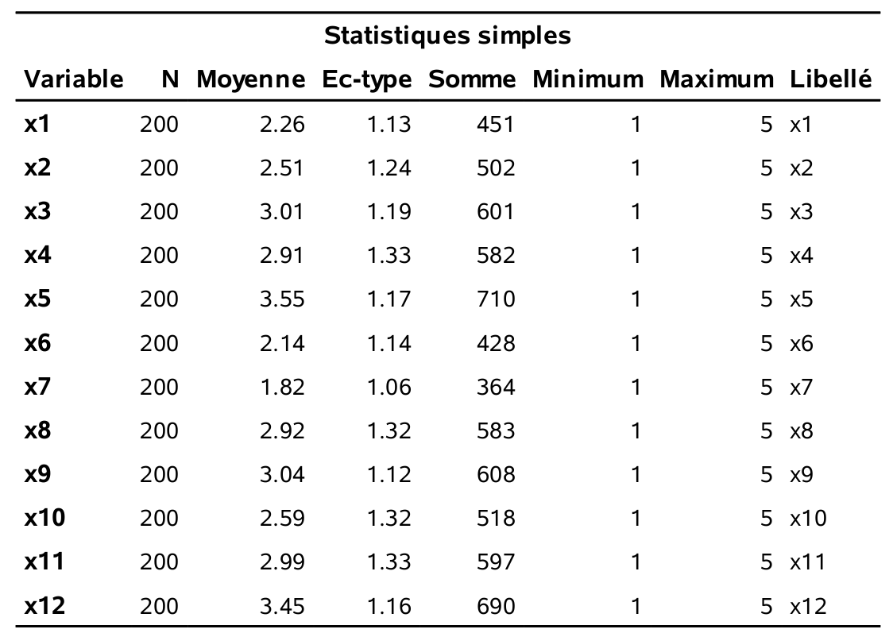
```
```{r fig1p1_fig2, echo = FALSE, out.width='90%', fig.align = "center"}
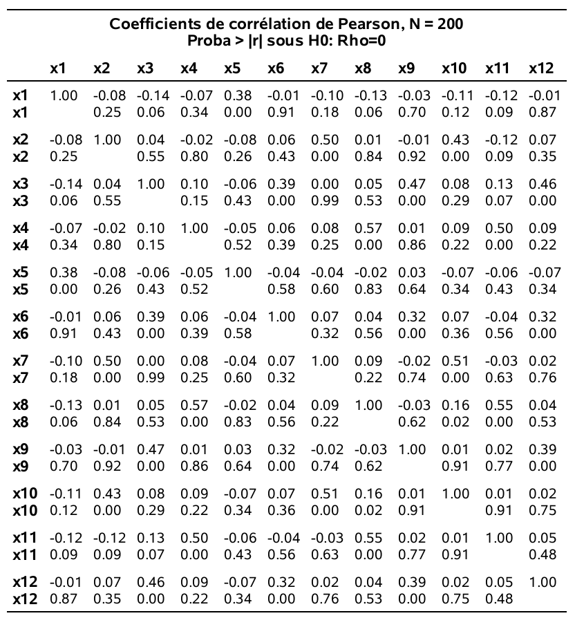
```

## Description du modèle d'analyse factorielle

On dispose d'observations sur $p$ variables $X_1, \ldots, X_p$. Le modèle d'analyse factorielle fait l'hypothèse que ces variables dépendent linéairement d'un plus petit nombre $m$ de variables aléatoires, $F_1, \ldots, F_m$, appelées facteurs communs et de $p$ termes d'erreurs (ou facteurs spécifiques) $\varepsilon_1, \ldots, \varepsilon_p$, de moyenne $\E{\eps_i}=0$ et de variance $\Va{\eps_i}=\psi_i$ pour $i=1, \ldots, p$. Spécifiquement, le modèle est
\begin{align*}
X_1 &= \mu_1 + l_{11}F_1 + l_{12} F_2 + \cdots + l_{1m}F_m + \eps_1\\
X_2 &= \mu_2 + l_{21}F_1 + l_{22} F_2 + \cdots + l_{2m}F_m + \eps_2\\
&\vdots \\
X_p &= \mu_p + l_{p1}F_1 + l_{p2} F_2 + \cdots + l_{pm}F_m + \eps_p,
\end{align*}
où $\mu_i$ est l'espérance de la variable aléatoire $X_i$ ($i=1, \ldots, p$) et où $l_{ij}$ est le chargement de la variable $X_i$ sur le facteur $F_j$ ($i=1,\ldots, p; j=1, \ldots, m$).

Les espérances ($\mu_i$), les chargements ($l_{ij}$) et les variances ($\psi_i$) sont des quantités fixes, mais inconnues, tandis que les facteurs communs ($F_i$) et spécifiques ($\eps_i$) sont des variables aléatoires non observables.

Des hypothèses supplémentaires sont nécessaires afin de pouvoir utiliser ce modèle (contraintes d'identifiabilité des paramètres). Sans entrer dans les détails, mentionnons que l'une de ces hypothèses est que les facteurs sont non corrélés.

De plus, si les variables ont été préalablement standardisées de telle sorte que $\E{X_i}=0$ et $\Va{X_i}=1$ (note: ceci revient à utiliser la matrice de corrélation des observations dans l'analyse ce qui est fait par défaut dans \SAS), alors $\Cor{X_i, F_j}=l_{ij}$, c'est-à-dire, le chargement de la variable $X_i$ sur le chargement $F_j$ est le coefficient de corrélation entre cette variable et ce facteur.

Sans aucune contrainte sur le modèle, la matrice de covariance de $X_1, \ldots, X_p$ possède $p(p+1)/2$ paramètres, soit $p$ variances et $p(p-1)/2$ termes de corrélation. Avec le modèle d’analyse factorielle, on suppose que l’on peut décrire cette structure en utilisant seulement $p(m+1)$ paramètres ($p$ variances spécifiques et $pm$ chargements). Par exemple, avec $p=50$ variables et $m=6$ facteurs, on essaie de décrire la structure de covariance à l’aide de 350 paramètres au lieu de 1275.

Il existe plusieurs méthodes pour extraire les facteurs, c'est-à-dire pour estimer les paramètres du modèle (les $\psi_i$ et les $l_{ij}$). Nous allons discuter de deux d'entre elles: la méthode du maximum de vraisemblance et la méthode des composantes principales. L'avantage de l'estimation par maximum de vraisemblance est qu'elle permet l'utilisation de critères d'information et de statistiques de tests pour guider le choix du nombre de facteurs. En revanche, l'estimation des paramètres requiert une optimisation numérique qui peut être délicate selon les cas de figure.

### Rotation des facteurs

Dans le modèle d’analyse factorielle, on peut montrer que, lorsqu’il y a deux facteurs ou plus, il existe plusieurs configurations de facteurs qui donnent la même structure de covariance. En fait, les chargements peuvent seulement être déterminés à une transformation orthogonale prêt (note: une transformation orthogonale est une transformation qui préserve le produit scalaire; elle préserve ainsi toutes les distances et les angles entre deux vecteurs). Si les chargements provenant d’une méthode d’extraction des facteurs ne sont pas uniques, la matrice de corrélation estimée par le modèle est par contre unique.

Il existe plusieurs techniques de rotation de facteurs. Le but de ces techniques est d’essayer de trouver une solution qui fera en sorte que les facteurs seront facilement interprétables. La méthode la plus utilisée est la méthode **varimax**: elle produit une configuration de chargement en maximisant la variance de la somme des carrés des chargements pour les $m$ facteurs. La méthode varimax tend à produire une configuration de facteurs tel que les chargements de chaque variable sont dispersés (des chargements élevés positifs ou négatifs et d’autres presque nuls). 

Je vous suggère de toujours tenter d’interpréter la solution avec une rotation varimax. Si ce n’est pas suffisamment clair, il existe d’autres méthodes de rotation dont certaines (les rotations de type oblique) permettent la présence de corrélation entre les facteurs. 


## Estimation des facteurs

Les chargements estimés pour la solution à quatre facteurs, suite à la rotation varimax, sont obtenus avec le code SAS suivant:

```{sas, eval=FALSE}
proc factor data=multi.factor2 
 method=ml rotate=varimax nfact=4
 maxiter=500 flag=.3 hey;
 var x1-x12;
run;
```


```{r fig1p3, echo = FALSE, out.width='70%', fig.align = "center"}
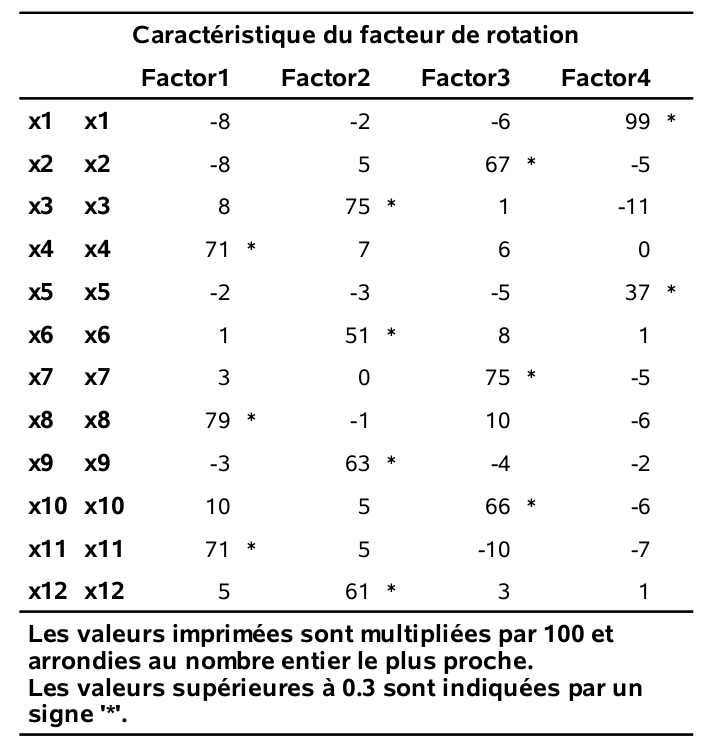
```

En général, on associe une variable à un groupe (facteur) si son chargement est supérieur à 0,3 (en valeur absolue), ce qui donne

- Facteur 1: $X_4$,$X_8$ et $X_{11}$
- Facteur 2: $X_3$,$X_6$, $X_9$ et $X_{12}$
- Facteur 3: $X_2$,$X_7$ et $X_{10}$
- Facteur 4: $X_1$ et $X_5$.

Ces facteurs sont interprétables:

- Le facteur 1 représente l’importance accordée au service.
- Le facteur 2 représente l’importance accordée aux produits.
- Le facteur 3 représente l’importance accordée à la facilité de paiement.
- Le facteur 4 représente l’importance accordée aux prix.

Dans cet exemple, les choses se sont bien passées et le nombre de facteurs que nous avons spécifié (4) semble être adéquat, mais ce n'est pas toujours aussi évident. Il est utile d'avoir des outils pour guider le choix du nombre de facteurs.

## Choix du nombre de facteurs

Il existe différentes méthodes pour se guider dans le nombre de facteurs, $m$, à utiliser. Cependant, le point important à retenir est que, peu importe le nombre choisi, il faut que les facteurs soient **interprétables**. Par conséquent, les méthodes qui
suivent ne devraient servir que de guide et non pas être suivies aveuglément.
La méthode du maximum de vraisemblance que nous avons utilisée dans l’exemple possède l’avantage de fournir trois critères pour choisir le nombre de facteurs appropriés. Ces critères sont: 

- AIC (critère d'information d'Akaike)
- BIC (critère d'information bayésien de Schwarz)
- Le test du rapport de vraisemblance pour l'hypothèse nulle que le modèle de corrélation décrit le modèle factoriel avec $m$ facteurs est adéquat, contre l'alternative qu'il n'est pas adéquat.

Les critères d'information servent à la sélection de modèles; ils seront traités plus en détail dans les chapitres qui suivent. Pour l’instant, il est suffisant de savoir que le modèle avec la valeur du critère AIC (ou BIC) la plus petite est considéré le « meilleur » (selon ce critère).

Les sorties suivantes proviennent du même programme SAS et correspondent au modèle factoriel avec quatre facteurs estimé par maximum de vraisemblance.


```{r fig1p4, echo = FALSE, out.width='70%', fig.align = "center"}
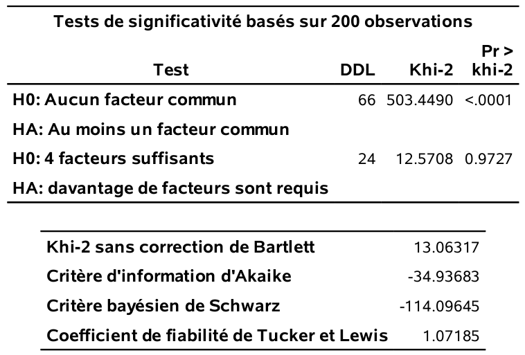
```

Pour choisir le nombre de facteurs avec les critères, il faut ajuster le modèle en faisant varier le nombre de facteurs (option `nfact` et extraire la valeur numérique.

Le tableau \@ref(01-IC_table) présente les valeurs estimées des critères d'information et des valeurs-$p$ pour le test du rapport de vraisemblance pour cinq modèles. Le critère AIC suggère quatre facteurs, tandis que les deux autres critères (BIC et test du rapport de vraisemblance suggèrent plutôt trois facteurs.

```{r 01-IC_table, echo=FALSE, message=FALSE, warnings=FALSE, results='asis'}
tabl <- "
| m | AIC | BIC | valeur-_p_|
|:-:|--------:|-------:|--------:|
| 1 | 228,0 | 49,9 | <0,001 |
| 2 | 99,5 | -42,3 | <0,001 |
| 3 | -20,5 | -129,3 | 0,096 |
| 4 | -34,9 | -114,1 | 0,973 |
| 5 | -24,8 | -77,6 | 0,975 |
"
cat(tabl) # output the table in a format good for HTML/PDF/docx conversion
```

On peut considérer le modèle avec trois facteurs: les chargements (après rotation varimax) sont données dans le tableau \@ref(fig:fig1p5).


```{r fig1p5, fig.cap="Estimés des chargements pour trois facteurs avec rotation varimax", echo = FALSE, out.width='55%', fig.align = "center"}
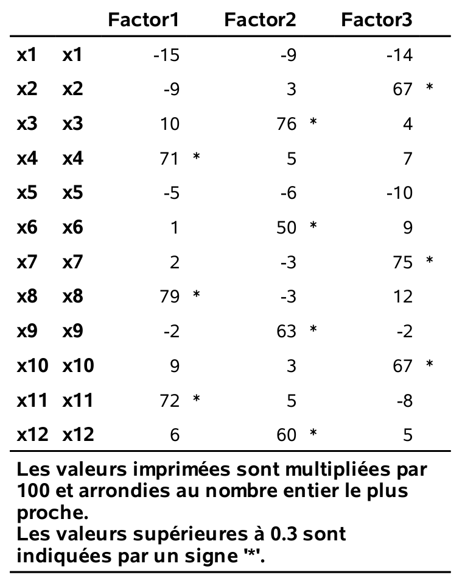
```

Cette solution récupère les trois facteurs _service_, _produits_ et _paiement_ de la solution précédente à quatre facteurs. Le facteur _prix_ (qui était formé de $X_1$ et $X_5$) n’est plus présent: que faire avec ce dernier? Cela dépend du but de l’analyse et nous y reviendrons plus tard.

Pour terminer cette section, voici la description de deux autres
critères _classiques_ pour choisir le nombre de facteurs. Ces deux critères sont: 
 
 - Critère de Kaiser, un critère basé sur les valeurs propres. Avec une analyse en composantes principales basée sur la matrice des corrélations, la valeur propre associée à un facteur représente la partie de la variance totale qui est expliquée par ce facteur. Chaque variable compte pour un dans la variance totale. Le nombre de facteurs choisis est le nombre de valeurs propres supérieures à 1. L’idée est de garder seulement les facteurs qui expliquent plus de variance qu’une variable individuelle.
- le diagramme d'éboulis:  un graphique des valeurs propres ordonnées de la plus grande à la plus petite en fonction de $1,\ldots, p$. Habituellement, ce graphe prendra la forme d’une chute assez importante suivie d’une stabilisation des valeurs propres. Avec ce critère, le nombre de facteurs est déterminé par le nombre de valeurs propres avant le début du coude où il a stabilisation apparente. L’idée est de choisir l’endroit où l’ajout d’un facteur supplémentaire n’apporte qu’un gain marginal faible. Ce critère est par contre subjectif et dépend de l’analyste.


Les sorties qui suivent proviennent du programme: 
```{sas 01-facto-scree, eval=FALSE}
proc factor data=multi.factor2 method=principal
 scree rotate=varimax flag=.3;
var x1-x12;
run;
```

Cette fois-ci, c’est la méthode des composantes principales qui
est utilisée (voir section suivante). En ne spécifiant pas l’option `nfact`, \SAS choisit le nombre de facteurs en utilisant par défaut le critère de Kaiser (valeurs propres supérieures à 1). Quatre facteurs sont retenus, tel qu'indiqué par la sortie au bas du tableau \@ref(fig:fig1p7). Pour le diagramme d'éboulis de la figure \@ref(fig:fig1p6), le choix est assez subjectif: il semble raisonnable de choisir trois ou quatre facteurs.

```{r fig1p7, fig.cap="Valeurs propres et proportion de variance", echo = FALSE, out.width='65%', fig.align = "center"}
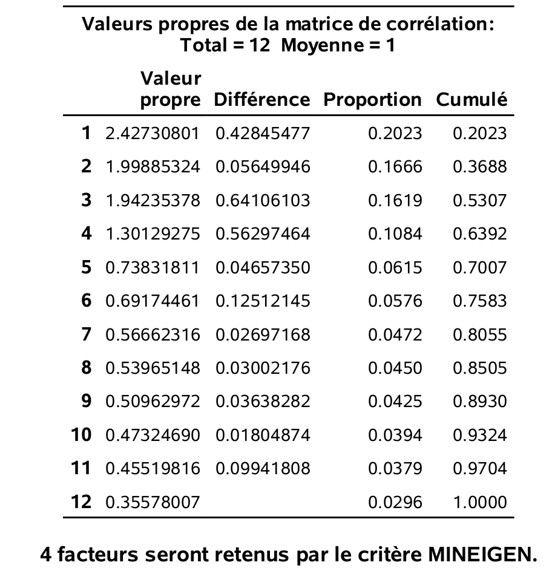
```

```{r fig1p6, fig.cap="Diagramme d'éboulis", echo = FALSE, out.width='65%', fig.align = "center"}
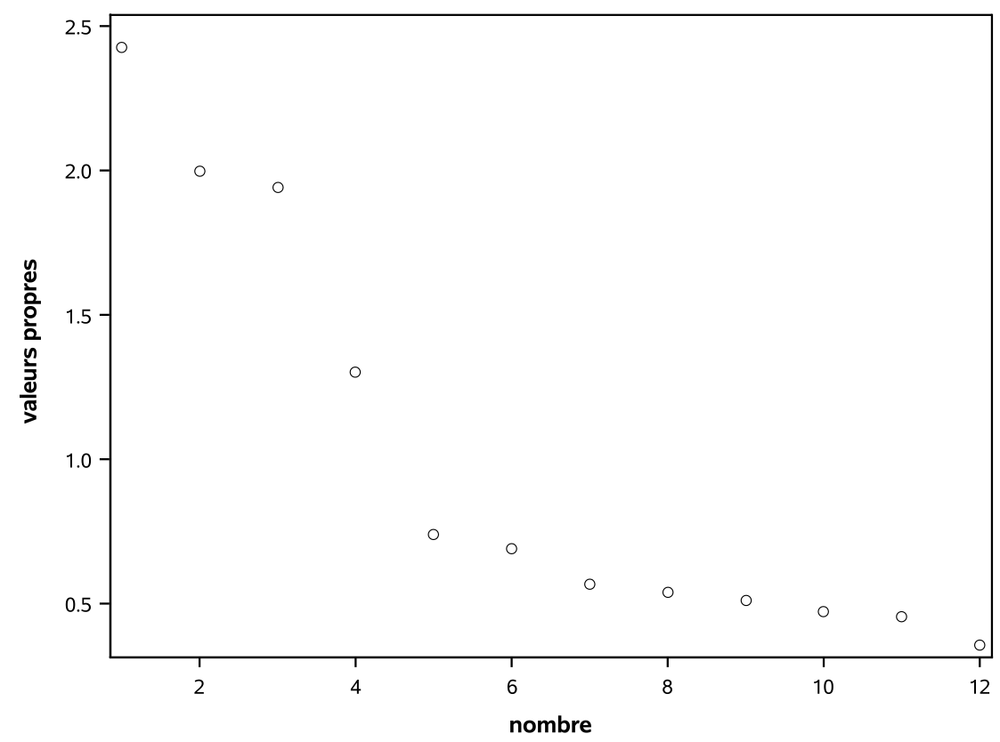
```

On suggère d'utiliser _de facto_ les trois critères découlant de l'utilisation de la vraisemblance et de déterminer le nombre de facteurs à extraire selon différents critères avant d'examiner les modèles avec ce nombre de facteurs et ceux
avec un facteur de moins ou de plus. Au final, le plus important est de pouvoir interpréter raisonnablement les facteurs et donc le modèle retenu est souvent choisi selon le critère **Wow!**. On veut dire par là que la configuration de facteurs choisie est compréhensible. 

## Construction d'échelles à partir des facteurs

Si le seul but de l’analyse factorielle est de comprendre la structure de corrélation entre les variables, alors se limiter à l’interprétation des facteurs est suffisant.

Si par contre, le but est de réduire le nombre de variables pour pouvoir par la suite procéder à d’autres analyses statistiques, l’analyse factorielle peut alors servir de guide pour construire de nouvelles variables (échelles). En supposant que l’analyse factorielle a produit des facteurs qui sont interprétables et satisfaisants, la méthode de construction d’échelles la plus couramment utilisée consiste à construire $m$ nouvelles variables, une par facteur. Pour un facteur donné, la nouvelle variable est simplement la moyenne des variables ayant des chargements élevés sur ce facteur (positifs ou négatifs, mais de même signe). Une autre méthode, les scores factoriels, sera présentée plus loin. 

Lorsqu’on construit une échelle, il est important d’examiner sa cohérence interne. Ceci peut être fait à l’aide du coefficient alpha de Cronbach. Ce coefficient mesure à quel point chaque variable faisant partie d’une échelle est corrélée avec le total de toutes les variables pour cette échelle.
Plus le coefficient est élevé, plus les variables ont tendance à être corrélées entre elles. L'alpha de Cronbach est 
\begin{align*}
\alpha=\frac{k}{k-1} \frac{S^2-\sum_{i=1}^k S_i^k}{S^2},
\end{align*}
où $k$ est le nombre de variables dans l'échelle, $S^2$ est la variance empirique de la somme des variables et $S_i^2$ est la variance empirique de la $i$e variable. En pratique, on voudra que ce coefficient soit au moins égal à 0,6 pour être satisfait de la cohérence interne de l’échelle.

Avec \SAS, la procédure `corr` permet de calculer $\alpha$.

```{sas 01-alphacronbach, eval=FALSE}
/* pour le facteur service */
proc corr data=multi.factor2 alpha;
var x4 x8 x11;
run;
/* pour le facteur produits */
proc corr data=multi.factor2 alpha;
var x3 x6 x9 x12;
run;
/* pour le facteur paiement */
proc corr data=multi.factor2 alpha;
var x2 x7 x10;
run;
/* pour le facteur prix */
proc corr data=multi.factor2 alpha;
var x1 x5;
run;
```

(ref:fig1p8) Alpha de Cronbach pour le facteur *service*.

(ref:fig1p9) Alpha de Cronbach pour le facteur *produits*.

(ref:fig1p10) Alpha de Cronbach pour le facteur *paiement*.

(ref:fig1p11) Alpha de Cronbach pour le facteur *prix*.


```{r fig1p8, fig.cap='(ref:fig1p8)', echo = FALSE, out.width='85%', fig.align = "center"}
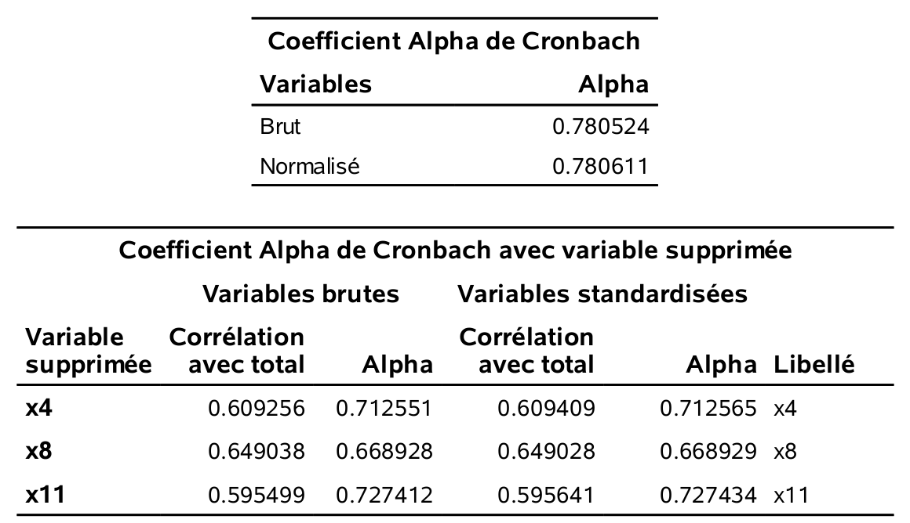
```

```{r fig1p9, fig.cap='(ref:fig1p9)', echo = FALSE, out.width='85%', fig.align = "center"}
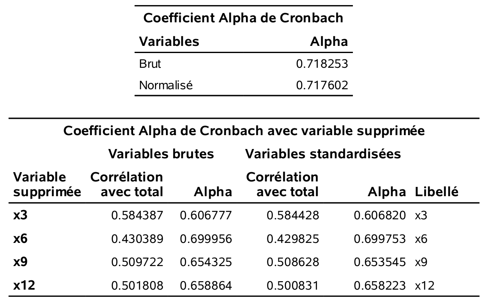
```

```{r fig1p10, fig.cap='(ref:fig1p10)', echo = FALSE, out.width='85%', fig.align = "center"}

```

```{r fig1p11, fig.cap='(ref:fig1p11)', echo = FALSE, out.width='85%', fig.align = "center"}

```

Il faut utiliser le alpha brut. Ainsi, les alphas de Cronbach sont tous
satisfaisants (plus grand que 0,6) sauf pour le facteur _prix_ ($\alpha=0,546$). \SAS fournit également la matrice des corrélations des variables de l’échelle ainsi que la valeur du alpha de Cronbach si on retirait une variable à la fois de l’échelle. Tout est donc cohérent. Les échelles provenant des facteurs _service_, _produits_ et _paiement_, sont satisfaisantes. Ces facteurs sont identifiés à la fois dans la solution à quatre, mais aussi dans la solution à troisfacteurs. Le facteur _prix_ est celui qui apparaît en plus dans la solution à quatre facteurs. Il a une interprétation claire, mais son faible alpha ferait en sorte qu’il serait discutable de travailler avec l’échelle _prix_ dans d’autres analyses (du moins avec selon l’usage habituel du alpha).

## Compléments d'information

### Variables ordinales

Théoriquement, une analyse factorielle ne devrait être faite qu’avec des
variables continues. Par contre, en pratique, on l’utilise souvent aussi avec des variables ordinales (comme pour l’exemple portant sur le questionnaire) et même avec des variables binaires (0-1).

Dans ce genre de situation, on peut aussi utiliser d’autres mesures d’associations au lieu du coefficient de corrélation linéaire. Par exemple, on peut utiliser la corrélation polychorique, qui est une mesure de corrélation entre deux variables ordinales. La corrélation tétrachorique correspond au cas spécial de deux variables binaires.

Ma suggestion est d’utiliser la corrélation linéaire ordinaire avec des variables ordinales (même binaires). Si les résultats ne sont pas satisfaisants, on peut alors essayer avec d’autres mesures d’associations.

On peut refaire l’analyse des données portant sur le magasin dans \SAS en utilisant la corrélation polychorique calculées par la procédure `corr` et en passant la sortie à la procédure `factor`.

```{sas 01-corrpolychorique, eval = FALSE}
proc corr data=multi.factor2 polychoric out=poly_corr;
var x1-x12;
run;

proc factor data=poly_corr
 method=ml rotate=varimax nfact=4
 maxiter=500 flag=.3 hey;
 var x1-x12;
run;
```

Les chargements sont donnés dans le tableau \@ref(fig:fig1p12). Les facteurs obtenus sont les mêmes qu’en utilisant les corrélations linéaires.

```{r fig1p12, fig.cap="Chargements estimés pour la corrélation polychorique", echo = FALSE, out.width='65%', fig.align = "center"}
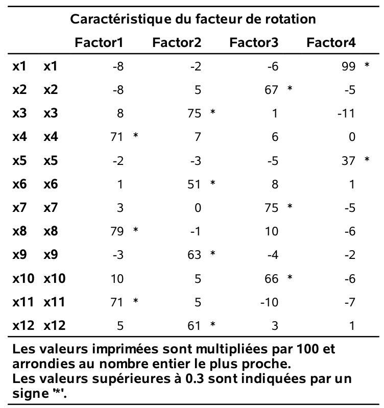
```

### Autres méthodes d’extractions de facteurs

Il n'y a pas de formule explicites pour l’estimation des paramètres avec la méthode du maximum de vraisemblance et un algorithme d'optimisation est nécessaire pour l'option des paramètres. Dans certains cas, l'algorithme peut terminer sans solution ou retourner un cas limite (où la variance est négative). La méthode par les composantes principales (mentionnée lors de la présentation des valeurs propres et du diagramme d'éboulis a une solution explicite et peut donc dépanner si on n'arrive pas à obtenir le maximum de vraisemblance. 

D’autres méthodes sont aussi disponibles dans \SAS (voir la rubrique d’aide du logiciel) mais les deux méthodes mentionnées devraient être suffisantes pour la grande majorité des applications.

### Autres méthodes de rotation des facteurs

Jusqu’à présent, nous avons utilisé la méthode de rotation orthogonale varimax. Il existe de nombreuses autres méthodes de rotations orthogonales telles, orthomax, quartimax, parsimax et equimax (voir la rubrique d’aide de \SAS). Rappelez-vous que le modèle d’analyse factorielle de base suppose que les facteurs sont non corrélés. Les rotations de type obliques quant à elles permettent d’introduire de la corrélation entre les facteurs. Quelquefois, une telle rotation facilitera davantage l’interprétation des facteurs qu’une rotation orthogonale. \SAS permet l’utilisation de plusieurs méthodes de
rotation obliques qui sont documentées dans la rubrique d'aide. Notez qu'il faut être prudent lorsqu’on utilise une méthode de rotation oblique car il y aura trois matrices de chargements après rotation. On suggère l'utilisation de la première, soit la représentation avec **coefficients de régression normalisés**. Il s’agit des coefficients de régression si on voulait prédire les variables à l’aide des facteurs. Ils indiquent donc à quel point chaque facteur est associé à chaque variable. Dans le cas d’une rotation orthogonale, ces trois matrices sont les mêmes et il s’agit de trois interprétations valides des chargements.

Le programme suivant fait une analyse factorielle avec quatre facteurs, mais en utilisant une rotation varimax oblique (option `rotate=obvarimax`).

```{sas obliqueproj, eval=FALSE}
proc factor data=multi.factor2
maxiter=500 flag=.3 hey;
var x1-x12;
run;
```

La matrice des corrélations entres facteurs est donnée dans le tableau \@ref(fig:fig1p13) et les chargements sont présentés dans le tableau \@ref(fig:fig1p14). On voit ici qu’on obtient les mêmes quatre facteurs qu’avec une rotation varimax orthogonale.

```{r fig1p13, fig.cap="Corrélation interfacteurs pour rotation varimax oblique", echo = FALSE, out.width='70%', fig.align = "center"}
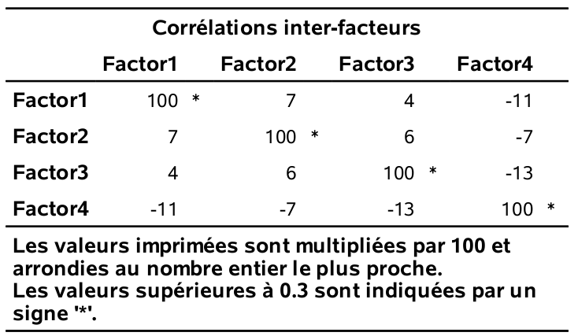
```

```{r fig1p14, fig.cap="Chargements avec rotation oblique varimax", echo = FALSE, out.width='70%', fig.align = "center"}
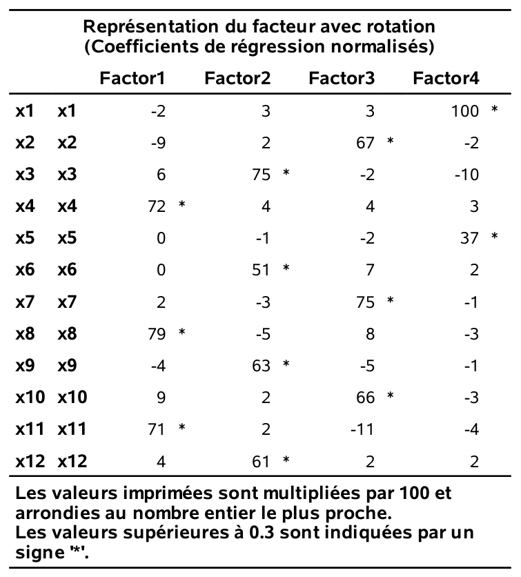
```

### Scores factoriels

Avec les données de l’exemple, en nous basant sur les résultats de l’analyse factorielle, nous avons créé quatre nouvelles échelles (une par facteur) que l’on peut calculer pour chaque individu: 

- _service_ = $(X_4+X_8+X_{11})/3$,
- _produit_ = $(X_3+X_6+X_9+X_{12})/4$,
- _paiement_ = $(X_2+X_7+X_{10})/3$,
- _prix_ = $(X_1+X_5)/2$.

Par exemple, la variable _prix_ peut donc être vu comme une combinaison linéaire des 12
variables où seulement $X_1$ et $X_5$ reçoivent un poids (égal) différent de zéro. Une autre façon de créer de nouvelles variables consiste à calculer des scores factoriels (un pour chaque facteur) pour chaque individu. Par exemple, pour un individu donné, un score factoriel pour le premier facteur peut être calculé selon la formule
\begin{align*}
\hat{F}_1 = \widehat{\beta}_1 x_1 + \cdots + \widehat{\beta}_{12}x_{12},
\end{align*}
où $x_1, \ldots, x_{12}$ sont les valeurs (habituellement standardisées) des variables pour cet individu et où $\widehat{\beta}_1, \ldots, \widehat{\beta}_{12}$ sont des coefficients estimés à partir des chargements (après rotation) et de la matrice de corrélation des variables.


Ainsi, chacune des 12 variables originales contribue au calcul du score
factoriel. Les variables ayant des chargements plus élevés sur ce facteur auront tendance à avoir des poids ($\widehat{\beta}$) plus élevés. Par contre, les scores factoriels ne sont pas uniques car ils dépendent des chargements utilisés (et donc à la fois de la méthode d’estimation et de la méthode de rotation).
On peut également utiliser les scores factoriels au lieu des 12 variables
originales dans des analyses subséquentes. Il est suggéré d'utiliser les nouvelles variables (échelles) obtenues en faisant les moyennes des variables identifiées comme faisant partie de chaque
facteur pour les raisons suivantes:

- l’interprétation des scores factoriels est moins claire (chaque facteur dépend de toutes les variables)
- les scores factoriels ne sont pas uniques (ils dépendent de la méthode d’estimation et de rotation).
- les coefficients servant au calcul seront différents d’une étude à l’autre.


```{r fig1p15, fig.cap="Coefficients du score normalisés", echo = FALSE, out.width='60%', fig.align = "center"}
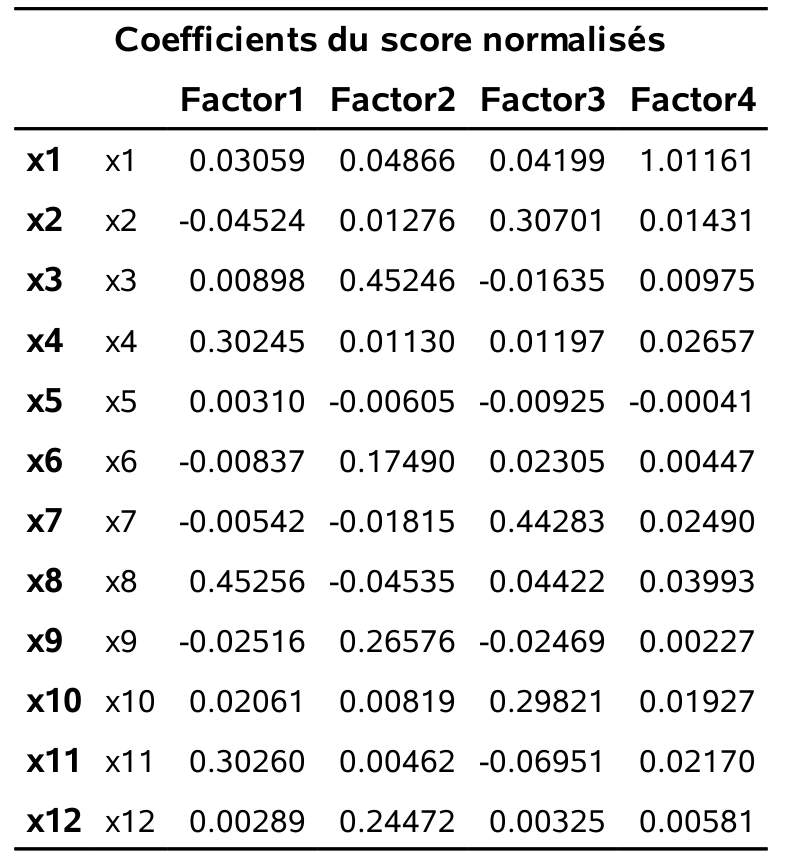
```


Pour obtenir les scores avec \SAS, il suffit d’insérer l’option `score` à la procédure `factor`. L’option `out=...` permet de créer un fichier de données \SAS qui contient la valeur des $m$ scores pour chaque individu.
Les scores factoriels pour l'exemples sont rapportés dans le tableau \@ref(fig:fig1p15). On remarque que 

- pour le premier facteur, trois variables ont des poids importants ($X_4$, $X_8$ et $X_{11}$). Il s’agit donc d’un facteur très proche du facteur _service_.
- pour le deuxième facteur, les variables $X_3$, $X_6$, $X_9$ et $X_{12}$ ont des poids importants. Il s’agit donc d’un facteur très proche du facteur _produits_. 
- pour le troisième facteur, les variables $X_2$, $X_7$, $X_{10}$ ont des poids importants. Il s’agit donc d’un facteur très proche du facteur _paiement_.
- pour le quatrième facteur, seule la variable $X_1$ a un poids important.
On aurait pu s’attendre à ce que ce soit également le cas pour $X_5$, en lien avec le facteur _prix_  --- ce facteur était moins clair selon le alpha de Cronbach.

Les corrélations entre les échelles (construites avec les moyennes) et les scores factoriels sont données dans le tableau \@ref(fig:fig1p16). On remarque la forte corrélation entre le score factoriel et les échelles construites avec les moyennes pour les facteurs _service_, _produits_ et
_paiement_. Cela veut dire qu’utiliser les échelles ou les scores factoriels ne
devrait pas faire de différence dans des analyses subséquentes. Par contre,
cette corrélation est plus faible (0.82) pour le facteur _prix_.


```{r fig1p16, fig.cap="Corrélation entre scores et échelles", echo = FALSE, out.width='65%', fig.align = "center"}
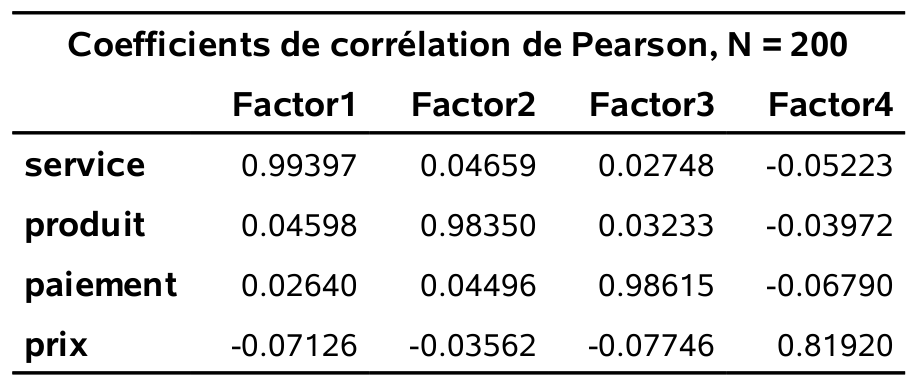
```