# Régression logistique

## Introduction

En régression linéaire, on cherche à expliquer le comportement d’une variable quantitative $Y$ que l’on peut traiter comme étant continue (elle peut prendre suffisamment de valeurs différentes).

Supposons à présent que l’on veut expliquer le comportement d’une variable $Y$ prenant seulement deux valeurs que l’on va noter 0 et 1.

Exemples :

- Est-ce qu’un client potentiel va répondre favorablement à une offre promotionnelle?
- Est-ce qu’un client est satisfait du service après-vente?
- Est-ce qu’un client va faire faillite ou non au cours des trois prochaines années.

En général, on cherchera à expliquer le comportement d’une variable binaire $Y$ en utilisant un modèle basé sur p variables quelconques $X_1, \ldots, X_p$.

Notre but sera de faire de l'inférence, de la prédiction, ou les deux à la fois, soit

1) Comprendre comment et dans quelles mesures les variables $\boldsymbol{X}$ influencent $Y$ (ou bien la probabilité que $Y=1$).
2) Prédiction : développer un modèle pour prévoir des valeurs de $Y$ futures à partir des variables $\boldsymbol{X}$.

## Modèle de régression logistique

Avec une variable réponse continue, le modèle de régression linéaire,
\begin{align*}
 Y = \beta_0 + \beta_1X_1 + \cdots + \beta_p X_p + \eps,
\end{align*}
avec $\E{\eps \mid \boldsymbol{X}}=0$ et $\Va{\eps \mid \boldsymbol{X}}=\sigma^2$, peut être écrit de manière équivalente comme $\E{Y  \mid \boldsymbol{X}} = \beta_0 + \beta_1X_1 + \cdots + \beta_pX_p$ et $\Va{Y \mid \boldsymbol{X}}=\sigma^2.$ 


Si $Y$ est binaire (0/1), on peut facilement vérifier que 
\begin{align*}
\E{Y \mid \boldsymbol{X}} = \P{Y=1 \mid  \boldsymbol{X}},
\end{align*}
soit la probabilité que $Y$ égale 1 étant donné les valeurs des variables explicatives. Pour simplifier la notation, posons $p = \P{Y=1 \mid   \boldsymbol{X}}$ en se rappelant que $p$ est une fonction des variables explicatives.

À première vue, on peut se demander pourquoi ne pas utiliser le même modèle que la régression linéaire, c’est-à-dire
\begin{align*}
\eta=\beta_0 + \beta_1X_1 + \cdots + \beta_p X_p.
\end{align*}

Le problème est que $p$ est une probabilité. Par conséquent $p$ prend seulement des valeurs entre 0 et 1 alors que rien n’empêche $\eta$ de prendre des valeurs dans $\mathbb{R}=(-\infty, \infty)$. Une façon de résoudre ce problème consiste à appliquer une transformation à $p$ de telle sorte que la quantité transformée puisse prendre toutes les valeurs entre $-\infty$ et $\infty$. 
Le modèle de régression logistique est défini à l'aide de la transformation $\logit$,
\[\logit(p) = \ln\left( \frac{p}{1-p}\right)=\eta=\beta_0 + \beta_1X_1 + \cdots + \beta_p X_p,\]
où $\ln$ est le logarithme naturel.


En régression linéaire, on suppose que l’espérance de $Y$ étant donné les valeurs des variables explicatives est une combinaison linéaire de ces dernières. En régression logistique, on suppose que le logit de la probabilité que $Y=1$ étant donné les valeurs des variables explicatives est une combinaison linéaire de ces dernières.

Une simple manipulation algébrique permet d’exprimer ce modèle en terme de la probabilité $p$,
\begin{align*}
 p &= \expit(\eta) = \frac{\exp(\eta)}{1+\exp(\eta)}
= \frac{1}{1+\exp(-\eta)}.
\end{align*}
On peut voir qu'à mesure que le prédicteur linéaire $\eta=\beta_0+\beta_1X_1 + \cdots + \beta_pX_p$ augmente, la probabilité augmente.
Si le coefficient $\beta_j$ est négatif, $p$ diminuera à mesure que $X_j$ augmente.


```{r logitplot, echo=FALSE, eval = TRUE, fig.align="center"}
logit <- function(x){log(x/(1-x))}
expit <- function(x){1/(1+exp(-x))}
par(mar = c(4,4,1,0.1), bty = "l")
curve(expit, 
    ylim = c(0,1),
    yaxs="i",
    from = -3.5, 
    to = 3.5, 
    xlab = expression(eta), 
    ylab = expression(p))

```

Pour une variable binaire $Y$, le quotient $p/(1-p)$ est appelé **cote** et représente le ratio de la probabilité de succès ($Y=1$) sur la probabilité d'échec ($Y=0$),
\begin{align*}
 \mathsf{cote}(p) = \frac{p}{1-p} = \frac{\P{Y=1 \mid \boldsymbol{X}}}{\P{Y=0 \mid \boldsymbol{X}}}.
\end{align*}

Par exemple, une cote de 4 veut dire qu’il y a 4 fois plus de chance que $Y$ soit égale à $1$ par rapport à $0$. Une cote de 0,25 veut dire le contraire, il y a 4 fois moins de chance que $Y=1$ par rapport à $0$ ou bien, de manière équivalente, il y a 4 fois plus de chance que $Y=0$ par rapport à $1$. Le Tableau \@ref(tab:03-cotes) donne un aperçu de cotes pour quelques probabilités $p$.

Table: (\#tab:03-cotes) Cote et probabilité de succès

|$\P{Y=1}$ | 0,1 | 0,2 | 0,3 | 0,4 | 0,5 | 0,6 | 0,7 | 0,8 | 0,9 |
|--:|:--:| :--:|:--:| :--: | :--: | :--: | :--: | :--: | :--: |
|cote | 0,11 | 0,25 | 0,43 | 0,67 | 1 | 1,5 | 2,33 | 4 | 9 |
|cote (frac.) | $\frac{1}{9}$ | $\frac{1}{4}$ | $\frac{3}{7}$ | $\frac{2}{3}$ | $1$ | $\frac{3}{2}$ | $\frac{7}{3}$ | $4$ | $9$|
 
## Estimation des paramètres

### Principes de base

On dispose d'un échantillon de taille $n$ sur les variables $(Y, X_1, \ldots, X_p)$, dans le tableau
\begin{align*}
 \begin{pmatrix}
 x_{11} & x_{12} & \cdots & x_{1p} & y_1 \\
 x_{21} & \ddots & \cdots & x_{2p} & y_2 \\
 \vdots & \ddots & \ddots & \ddots & \vdots \\
 x_{n1} & x_{n2} & \cdots & x_{np} & y_n \\
 \end{pmatrix}
\end{align*}
À l'aide de ces observations, on peut estimer les paramètres $\boldsymbol{\beta} = (\beta_0, \beta_1 ,\ldots, \beta_p)$ du modèle de régression logistique
\begin{align*}
\logit(p) = \ln \left( \frac{p}{1-p}\right) = \beta_0 + \beta_1 X_1 + \cdots + \beta_pX_p.
\end{align*}
On obtient ainsi les estimés des paramètres $\widehat{\boldsymbol{\beta}}$, desquels découle une estimation de $\P{Y=1}$ pour les valeurs $X_1=x_1, \ldots, X_p=x_p$ d'un individu donné,
\begin{align*}
 \widehat{p} = \expit(\widehat{\beta}_0 + \cdots + \widehat{\beta}_pX_p).
\end{align*}

Un modèle ajusté peut ensuite être utilisé pour faire de la classification (prédiction) pour de nouveaux individus pour lesquels la variable réponse $Y$ n'est pas observée. Pour ce faire, on choisit un point de coupure $c$ (souvent $c=0,5$ mais pas toujours) et on classifie les observations en deux groupes:

- Si $\widehat{p}< c$, alors $\widehat{Y}=0$ (c’est-à-dire, on assigne cette observation à la catégorie 0).
- Si $\widehat{p} \geq c$, alors $\widehat{Y}=1$ (c’est-à-dire, on assigne cette observation à la catégorie 1).

On reviendra en détail sur cet aspect dans une section suivante.

La méthode d’estimation des paramètres habituellement utilisée est la méthode du maximum de vraisemblance. Pour les applications, il est suffisant de savoir manipuler trois quantités importantes: la log-vraisemblance $\ell$, le $\mathsf{AIC}$ et le $\mathsf{BIC}$. Les deux critères d'information, que nous avons couvert dans les chapitres précédent, servent à la sélection de modèles tandis que la log-vraisemblance servira à construire un test d’hypothèse. 

### Méthode du maximum de vraisemblance

Cette sous-section est facultative. Elle donne plus de détails sur la méthode du maximum de vraisemblance et les quantités en découlant ($\mathsf{AIC}$, $\mathsf{BIC}$ et -2LL).

La méthode du maximum de vraisemblance (_maximum likelihood_) est possiblement la méthode d'estimation la plus utilisée en statistique. En général, pour un échantillon donné et un modèle avec des paramètres inconnus $\boldsymbol{\theta}$, on peut calculer la « probabilité » d’avoir obtenu les observations de notre échantillon selon les paramètre. Si on traite cette « probabilité » comme étant une fonction des paramètres du modèle, $\boldsymbol{\theta}$, on l’appelle alors la vraisemblance (_likelihood_). La méthode du maximum de vraisemblance consiste à trouver les valeurs des paramètres qui maximisent la vraisemblance. On cherche donc les estimations qui sont les plus vraisemblables étant donné nos observations. 

En pratique, il est habituellement plus simple de chercher à maximiser le log de la vraisemblance (ce qui revient au même car le log est une fonction croissante) et on nomme cette fonction la log-vraisemblance (_log-likelihood_).

Vous connaissez déjà des exemples d’estimateurs du maximum de vraisemblance. La moyenne d’un échantillon est l'estimateur du maximum de vraisemblance pour la moyenne de la population $\mu$ si les observations représentent un échantillon aléatoire simple tiré d'une loi normale.

Dans le cas d’un modèle de régression linéaire multiple $Y = \beta_0 + \sum_{j=1}^p \beta_jX_j + \eps$ avec les erreurs $\eps \sim \mathcal{N}(0, \sigma^2)$ des termes indépendants et identiquement distributions, alors la log-vraisemblance du modèle pour un échantillon de taille $n$ est 
\begin{align*}
 \ell(\boldsymbol{\beta}, \sigma^2) =- \frac{n}{2} \ln(2\pi\sigma^2) - \frac{1}{2\sigma^2}\sum_{i=1}^n (Y_i- \beta_0 - \beta_1 X_{1i} - \cdots - \beta_pX_{ip})^2.
\end{align*}
Puisque le premier terme ne dépend pas des paramètres $\boldsymbol{\beta}$, il est clair que maximiser cette fonction de $\boldsymbol{\beta}$ revient à minimiser $\sum_{i=1}^n (Y_i- \beta_0 - \beta_1 X_{1i} - \cdots - \beta_pX_{ip})^2$,  et ce critère est exactement le même que celui des moindres carrés. Par conséquent, les estimations des paramètres $\boldsymbol{\beta}$ provenant de la méthode des moindres carrés peuvent être vues comme étant des estimateurs du maximum de vraisemblance sous l’hypothèse de normalité des observations. De plus, il est même possible d’écrire une formule explicite pour ces estimations.

Dans le cas de la régression logistique, la fonction de log-vraisemblance s'écrit
\begin{align*}
 \ell(\boldsymbol{\beta}) = \sum_{i=1}^n Y_i ( \beta_0 + \beta_1 X_{i1} + \cdots + \beta_p X_{ip}) - \sum_{i=1}^n \ln\left\{1+\exp(\beta_0 + \cdots + \beta_pX_{ip})\right\}
\end{align*}

Contrairement au cas de la régression linéaire, on ne peut trouver une fonction explicite pour les valeurs des paramètres qui maximisent cette fonction. Des méthodes numériques doivent alors être utilisées pour l'optimisation. Une fois la maximisation accomplie, on obtient les estimés du maximum de vraisemblance, $\widehat{\boldsymbol{\beta}}$. On peut alors calculer la valeur maximale (numérique) du $\ell(\widehat{\boldsymbol{\beta}}$. La quantité $-2\ell(\widehat{\boldsymbol{\beta}})$ (`-2 Log L`) est rapportée dans les sorties **SAS**. Par analogie avec la régression linéaire la valeur de la log-vraisemblance évaluée à $\widehat{\boldsymbol{\beta}}$, $\ell(\widehat{\boldsymbol{\beta}})$, augmente toujours lorsqu'on ajoute des régresseurs et c'est pourquoi on ne pourra pas l’utiliser comme outil de sélection de variables. 

Les critères d'information sont fonctions de a log-vraisemblance et sont 
\begin{align*}
 \mathsf{AIC} & = -2 \ell(\widehat{\boldsymbol{\beta}}) + 2(p+1)\\
 \mathsf{BIC} & = -2 \ell(\widehat{\boldsymbol{\beta}}) + \ln(n)(p+1)
\end{align*}

Ces définitions sont utilisables dans plusieurs situations lorsque le modèle est ajusté par la méthode du maximum de vraisemblance. En particulier, elles sont utilisées par **SAS** en régression logistique. Tout comme en régression linéaire et analyse factorielle, ces deux critères pourront être utilisés pour faire de la sélection de modèles si on calcule les estimateurs du maximum de vraisemblance.

## Exemple du _Professional Rodeo Cowboys Association_

L’exemple suivant est inspiré de l’article

> Daneshvary, R. et Schwer, R. K. (2000) The Association Endorsement and Consumers’ Intention to Purchase. _Journal of Consumer Marketing_ **17**, 203-213.

Dans cet article, les auteurs cherchent à voir si le fait qu’un produit soit recommandé par le _Professional Rodeo Cowboys Association_ (PRCA) a un effet sur les intentions d’achats. On dispose de 500 observations sur les variables suivantes:

- $Y$: seriez-vous intéressé à acheter un produit recommandé par le PRCA
    - $\code{0}$: non
    - $\code{1}$: oui
- $X_1$: quel genre d’emploi occupez-vous?
    - $\code{1}$: à la maison
    - $\code{2}$: employé
    - $\code{3}$: ventes/services
    - $\code{4}$: professionnel
    - $\code{5}$: agriculture/ferme
- $X_2$: revenu familial annuel
    - $\code{1}$: moins de 25 000
    - $\code{2}$: 25 000 à 39 999
    - $\code{3}$: 40 000 à 59 999
    - $\code{4}$: 60 000 à 79 999
    - $\code{5}$: 80 000 et plus
- $X_3$: sexe
    - $\code{0}$: homme
    - $\code{1}$: femme
- $X_4$: avez-vous déjà fréquenté une université?
    - $\code{0}$: non
    - $\code{1}$: oui
- $X_5$: âge (en années)
- $X_6$: combien de fois avez-vous assisté à un rodéo au cours de la dernière année?
    - $\code{1}$: 10 fois ou plus
    - $\code{2}$: entre six et neuf fois
    - $\code{3}$: cinq fois ou moins

Le but est d’examiner les effets de ces variables sur l'intentions d’achat ($Y$). Les données se trouvent dans le fichier `logit1.sas7bdat`.

### Modèle avec une seule variable explicative

Faisons tout d’abord une analyse en utilisant seulement $X_5$ (âge) comme variable explicative. L'ajustement du modèle de régression incluant uniquement $X_5$ sera effectuée en exécutant le programme 
```{sas 03-logisticageonly, eval = FALSE, echo = TRUE}
proc logistic data=multi.logit1 ;
model y(ref='0') = x5 / clparm=pl clodds=pl expb;
run;
```
Le fichier `logit1_intro.sas` contient ce programme et décrit plus en détail les différentes options. La syntaxe `y(ref='0')` sert à spécifier la catégorie de référence, zéro, de la variable réponse $Y$: le modèle décrit donc $\P{y=1 \mid X_5}$.


Voici une partie de la sortie

```{r fig3_e1, echo = FALSE, out.width='63%', fig.align = "center"}
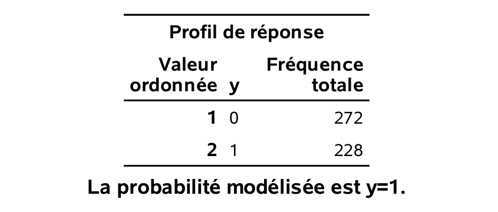
```


```{r fig3_e2, echo = FALSE, out.width='80%', fig.align = "center"}
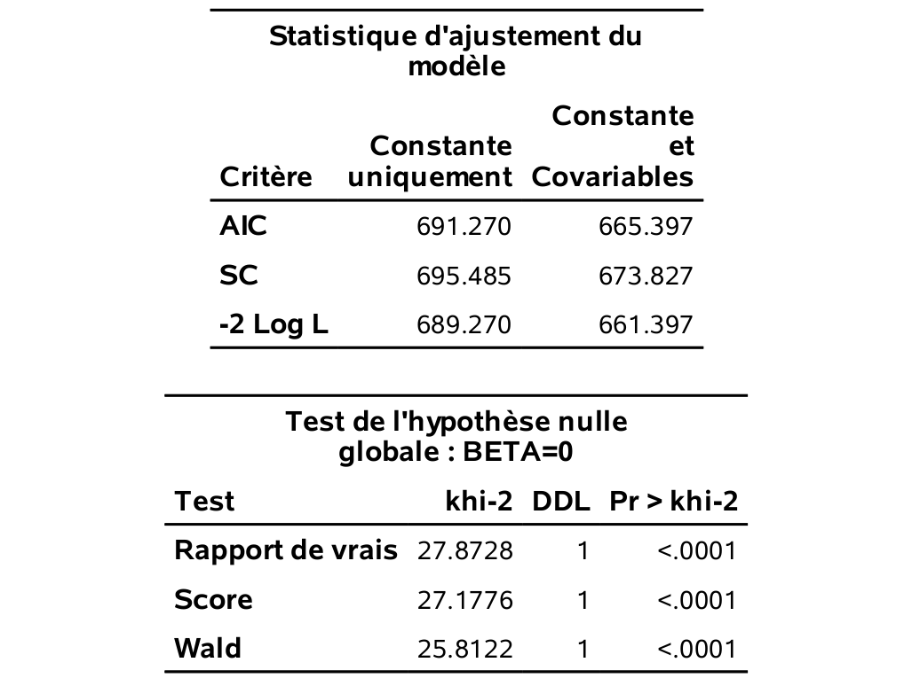
```


```{r fig3_e3, echo = FALSE, out.width='80%', fig.align = "center"}
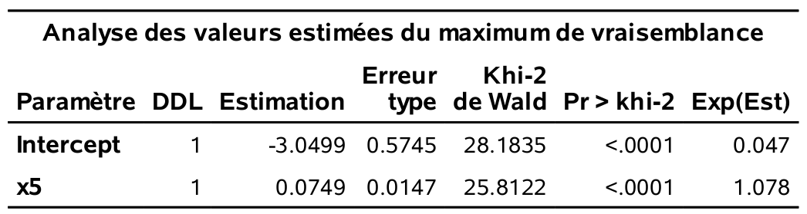
```


```{r fig3_e4, echo = FALSE, out.width='80%', fig.align = "center"}
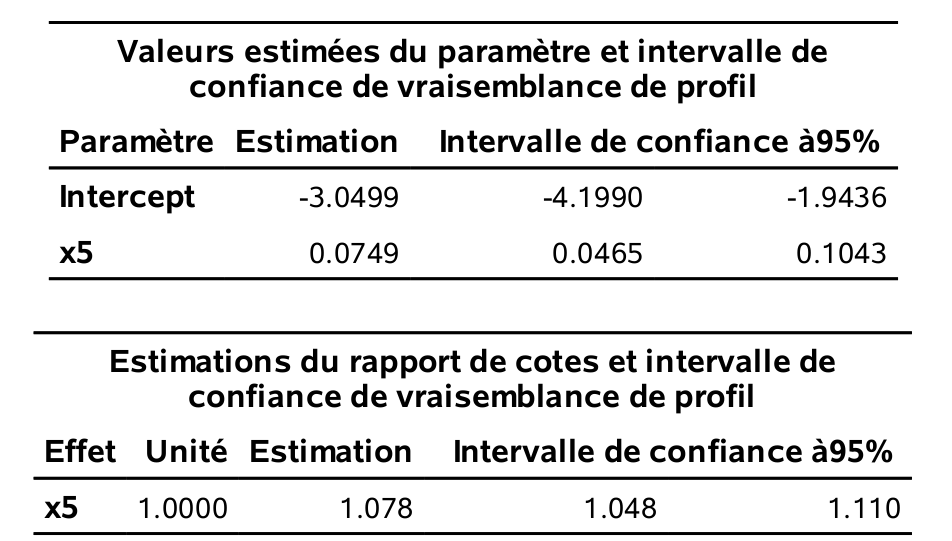
```

- On voit qu'il y a 272 personnes ($\code{0}$) qui ne sont pas intéressées à acheter un produit recommandé par le PRCA et 228 personnes ($\code{1}$) qui le sont. 
- Les estimés des paramètres sont $\widehat{\beta}_0 = -3,05$ et $\widehat{\beta}_{\code{age}}=0,0749$.
- Un intervalle de confiance de niveau 95\% pour l’effet de l’âge est [$0,0465; 0,1043$]. 
- Le modèle ajusté est $\logit\{\P{Y=1 \mid X_5=x_5}\} = -3,05 + 0,0749 x_5$. On peut également exprimer ce modèle directement en terme de la probabilité de succès,
\begin{align*}
\P{Y=1 \mid X_5=x_5} &= \expit(-3,05 + 0,0749 x_5) \\&= \frac{1}{1+\exp(3,05 - 0,0749 x_5)}
\end{align*}
Le graphe de cette fonction pour $X_5$ allant de 18 à 59 ans, respectivement les valeurs minimales et maximales observées dans l'échantillon, montre que le lien entre l'âge et $p$ est presque linéaire entre 20 et 60 ans. On décèle tout de même la forme sigmoide de la fonction $\logit$ aux deux extrémités.
```{r logitplot2, echo=FALSE, eval = TRUE, fig.align="center"}
par(mar = c(4,4,1,0.1), bty = "l")
curve(expit(-3.05+0.0749*x), 
    ylim = c(0,1),
    yaxs="i",
    from = 18, 
    to = 59, 
    xlab = "âge (en années)", 
    ylab = "p")

```

- La valeur-$p$ pour $\widehat{\beta}_{\code{age}}$ (`Pr > khi-2`), correspondant aux test des hypothèses $\Hy_0: \beta_{\code{age}}=0$ versus $\Hy_1: \beta_{\code{age}} \neq 0$, est plus petite que $10^{-4}$ et donc l'effet de la variable âge est statistiquement différent de zéro. Plus l’âge augmente, plus la probabilité d’être intéressé à acheter un produit recommandé par le PRCA augmente.
- Le tableau `Test de l'hypothèse nulle globale : BETA=0` contient les résultats de trois tests pour l'hypothèse nulle que tous les paramètres sont nuls, contre l'alternative qu'au moins un des paramètres est différent de zéro. Comme il y a un seul paramètre ici, ces tests reviennent à tester l’effet de la variable âge. Le test de Wald est le même que celui que nous venons de voir dans le tableau des coefficients. 

### Interprétation du paramètre

Si une variable est modélisée à l’aide d’un seul paramètre (pas de terme quadratique et pas d'interaction avec d'autre covariables), une valeur positive du paramètre indique une association positive avec $p$ alors qu’une valeur négative indique le contraire. 

Ainsi, le signe du paramètre donne le sens de l’association. Si le coefficient $\beta_j$ de la variable $X_j$ est positif, alors plus la variable augmente, plus $\P{Y=1}$ augmente. Inversement, Si le coefficient $\beta_j$ est négatif, plus la variable augmente, plus $\P{Y=1}$ diminue. 

En régression linéaire, l’interprétation de coefficient $\beta_j$ est simple: lorsque la variable $X_j$ augmente de un, la variable $Y$ augmente en moyenne de $\beta_j$, toute chose étant égale par ailleurs. Cette interprétation ne dépend pas de la valeur de $X_j$. En régression logistique, comme le modèle est nonlinéaire en fonction de $\P{Y=1}$ (courbe sigmoide), l'augmentation ou la dimininution de $\P{Y=1\mid \boldsymbol{X}}$ pour un changement d'une unité de $X_j$ dépend de la valeur de cette dernière. C’est pourquoi il est parfois plus utile d’utiliser la cote pour interpréter globalement l’effet d’une variable.

Dans notre exemple, on peut exprimer le modèle ajusté en termes de cote,
\begin{align*}
 \frac{\P{Y=1 \mid X_5=x_5}}{\P{Y=0 \mid X_5=x_5}} = \exp(-3,05)\exp(0,0749x_5).
\end{align*}
Ainsi, lorsque $X_5$ augmente d'une année, la cote est multipliée par $\exp(0,0749) = 1,078$ peut importe la valeur de $x_5$. Pour deux personnes dont la différence d'âge est un an, la cote de la personne plus âgée est 7,8\% plus élevée. On peut aussi quantifier l’effet d’une augmentation d’un nombre d’unités quelconque.  Par exemple, pour chaque augmentation de 10 ans de $X_5$, la cote est multiplié par $1,078^10 = 2,12$, soit une augmentation de 112\%.


La cote est rapportée à la dernière colonne du tableau des coefficients. En  général, si on veut une interprétation globale de l’effet d’une variable, il faudra baser l’interprétation sur l'exponentielle du coefficient, $\exp(\widehat{\beta})$. **SAS** dénomme cette quantité rapport de cote (_odds ratio_).

Un des avantages d'utiliser la vraisemblance comme fonction objective est que les intervalles de confiance et les estimateurs basés sur la vraisemblance (profilée) sont invariant aux reparametrisations. Ainsi, l'intervalle de confiance à niveau 95\% pour $\exp(\beta_{\code{age}})$ est obtenu en prenant l'exponentielle des bornes de l'intervalle pour $\beta_{\code{age}}$, [$\exp(0,0465); \exp(0,1043)$], soit [$1,048; 1,110$] tel que rapporté dans la sortie. Ce n'est **pas** le cas des intervalles de Wald qui ont la forme $\widehat{\beta} \pm 1.96 \mathrm{se}(\widehat{\beta})$.
Comme l'exponentielle est une transformation monotone croissante, on a $\beta>0$ si et seulement si $\exp(\beta)>1$, etc. On peut ainsi utiliser les intervalles de confiance pour tester l’hypothèse $\mathcal{H}_0: \beta_j=0$ ou de façon équivalente $\mathcal{H}_0: \exp(\beta_j)=1$ à niveau 95\%.

### Modèle avec toutes les variables explicatives

Ajustons à présent le modèle avec toutes les variables explicatives. Rappelez-vous que la variable $X_1$ (quel genre d’emploi occupez-vous) a cinq catégories, $X_2$ (revenu familial annuel) a cinq catégories, et $X_6$ (combien de fois avez-vous assisté à un rodéo au cours de la dernière année) a trois catégories. Il faut donc spécifier à **SAS** de les traiter comme des variables catégorielles dans le modèle. Notez qu’on pourrait aussi traiter $X_2$ comme continue car elle est ordinale et possède tout de même cinq modalités, mais on la traitera comme variable nominale. 


```{sas 03-logisticall, eval = FALSE, echo = TRUE}
proc logistic data=multi.logit1 ;
class x1(ref=last) x2(ref=last) x6 / param=ref;
model y(ref='0') =x1-x6 / clparm=pl clodds=pl expb;
run;
```

Dans **SAS**, les variables incluses dans la commande `class` sont modélisées à l’aide d’un ensemble de variables indicatrices. Cette commande nous évite de créer nous-même les indicatrices; cette option est disponible dans la plupart des procédures **SAS**, bien que la procédure `reg` est une exception notable.


On peut changer la catégorie de référence (`ref=`) qui est par défaut la dernière modalité (en ordre alphanumérique). L'option `param=ref` pour `class` permet d'imprimer un tableau indiquant le code pour les variables indicatrices.
Les variables incluses dans la commande `class` sont modélisées à l’aide d’un ensemble de variables indicatrices. Prenons l’exemple de la variable $X_1$: la modalité de référence est (\code{5}), soit agriculture est spécifiée dans le tableau `Informations sur les niveaux de classe`.

```{r fig3_e9, echo = FALSE, out.width='75%', fig.align = "center"}
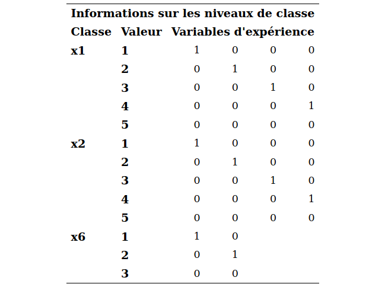
```

Le fichier `logit1_intro.sas` contient le code pour ajuster le même modèle sans la commande `class`, c’est-à-dire en créant nous-mêmes les variables indicatrices pour inclure les variables explicatives catégorielles. Vous pouvez l’exécuter afin de vous convaincre qu’il s’agit du même modèle. Les estimés seront les mêmes.

```{r fig3_e5, echo = FALSE, out.width='65%', fig.align = "center"}
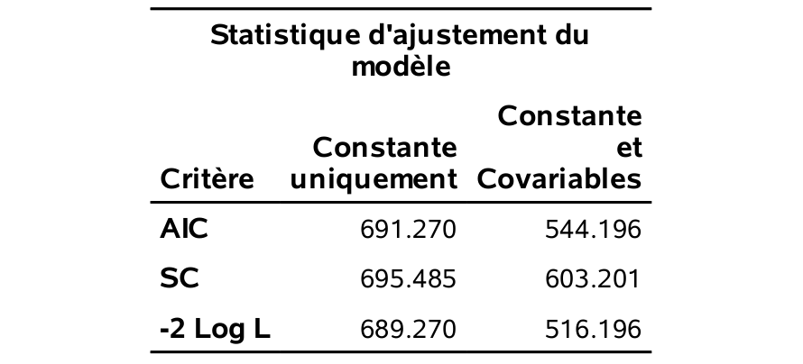
```
```{r fig3_e6, echo = FALSE, out.width='75%', fig.align = "center"}
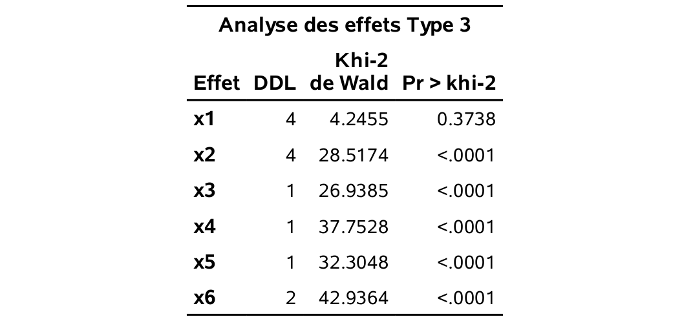
```
```{r fig3_e7, echo = FALSE, out.width='90%', fig.align = "center"}
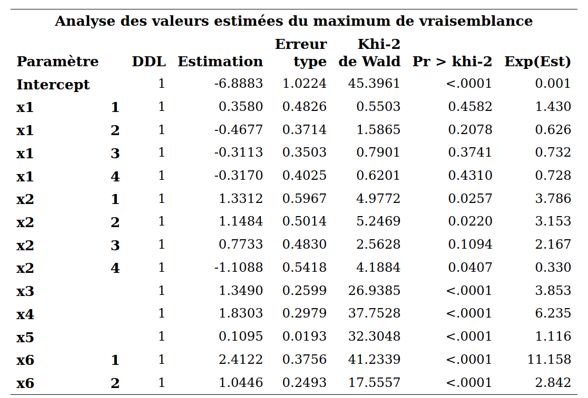
```
```{r fig3_e8, echo = FALSE, out.width='100%', fig.align = "center"}
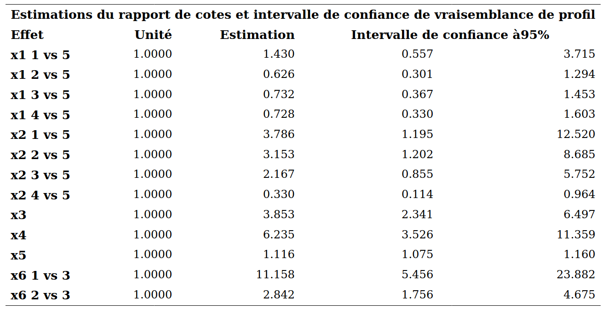
```
Le modèle ajusté est
\begin{align*}
 \logit\{\P{Y=1 \mid \boldsymbol{X}=\boldsymbol{x}}\} &= -6,89 + 0,36\I{X_1=1} - 0,47\I{X_1=2} - 0,31\I{X_1=3} - 0,32\I{X_1=4} \\& \qquad 
+ 1,33\I{X_2=1} + 1,15\I{X_2=2} + 0,77\I{X_2=3} - 1,11\I{X_2=4} \\&\qquad 
+ 1,35X_3+ 1,83X_4
+ 0,11X_5
+ 2,41\I{X_6=1} + 1,04\I{X_6=2}
\end{align*}

Notez que les variables $\I{X_1=1}$ (`x11`), $\I{X_1=21}$ (`x12`), $\I{X_1=3}$ (`x13`) et $\I{X_1=4}$ (`x14`) représentent les quatre indicatrices pour la variable $X_1$ (et de même pour $X_2$ et $X_6$). L’interprétation se fait comme en régression linéaire multiple. Ici, il n’y a pas de terme quadratique, ni d’interaction. Les paramètres estimés représentent donc l’effet de la variable correspondante sur le logit une fois que les autres variables sont dans le modèle, et demeurent fixes. 


Prenons le coefficient associé à l'âge ($X_5$) comme exmple. Le paramètre estimé est $\widehat{\beta}_{\code{age}}=0,1095$ et il est significativement différent de zéro. Ainsi, plus l’âge augmente, plus $\P{Y=1\mid \boldsymbol{X}}$ augmente, toutes autres choses étant égales par ailleurs. Pour chaque augmentation d'un an de $X_5$, la cote est multipliée par $\exp(0,1095)=1,116$, lorsque les autres variables demeurent fixes. 

N’oubliez pas la nuance suivante concernant l’interprétation d’un test lorsque plusieurs variables explicatives font partie du modèle. Si un paramètre n’est pas significativement différent de zéro, cela ne veut pas dire qu’il n’y a pas de lien entre la variable correspondante et $Y$. Cela veut seulement dire qu’il n’y a pas de lien significatif une fois que les autres variables sont dans le modèle. 


 Prenons l'exemple de la variable $X_6$, qui représente le nombre de fois où l'individu a assisté à un rodéo au cours de la dernière année. Cette variable est modélisée à l’aide de deux variables indicatrices, $\I{X_6=1}$ égale à un si $X_6=1$ et zéro autrement, et $\I{X_6=2}$  égale à un si $X_6=2$ et zéro sinon. La catégorie de référence est $X_6=3$, c’est-à-dire les personnes ayant assisté cinq fois ou moins à un rodéo au cours de la dernière année. Pour tester la significativité globale d’une variable catégorielle qui est modélisée avec plusieurs indicatrices, il faut aller dans le tableau `Analyse des effets Type 3`. On voit que la statistique de test est $42,9364$ et que la valeur-$p$ associée est négligeable: la variable $X_6$ est donc globalement significative. En fait, il s’agit du test conjoint sur toutes les indicatrices associées à cette variable. Plus précisément, il s’agit du test de l'hypothèse nulle $\Hy_0: \beta_{6_{\code{1}}}=\beta_{6_{\code{2}}}=0$ versus la contre-hypothèse qu'au moins un de ces deux paramètres est différent de zéro.

L'interprétation des variables catégorielles est analogue à celle faite en régression linéaire. On peut aussi interpréter individuellement les paramètres des indicatrices: pour $\I{X_6=1}$, lorsque les autres variables demeurent fixes, les personnes ayant assisté 10 fois ou plus à un rodéo au cours de la dernière année voient leur cote multipliée par $\exp(2,4122)=11,158$ par rapport aux personnes ayant assisté cinq fois ou moins. Ce paramètre est significativement différent de zéro car sa valeur-$p$ est négligeable (tableau `Analyse des valeurs estimées du maximum de vraisemblance`); l'intervalle de confiance à 95\% pour le  rapport de cotes, basé sur la vraisemblance profilée, est [$5,456; 23,882$] et un n'est pas dans l'intervalle.  Ainsi, il y a une différence significative entre les gens qui ont assisté à 10 rodéos ou plus et les gens qui ont assisté à 5 rodéos ou moins, pour ce qui est de l’intérêt à acheter un produit recommandé par le PRCA.

On procède de la même façon pour $\I{X_6=2}$: lorsque les autres variables demeurent fixes, les personnes ayant assisté entre six et neuf fois à un rodéo au cours de la dernière année voient leur cote multipliée par $2,842$ par rapport aux personnes ayant assisté cinq fois ou moins. Ce paramètre est aussi significativement différent de zéro. Il y a donc une progression. Plus une personne a assisté à un grand nombre de rodéo au cours de la dernière année, plus elle est intéressée à acheter un produit recommandé par la PRCA.

Si on désire comparer les deux modalités $X_6=1$ et $X_6=2$, il suffit de changer la modalité de référence dans la commande `class` et d’exécuter le modèle à nouveau. Une alternative est de calculer le rapport (de rapport) de cotes pour ces deux modalités.

### Test du rapport de vraisemblance


Les tests correspondants aux valeurs-$p$ dans le tableau des paramètres sont des tests de Wald. Ces tests feront l’affaire dans la plupart des applications. Par contre, il existe un autre test qui est généralement plus puissant, c’est-à-dire qu’il sera meilleur pour détecter que $\Hy_0$ n’est pas vraie lorsque c’est effectivement le cas. Ce test est le test du rapport de vraisemblance (_likelihood ratio test_). Il découle de la méthode d’estimation du maximum de vraisemblance et est donc généralement applicable lorsqu’on estime les paramètres avec cette méthode. Il est basé sur la quantité $\ell$ que nous avons vue plus tôt.

La procédure consiste à ajuster deux modèles **imbriqués**:

- Le premier modèle, le modèle complet, contient tous les paramètres et l'estimateur du maximum de vraisemblance $\widehat{\boldsymbol{\beta}})$.
- Le deuxième modèle correspondant à l'hypothèse nulle $\Hy_0$, le modèle réduit, contient tous les paramètres avec les restrictions imposées sous $\Hy_0$; on dénote l'estimateur du maximum de vraisemblance $\widehat{\boldsymbol{\beta}}_0$

Le test est basé sur la statistique
\begin{align*}
 D = -2\{\ell(\widehat{\boldsymbol{\beta}}_0)-\ell(\widehat{\boldsymbol{\beta}})\}
\end{align*}
ou la différence entre `-2 Log L` pour le modèle réduit et `-2 Log L` pour le modèle complet. Cette différence $D$, lorsque l’hypothèse $\Hy_0$ est vraie suit approximativement une loi khi-deux avec un nombre de degrés de liberté égal au nombre de paramètre testé (le nombre de restrictions sous $\Hy_0$). On peut donc calculer la valeur-$p$ en utilisant la distribution du khi-deux.

Prenons comme exemple le test de la significativité de $X_6$, qui est modélisée à l'aide deux variables binaires $\I{X_6=1}$ et $\I{X_6=2}$ et dont les paramètres correspondants sont $\beta_{6_{\code{1}}}$ et $\beta_{6_{\code{2}}}$. Nous avons déjà étudié la sortie pour le test de Wald de significativité globale de $X_6$, soit le test de l'hypothèse $\Hy_0: \beta_{6_{\code{1}}}=\beta_{6_{\code{2}}}=0$ versus l'alternative qu'au moins un de ces deux paramètres est différent de zéro. La statistique de test (de Wald) est 42,93 et la valeur-$p$ est moins de $10^{-4}$. Pour effectuer le test du rapport de vraisemblance, il suffit de retirer la variable $X_6$ et de réajuster le modèle à nouveau avec toutes les autres variables; cette manipulation est effectuée dans `logit1_intro.sas`. On obtient donc 
`-2 Log L` de 516,196 pour le modèle complet sans contrainte et $566,447$ pour le modèle excluant la variable $X_6$.

La différence $D = 566,447 - 516,196 = 50,25$.  Il s’agit de la statistique du test de rapport de vraisemblance. La valeur-$p$ peut-être obtenue de la loi du khi-deux avec 2 degrés de liberté via le code suivant permet d'imprimer la valeur-$p$, qui est $1,22 \times 10^{-11}$.
```{sas 03-pvallrt, eval = FALSE, echo = TRUE}
data pval;
pval=1-CDF('CHISQ', 566.447 - 516.196, 2);
run;
proc print data=pval;
run;
```
Comme la statistique du test de rapport de vraisemblance $D=50,25$ est encore plus grande est encore plus grande que la statistique de Wald ($42,9364$), qui suit la même loi de probabilité sous $\Hy_0$, cela indique que le test du rapport de vraisemblance est encore plus significatif que le test de Wald. Cela ne fait pas de différence ici mais, dans certains cas, il est possible que le test de Wald ne soit pas significatif (valeur-$p$ plus grande que $0,05$) tandis que le test du rapport de vraisemblance le soit (valeur-$p$ inférieure à $0,05$). 

### Multicolinéarité

Rappelez-vous que le terme multicolinéarité fait référence à la situation où les variables explicatives sont très corrélées entre elles ou bien, plus généralement, à la situation où une (ou plusieurs) variable(s) explicative(s) est (sont) très corrélée(s) à une combinaison linéaire des autres variables explicatives.

L’effet potentiellement néfaste de la multicolinéarité est le même qu’en régression linéaire, c’est-à-dire, elle peut réduire la précision des estimations des paramètres (augmenter leurs écarts-types estimés).

En pratique, le problème est qu’il devient difficile de départager l’effet individuel d’une variable explicative lorsqu’elle est fortement corrélée avec d’autres variables explicatives.

Comme la multicolinéarité est une propriété des variables explicatives (le $Y$ n’intervient pas) on peut utiliser les mêmes outils qu’en régression linéaire pour tenter de la détecter, par exemple, le facteur d'inflation de la variance (_variance inflation factor_). Cette quantité ne dépend que des variables explicatives $\bs{X}$, pas du modèle ou de la variable réponse.

La multicolinéarité est surtout un problème lorsque vient le temps d’interpréter et tester l’effet des paramètres individuels. Si le but est seulement de faire de la classification (prédiction) et que l’interprétation des paramètres individuels n’est pas cruciale alors il n’y a pas lieu de se soucier de la multicolinéarité. Il faut alors plutôt comparer correctement la performance de classification des modèles en utilisant des méthodes permettant d’obtenir un bon modèle tout en se protégeant contre le surajustement. Certaines de ces méthodes (division de l’échantillon, validation croisée) ont déjà été présentées.

## Classification et prédiction à l’aide de la régression logistique

La finalité du modèle de régression logistique est fréquemment l'obtention de prédictions. Une fois qu’on a ajusté un modèle, on peut l’utiliser pour prévoir la valeur de $Y$ pour de nouvelles observations. Ceci consiste à assigner une classe ($0$ ou $1$) à ces observations (pour lesquels $Y$ est inconnue) à partir des valeurs prises par $X_1, \ldots, X_p$.

Le modèle ajusté nous fournit une estimation de $\P{Y=1 \mid \bs{X}=\bs{x}}$ pour des valeurs $X_1=x_1, \ldots, X_p=x_p$ données. Cet estimé est
\begin{align*}
 \widehat{p} = \frac{1}{1+ \exp\{- ( \widehat{\beta}_0 + \widehat{\beta}_1x_1 + \cdots + \widehat{\beta}_p x_p)\}}.
\end{align*}


Classification de base: pour classifier des observations, il suffit de choisir un point de coupure $c$, souvent $c=0,5$, et de classifier une observation de la manière suivante:

- Si $\widehat{p} < c$, on assigne cette observation à la catégorie zéro et $\widehat{Y}=0$.
- Si $\widehat{p} \geq c$, on assigne cette observation à la catégorie un et $\widehat{Y}=1$.

Si on prend $c=0,5$ comme point de coupure, cela revient à assigner l’observation à la classe (catégorie) la plus probable, un choix fort raisonnable. Nous verrons dans une section suivante que, lorsque les conséquences de faussement classifier une observation (succès, mais échec prédit et vice-versa) ne sont pas les mêmes, il peut être avantageux d’utiliser un autre point de coupure.


Dans un cadre de prédiction, il nous faudra un critère pour juger de la qualité de l'ajustement du modèle.
Rappelez-vous que pour une réponse continue, nous avons utilisé l'erreur moyenne quadratique,
$\mathsf{EMQ} = \mathsf{E}\{(Y-\widehat{Y})^2\}$,
pour juger de la performance d’un modèle. Comme la réponse $Y$ est binaire ici, nous allons utiliser des critères différents.

Voyons d’abord un premier critère pour juger de la qualité d’un modèle de prédiction. Soit $Y$ la vraie valeur de la réponse binaire et $\widehat{Y}$ (soit 0 ou 1) la valeur de $Y$ prédite par un modèle pour une observation choisie au hasard dans la population. Un premier critère pour juger de la performance d’un modèle est $\P{Y \neq\widehat{Y}}$, soit la probabilité de mal classifier une observation choisie au hasard dans
la population. Ce critère est le **taux de mauvaise classification**. Plus $\P{Y \neq\widehat{Y}}$ est petite, meilleure est la capacité prédictive du modèle.


Tout comme l'erreur moyenne quadratique, on ne peut pas calculer exactement le taux de mauvaise classification; tout au plus peut-on l'estimer. Pour les raisons vues au chapitre précédent, l’estimer en
calculant le taux de mauvaise classification des observations ayant servi à
l’ajustement du modèle sans aucune correction n’est pas une bonne approche.
Les approches couvertes dans le dernier chapitre pour l'estimation de l'erreur moyenne quadratique, telles la validation-croisée et la
division de l’échantillon, peuvent être utilisées pour estimer le taux de mauvaise classification $\P{Y \neq \widehat{Y}}$.


Cette utilisation d’un modèle de régression logistique sera illustrée avec l’exemple que nous avons traité au chapitre précédent: notre objectif final est de construire un modèle avec les 1000 clients de l'échantillon d'apprentissage et cibler ensuite lesquels des 100 000 clients restants seront choisis pour recevoir le catalogue. Les variables cibles sont:

- `yachat`: variable binaire égale à un si le client a acheté quelque chose dans le catalogue et zéro sinon.
- `ymontant`: le montant de l’achat si le client a acheté quelque chose


Les 10 variables suivantes sont disponibles pour tous les clients et serviront de variables explicatives,

- `x1`: sexe de l'individu, soit homme (0) ou femme (1);
- `x2`: l'âge (en année);
- `x3`: variable catégorielle indiquant le revenu, soit moins de 35 000\$ (1), entre 35 000\$ et 75 000\$ (2) ou plus de 75 000$ (3);
- `x4`: variable catégorielle indiquant la région où habite le client (de 1 à 5);
- `x5`: conjoint : le client a-t-il un conjoint, soit oui (1) ou non (0);
- `x6`: nombre d’année depuis que le client est avec la compagnie;
- `x7`: nombre de semaines depuis le dernier achat;
- `x8`: montant (en dollars) du dernier achat;
- `x9`: montant total (en dollars) dépensé depuis un an;
- `x10`: nombre d’achats différents depuis un an.


Dans le chapitre précédent, nous avons cherché à développer un modèle pour prévoir `ymontant`, le montant dépensé, étant donné que le client achète quelque chose. Cette fois-ci, nous allons travailler avec la variable `yachat`, qui est binaire, à l’aide de la régression logistique. 

Afin d’introduire différentes notions, nous allons, dans un premier temps, utiliser les 10 variables de base. À partir de la section suivante, nous chercherons à optimiser le modèle en considérant les interactions d’ordre deux. Pour ce faire, nous utiliserons des méthodes de sélections de variables. Les commandes se trouvent dans le fichier `logit2_classification_base.sas`. Dans le code qui suit, le fichier `train` contient les 1000 clients de l’échantillon d’apprentissage et le fichier `test` contient les 100 000 clients pour lesquels on veut prédire l'intention d'achat.

```{sas 03-score, eval = FALSE, echo = TRUE}
proc logistic data=train;
model yachat(ref='0') = x1 x2 x31 x32 x41 x42 x43 x44 x5 x6 x7 x8 x9 x10;
output out=pred predprobs=crossvalidate;
run;
```

Le modèle utilise seulement les 10 variables de base (en fait 14 avec les indicatrices pour les variables catégorielles). Des prévisions pour les clients restants seront exportées dans le fichier `pred`, grâce à la commande `score`. L’option `ctable` permet d'obtenir la `Table de classification` (sic). Tel que nous l’avons vu au chapitre précédent, il y a 210 clients qui ont acheté quelque chose parmi les 1000.  Le tableau de classification contient des estimations de plusieurs quantités intéressantes, en faisant varier le point de coupure (`Niveau de proba`). Pour chaque point de coupure, ces estimations ont été obtenues à l’aide d’une approximation de la méthode de validation croisée à $n$ groupes (en anglais, _leave-one-out cross-validation_, ou LOOCV). Ainsi, ces estimations sont valides car elles ne sont pas obtenues en utilisant les mêmes observations que celles qui ont servi à estimer le modèle.

```{r classification, echo = FALSE, eval = TRUE, cache = TRUE}
url <- "https://lbelzile.bitbucket.io/MATH60602/dbm.sas7bdat"
dbm <- haven::read_sas(url)
# Transformer les variables catégorielles en facteurs
dbm$x3 <- factor(dbm$x3)
dbm$x4 <- factor(dbm$x4)
# Ne conserver que l'échantillon d'apprentissage
train <- dbm[(dbm$train == 1),]
# Formule pour la moyenne du modèle logistique
form <- formula("yachat ~ x1 + x2 + x3 + x4 + x5 + x6 + x7 + x8 + x9 + x10")
# Créer un conteneur pour les probabilités
n <- nrow(train)
loocv_prob <- rep(0, n)
# Calculer la prédiction avec validation croisée (n groupes)
# On retourne la probabilité de façon à obtenir le taux de mauvaise classification
# la sensibilité et la spécificité pour différents seuils
for(i in 1:n){
   mod <- glm(data = train, 
              formula = form, 
              family=binomial(link="logit"),
              subset = -i)
   loocv_prob[i] <- predict(mod, newdata = train[i,], type = "response")
}
# Histogramme des probabilités prédites par validation croisée avec n groupes
hist(loocv_prob, 
     breaks = 25, 
     xlab = "Probabilité d'achat prédite", 
     ylab = "densité", main = "")
#  Modèle complet et valeurs prédites
train_prob <- fitted(glm(data = train, 
                         formula = form, 
                         family=binomial), 
                     type = "response") 

perfo <- function(prob, resp, plot = FALSE){
   # VRAI == 1, FAUX == 0
   cuts <- seq(from = 0.005, to = 0.995, by = 0.005)
   tab <- data.frame(coupe = cuts,
      t(sapply(cuts, function(cut){
   nsucces <- sum(resp == 1)
   nechec <- length(resp) - nsucces
   n <- length(resp)
   predy <- ifelse(prob >= cut, 1, 0) 
   c1 <- sum(predy & resp) # Y=1, Yhat=1
   c0 <- sum(!predy & !resp) # Y=0, Yhat=0
   i1 <- sum(!predy & resp) # Y=1, Yhat=0
   i0 <- sum(predy & !resp) # Y=0, Yhat=1
   c(c1 = c1, 
     c0 = c0, 
     i0 = i0,
     i1 = i1,      
     pcorrect = 100*(c0+c1)/n, 
     sensi = 100*c1/(c1+i1), # Y=1 & Yhat=1 / # Y=1
     speci = 100*c0/(c0+i0), # Y=0 & Yhat=0 / # Y=0
     fpos = 100*i0/(c1+i0), # Y=0 & Yhat=1 / # Yhat=1
     fneg = 100*i1/(c0+i1)) # Y=1 & Yhat=0 / # Yhat=0
   })))
   if(plot){
     plot(c(1,1-tab$speci/100,0), c(1,tab$sensi/100,0), type = "l", pty = "s", bty = "l", 
          xlab = "1-spécificité", 
          ylab = "sensibilité", 
          main ="Fonction d'efficacité du récepteur (ROC)",
          panel.first = abline(a=0,b=1), 
          ylim = c(0,1), xlim = c(0,1), yaxs = "i", xaxs = "i")
   }
   invisible(list(cut = tab[which.max(tab$pcorrect),"coupe"],
        confusion = matrix(tab[which.max(tab$pcorrect), c(2,5,4,3)], nrow = 2, ncol = 2),
        table = tab[seq(4, by = 4, length.out = 49),]))
   
}

# Performance du modèle avec données d'apprentissage
perfo0 <- perfo(prob = train_prob, resp = train$yachat)
perfo1 <- perfo(prob = loocv_prob, resp = train$yachat)
knitr::kable(perfo1$table, digits = c(2, rep(0,4), rep(1,5)), 
             col.names = c("coupe",
                            "vrai positif",
                           "vrai négatif",
                           "faux positif",
                           "faux négatif",
                           "correct (%)",
                           "sensibilité (%)",
                           "spécificité (%)",
                           "faux positif (%)",
                           "faux négatif (%)"),
             escape = TRUE)

# La fonction cv.glm permet aussi de faire la validation croisée, 
# Définir une fonction de coût, mais pour un seul point de coupure
# cost <- function(yachat, pi = 0){ 1-mean(abs(yachat - (pi > 0.56)))}
# vcboot <- boot::cv.glm(data = train, 
#                         glmfit = glm(data = train, 
#                                      formula = form, family=binomial), 
#                                      cost = cost)$delta
```

Ce tableau contient des estimations de plusieurs quantités intéressantes, en faisant varier le point de coupure (_Niveau de proba_). Pour chaque point de coupure, ces estimations ont été obtenues à l’aide de la validation-croisée $n$ observations, soit autant de groupes que d’observations. Ainsi, ces estimations sont valides car elles ne sont pas obtenues en utilisant les mêmes observations que celles qui ont servi à estimer le modèle.
La colonne `correct` donne une estimation du taux de bonne classification, $\P{Y = \hat{Y}} = 1-\P{Y \neq \hat{Y}}$, ou de manière équivalente un moins le taux de mauvaise classification.

Avec un point de coupure de $0$, on classifie toutes les observations à la classe achat ($1$), car $\hat{p}$ est forcément plus grande que zéro. Le taux de bonne classification dans ce cas de figure sera de $21$\%, puisque 210 individus ont acheté un produit dans le catalogue dans l'échantillon d'apprentissage.
L'autre extrême, avec un point de coupure $c=1$, donne un taux de bonne classification de $79$\%.

On peut chercher dans le tableau les points de coupure qui donnent le meilleur taux de bonne classification. Ce dernier est de 84,6\% et est atteint par trois points de coupure, soit 0,52, soit 0,6, soit 0,62. Une recherche plus fine donne 0,465 comme point de coupure optimal, avec un taux de mauvaise classification de 15,3%\.

La **matrice de confusion**, qui compare les vraies valeurs avec les prédictions, peut être construite à partir des colonnes `Correct - Événement`, `Correct - Non-événement`, `Incorrect - Événement`, `Incorrect - Non-événement`. Il y a deux classifications possibles et le tableau contient, en partant du coin supérieur gauche et dans le sens des aiguilles d'une montre, le nombre de vrai positif ($Y=1, \hat{Y}=1$), de faux positif ($Y=0, \hat{Y}=1$), de vrai négatif ($Y=0, \hat{Y}=0$) et finalement de faux négatif ($Y=1, \hat{Y}=0$). Ces nombres proviennent de la validation croisée à $n$ groupes et ne sont pas ceux qu'on obtiendrait si on appliquait directement le modèle ajusté à notre échantillon. Le taux de classification est $(\mathsf{FP}+\mathsf{FN})/n$.


```{r confumat, eval = TRUE, echo = FALSE, }
confumat <- perfo1$confusion
rownames(confumat) <- c("$\\hat{Y}=0$","$\\hat{Y}=1$")
colnames(confumat) <- c("$Y=0$","$Y=1$")
knitr::kable(x = confumat, align = "r", 
             caption = paste0("Matrice de confusion avec point de coupure ", perfo1$cut))  

```

Quatre autres quantités, dérivées à partir de la matrice de confusion, sont parfois utilisées: 

- la **sensibilité** (_sensitivity_), $\P{\hat{Y}=1 \mid Y=1}$, ou $\mathsf{VP}/(\mathsf{VP}+\mathsf{FN})$;
- la **spécificité** (_specificity_), $\P{\hat{Y}=0 \mid Y=0}$, ou $\mathsf{VN}/(\mathsf{VN}+\mathsf{FP})$;
- le **taux de faux positifs**, $\P{Y=0 \mid \hat{Y}=1}$, ou $\mathsf{FP}/(\mathsf{VP}+\mathsf{FP})$;
- le **taux de faux négatifs**, $\P{Y=1 \mid \hat{Y}=0}$, ou $\mathsf{FN}/(\mathsf{VN}+\mathsf{FN})$.

Les estimés empiriques sont simplement obtenus en calculant les rapports du nombre d'observations dans chaque classe. La sensibilité mesure à quel point notre modèle est performant pour détecter un vrai positif (classe 1). La spécificité mesure à quel point notre modèle est performant pour détecter un résultat négatif (classe 0).


Plus le point de coupure augmente, plus la sensibilité et le taux de faux positifs diminuent mais plus la spécificité et le taux de faux négatifs augmentent.

La ** fonction d’efficacité du récepteur**, parfois appelée courbe ROC (_receiver operating characteristic_) est parfois utilisée pour représenter globalement la performance du modèle. Elle
est obtenue avec l’option `plots(only)=(roc)` dans **SAS**. Il s’agit du graphe de la sensibilité
en fonction de un moins la spécificité, en faisant varier le point de coupure. Un modèle
parfait aurait une sensibilité et une spécificité égales à 1 (correspondant au coin supérieur gauche de la fonction d'efficacité du récepteur). Ainsi, plus le couple ($1-$spécificité,
sensibilité) est près de ($0,1$), meilleur est le modèle. Par conséquent, plus la
courbe ROC tend vers ($0,1$) meilleur est le pouvoir prévisionnel des variables.
L'**aire sous la courbe** (_area under the curve_) est souvent utilisée en parallèle
est simplement l'aire sous la courbe de la fonction d'efficacité du récepteur. Pour le modèle logistique ajusté, on a une aire sous la courbe de 0,8847. Plus cette valeur est élevée (au plus $1$), mieux c’est.


```{r fig3_e11, echo = FALSE, out.width='80%', fig.align = "center"}
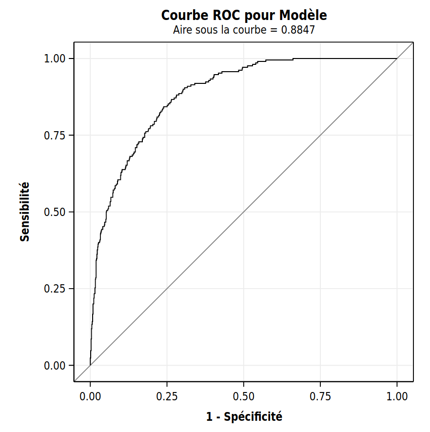
```


La courbe ROC et la valeur de l'aire sous la courbe (avec l’option `plots(only)=(roc)`), sont calculées avec les données d’apprentissage et ne sont pas corrigées. Si on veut les utiliser pour comparer des modèles, il faut plutôt utiliser l’option `crossvalidate` qui permet d’obtenir des estimations des probabilités par validation-croisée avec $n$ groupes tout comme celle utilisée dans le tableau de classification.

```{sas 03-rocok, eval = FALSE, echo = TRUE}
proc logistic data=train;
model yachat(ref='0') = x1 x2 x31 x32 x41 x42 x43 x44 x5 x6 x7 x8 x9 x10;
output out=pred predprobs=crossvalidate;
run;

proc logistic data=pred ;
model yachat(ref='0') = x1 x2 x31 x32 x41 x42 x43 x44 x5 x6 x7 x8 x9 x10;
roc pred=xp_1;
run;
```

On sauvegarde d'abord les probabilités estimées par validation-croisée dans le
fichier `pred` avec la commande `output out=pred predprobs=crossvalidate`
La variable `xp_1` désigne cette probabilité dans le fichier `pred`. Ensuite, on
exécute de nouveau la procédure `logistic` avec ce fichier et la commande `roc`.
L'aire sous la courbe pour les prédictions avec la validation-croisée à $n$ groupes est 0,8723: cet estimé est légèrement inférieur à celui obtenu sans
la correction (trop optimiste) qui est 0,8847.

```{r fig3_e15, echo = FALSE, out.width='80%', fig.align = "center"}
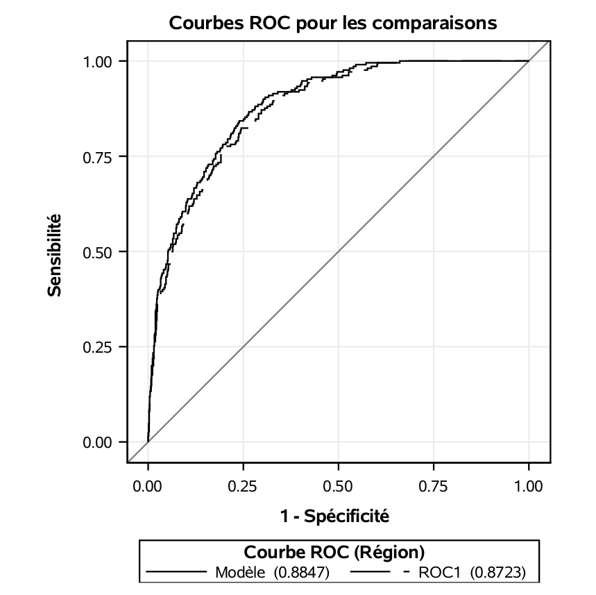
```


Un autre type de graphe qui est souvent utilisé dans des contextes de gestion
est la courbe lift (sic) (en anglais, _lift chart). Cette courbe est obtenue en ordonnant les probabilités de succès estimées par le modèle, $\hat{p}$, en ordre croissant et en regardant quelle pourcentage de ces derniers seraient bien classifiés (le nombre de vrais positifs sur le nombre de succès).


**SAS** ne permet pas de la tracer directement, mais le fichier `logit3_lift_chart.sas` contient une macro **SAS** qui permet de le faire.

```{sas liftchart, eval = FALSE, echo = TRUE}
proc logistic data=train;
model yachat(ref='0') = x1 x2 x31 x32 x41 x42 x43 x44 x5 x6 x7 x8 x9 x10; 
output out=pred predprobs=crossvalidate;
run;
%liftchart1(pred,yachat,xp_1,10);
```


Ici, le tableau présente les 10 déciles. Si on classifiait comme acheteurs les 10\% qui ont la plus forte probabilité estimée d'achat, on détecterait 79 des 210 clients (37,6\%). En comparaison, on s'attend que 21 clients soient sélectionnés en moyenne si on prend un échantillon aléatoire de 100 personnes. Le ratio 79/21 (dernière colonne) est le _lift_ du modèle: il permet de détecter 3,76 fois plus de succès que le hasard.

```{r fig3_e16, echo = FALSE, out.width='80%', fig.align = "center"}
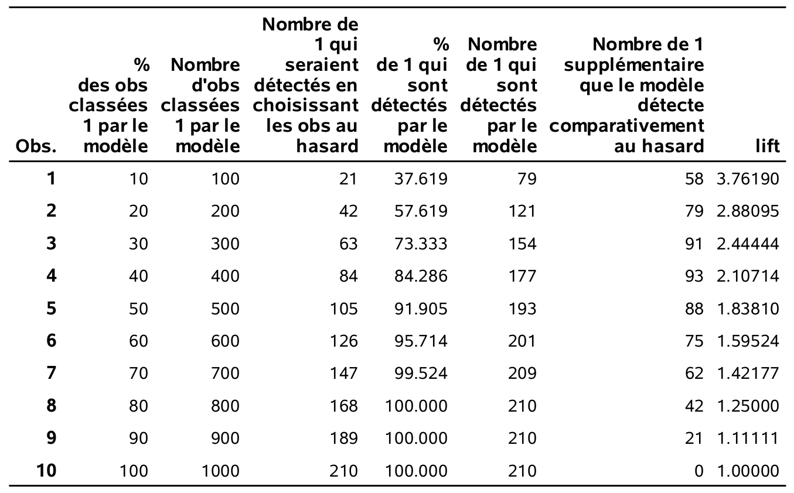
```

Le graphe \@ref(fig:fig3_e17) présente le pourcentage d'observations bien classées parmi les variables (pourcentage des probabilités prédites qui correspondent à un succès parmi les $k$ plus susceptibles selon le modèle). La référence est la ligne diagonale, qui correspond à une détection aléatoire.

```{r fig3_e17, echo = FALSE, out.width='80%', fig.align = "center"}
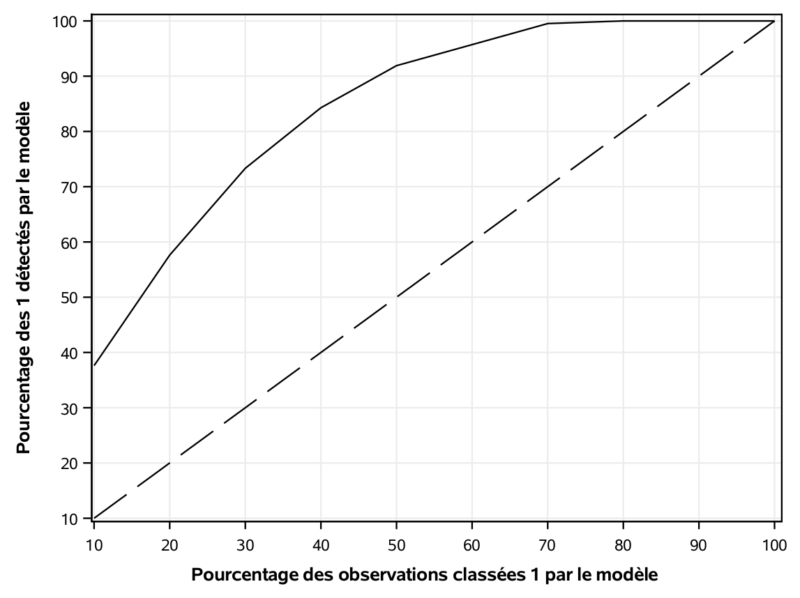
```

## Classification avec une matrice de gain

Utiliser le taux de mauvaise classification P(Y), comme critère de performance, revient au même que d’utiliser le taux de bonne classification P(Y), car P(Y) = 1- P(Y). On veut un modèle avec un haut taux de bonne classification (ou un faible taux de mauvaise classification).

Lorsqu’on utilise $\P(Y \neq \hat{Y}}$ comme critère pour juger de la qualité d’un modèle prévisionnel, on fait l’hypothèse que le gain associé à bien classifier une observation dans la catégorie 0 lorsqu’elle est réellement dans la catégorie 0 est le même que celui associé à classifier une observation dans la catégorie 1 lorsqu’elle est réellement dans la catégorie 1: cela correspond à la matrice de gain 

 
Table: (\#tab:03-gain1) Matrice de gain correspondant au taux de bonne classification 
|            |             | observation |       |
|------------|-------------|-------------|-------|
|            | gain        | $Y=1$       | $Y=0$ |
| prédiction | $\hat{Y}=1$ | 1           | 0     |
|            | $\hat{Y}=0$ | 0           | 1     |
 
C’est-à-dire, le gain vaut 1 lorsque la prévision est bonne (les deux cas sur la diagonale) et 0 lorsque le modèle se trompe (les deux autres cas). L’unité de mesure du gain n’est pas importante pour l’instant. Le gain total est 

\begin{align*}
\text{gain} &= 1 \P{\hat{Y}=1, Y=1} + 1 \P{\hat{Y}=0, Y=0} 
\\ &\quad + 0 \P{\hat{Y}=1, Y=0}  + 0 \P{\hat{Y}=0, Y=1}
\\& = \P{Y = \hat{Y}}.
\end{align*}
Maximiser le gain total revient donc à maximiser le taux de bonne classification.

Dans certaines situations, les gains (ou la perte si le gain est négatif) associés aux bonnes décisions et aux erreurs ne sont pas équivalents. Par exemple, un des types d’erreurs peut être plus grave que l’autre.  Il peut alors être souhaitable d’en tenir compte dans le choix du modèle de classification. 

Supposons que le gain de classer une observation à $i$ (0 ou 1) lorsqu’elle vaut $j$ (0 ou 1) en réalité est de $c_{ij}$. La matrice de gain est alors

Table: (\#tab:03-gain2) Matrice de gain pondérée en fonction d'un coût
|            |             | observation |          |
|------------|-------------|-------------|----------|
|            | gain        | $Y=1$       | $Y=0$    |
| prédiction | $\hat{Y}=1$ | $c_{11}$    | $c_{10}$ |
|            | $\hat{Y}=0$ | $c_{01}$    | $c_{00}$ |
 
En pratique, l’une de ces quatre quantités peut être fixée à 1 car seulement les poids relatifs (les ratios) des gains sont importants. Dans ce cas, le gain moyen est
\begin{align*}
\text{gain} &= c_{11} \P{\hat{Y}=1, Y=1} + c_{00}\P{\hat{Y}=0, Y=0} 
\\ &\quad + c_{10} \P{\hat{Y}=1, Y=0}  + c_{01} \P{\hat{Y}=0, Y=1}
\\& = \P{Y = \hat{Y}}.
\end{align*}

Le meilleur modèle est alors celui qui maximise le gain moyen. Le fichier `logit4_macro_gain.sas` contient des macros **SAS** qui permettent d’estimer le gain moyen à l’aide de la validation croisée.


Nous allons encore une fois seulement utiliser les 10 variables de base. Mais nous allons intégrer des revenus et coûts afin de trouver le meilleur point de coupure. Rappelez-vous que le coût de l’envoi d’un catalogue est de 10\$. Le tableau des variables descriptives qui suit montre que, pour les 210 clients qui ont acheté quelque chose, le revenu moyen est de 67,29\$ (moyenne de la variable `ymontant`).

```{r fig3_e18, echo = FALSE, out.width='60%', fig.align = "center"}
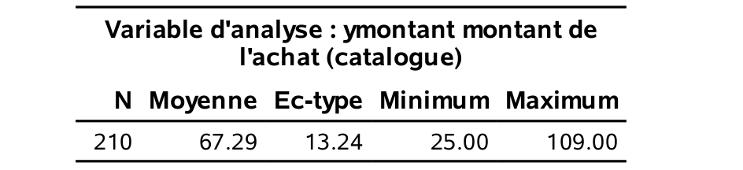
```

Nous allons travailler en termes de revenu net. Nous pouvons donc spécifier la matrice de gain du tableau \@ref(tab:03-gain3) pour notre problème. Si on n'envoit pas de catalogue, notre gain est nul. Si on envoie le catalogue à un client qui n'achète pas, on perd 10\$ (le coût de l'envoi). En revanche, notre revenu net est de 57\$ (revenu moyen moins coût de l'envoi).

Table: (\#tab:03-gain3) Matrice de gain pour l'envoi de catalogue
|            |             | observation |       |
|------------|-------------|-------------|-------|
|            | gain        | $Y=1$       | $Y=0$ |
| prédiction | $\hat{Y}=1$ | 57          | $-10$ |
|            | $\hat{Y}=0$ | 0           | 0     |

L'apel de la macro `manycut_cvlogistic` se fait de la manière suivante:
```{sas manycutmacro, eval = FALSE, echo = TRUE}
%manycut_cvlogistic(yvar=yachat,xvar=x1  x2 x31 x32 x41 x42 x43 x44  x5  x6 x7 x8 x9 x10, n=1000,k=10,ncv=10,dataset=train,c00=0,c01=0,c10=-10,c11=57,
manycut=.05 .06 .07 .08 .09 .1 .11 .12 .13 .14 .15 .16 .17 .18 .5);
```

Les paramètres sont expliqués dans le fichier.

Cette macro produit le tableau suivant. Il donne l’estimation du gain moyen (`gain`) pour différents points de coupures (`cutpoint`). Cette estimation provient d’une validation-croisée avec 10 groupes (`k=10` dans la macro). En fait, on a répété 10 fois (`ncv=10` dans la macro) la validation croisée avec 10 groupes et fait la moyenne des 10 répétitions afin d’avoir plus de précisions. Il faut essayer plusieurs points de coupure afin de trouver le meilleur.

On voit que le meilleur point de coupure, celui qui maximise le gain est 0,12. Avec ce point de coupure, on estime que le taux de bonne classification est de 0,707 et que la sensitivité est de 0,899. Ainsi, on estime qu’on va détecter 90\% des clients qui achètent. 
```{r fig3_e19, echo = FALSE, out.width='60%', fig.align = "center"}
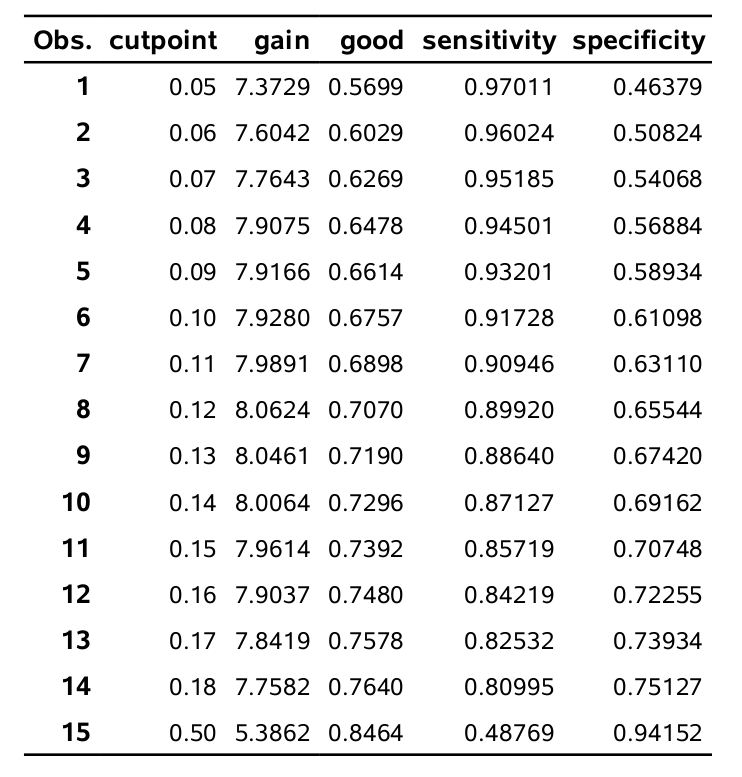
```

 On est loin du point de coupure usuel de 0,5 (présenté à la dernière ligne). La raison est simple. Comme il est très coûteux de rater un client qui aurait acheté quelque chose, il est préférable d’envoyer le catalogue à plus de clients, quitte à ce que plusieurs d’entre eux n’achètent rien. En fait, le point de coupure de 0,5 donne un meilleur taux de bonne classification mais un gain moyen plus faible car on rate trop de clients qui achètent (la sensitivité est seulement de 48,8%). Travailler avec la matrice de gain permet de trouver le point de coupure optimal en incorporant des notions de coûts et profits.

Ici, nous avons ajusté un seul modèle, celui contenant uniquement les 10 variables de base et nous nous sommes attardés au choix du point de coupure pour l’assignation aux classes. Il est possible qu’un autre modèle, contenant par exemple des termes d’interactions, des termes quadratiques ou d’autres transformations des variables, soit supérieur à celui-ci. Le choix du modèle de prévision se fait donc souvent en deux étapes

1. trouver les bonnes variables
2. trouver le bon point de coupure. 

Nous avons déjà vu des méthodes de sélections de variables au chapitre précédent. La section suivante reviendra sur ces méthodes dans le contexte de la régression logistique.