# Sélection de variables et de modèles {#selection-modele}

## Introduction 

Ce chapitre présente des principes, outils et méthodes très généraux pour choisir un « bon » modèle. Nous allons principalement utiliser la régression linéaire pour illustrer les méthodes en supposant que tout le monde connaît ce modèle de base. Les méthodes présentées sont en revanche très générales et peuvent être appliquées avec n'importe quel autre modèle (régression logistique, arbres de classification et régression, réseaux de neurones, analyse de survie, etc.) 


L'expression « sélection de variables » fait référence à la situation où l'on cherche à sélectionner un sous-ensemble de variables à inclure dans notre modèle à partir d'un ensemble de variables $X_1, \ldots, X_p$. Le terme variable ici inclut autant des variables distinctes que des transformations d'une ou plusieurs variables. 

Par exemple, supposons que les variables `age`, `sexe` et `revenu` sont trois variables explicatives disponibles. Nous pourrions alors considérer choisir entre ces trois variables. Mais aussi, nous pourrions considérer inclure $\mathrm{age}^2$, $\mathrm{age}^3$, $\log(\mathrm{age})$, etc. Nous pourrions aussi considérer des termes d'interactions entre les variables, comme $\mathrm{age} \cdot \mathrm{revenu}$ ou $\mathrm{age}\cdot\mathrm{revenu}\cdot\mathrm{sexe}$. Le problème est alors de trouver un bon sous-ensemble de variables parmi toutes celles considérées.

L'expression « sélection de modèle » est un peu plus générale. D'une part, elle inclut la sélection de variables car, pour une famille de modèles spécifiques (régression linéaire par exemple), choisir un sous-ensemble de variables revient à choisir un modèle. D'autre part, elle est plus générale car elle peut aussi faire référence à la situation où l'on cherche à trouver le meilleur modèle parmi des modèles de natures différentes. Par exemple, on pourrait choisir entre une régression linéaire, un arbre de régression, une forêt aléatoire, un réseau de neurones, etc. 


## Sélection de variables et de modèles selon les buts de l'étude


Nous disposons d'une variable réponse $Y$ et d'un ensemble de variables explicatives $X_1, \ldots, X_p$. L'attitude à adopter dépend des buts de l'étude.

1e situation : On veut développer un modèle pour faire des prédictions sans qu'il soit important de tester formellement les effets des paramètres individuels.

Dans ce cas, on désire seulement que notre modèle soit performant pour prédire des valeurs futures de $Y$. On peut alors baser notre choix de variable (et de modèle) en utilisant des outils qui nous guiderons quant aux performances prédictives futures du modèle (voir $\mathsf{AIC}$, $\mathsf{BIC}$ et validation croisée plus loin). On pourra enlever ou rajouter des variables et des transformations de variables au besoin afin d'améliorer les performances prédictives. Les méthodes que nous allons voir concernent essentiellement ce contexte.


2e situation : On veut développer un modèle pour estimer les effets de certaines variables sur notre $Y$ et tester des hypothèses de recherche spécifiques concernant certaines variables. 

Dans ce cas, il est préférable de spécifier le modèle dès le départ selon des considérations scientifiques et de s'en tenir à lui. Faire une sélection de variables dans ce cas est dangereux car on ne peut pas utiliser directement les valeurs-_p_ des tests d'hypothèses (ou les intervalles de confiance sur les paramètres) concernant les paramètres du modèle final car elles ne tiennent pas compte de la variabilité due au processus de sélection de variables. 

Une bonne planification de l'étude est alors cruciale afin de collecter les bonnes variables, de spécifier le ou les bons modèles, et de s'assurer d'avoir suffisamment d'observations pour ajuster le ou les modèles désirés. 

Si procéder à une sélection de variables est quand même nécessaire dans ce contexte, il est quand même possible de le faire en divisant l'échantillon en deux. La sélection de variables pourrait être alors effectuée avec le premier échantillon. Une fois qu'un modèle est retenu, on pourrait alors réajuster ce modèle avec le deuxième échantillon (sans faire de sélection de variables cette fois-ci). L'inférence sur les paramètres (valeurs-_p_, etc.) sera alors valide. Le désavantage ici qu'il faut avoir une très grande taille d'échantillon au départ afin d'être en mesure de le diviser en deux.

## Mieux vaut plus que moins

Il est préférable d'avoir un modèle un peu trop complexe qu'un modèle trop simple. Plaçons-nous dans le contexte de la régression linéaire et supposons que le vrai modèle est inclus dans le modèle qui a été ajusté. Il y a donc des variables en trop dans le modèle qui a été ajusté. Le modèle ajusté est surspécifié.

Par exemple, supposons que le vrai modèle est $Y=\beta_0+\beta_1X_1+\varepsilon$ mais que c'est le modèle $Y=\beta_0+\beta_1X_1+\beta_2X_2+\varepsilon$ qui a été ajusté. Dans ce cas, règle générale, les estimateurs des paramètres et les prédictions provenant du modèle sont sans biais. Mais leurs variances estimées seront un peu plus élevées car on estime des paramètres pour des variables superflues.

Supposons à l'inverse qu'il manque des variables dans le modèle ajusté et que le modèle ajusté est sous-spécifié. Par exemple, supposons que le vrai modèle est $Y=\beta_0+\beta_1X_1+\beta_2X_2+\varepsilon$, mais que c'est le modèle $Y=\beta_0+\beta_1X_1+\varepsilon$ qui a été ajusté. Dans ce cas, généralement, les estimateurs des paramètres et les prédictions sont biaisés. 

Ainsi, il est généralement préférable d'avoir un modèle légèrement surspécifié qu'un modèle sous-spécifié. Plus généralement, il est préférable d'avoir un peu trop de variables dans le modèle que de prendre le risque d'omettre une ou plusieurs variables importantes. Encore plus généralement, il est préférable d'avoir un modèle un peu trop complexe que d'avoir un modèle trop simple. 

Il faut faire attention et ne pas tomber dans l'excès et avoir un modèle trop complexe (avec trop de variables inutiles) car il pourrait souffrir de surajustement (_over-fitting_). Les exemples qui suivent illustreront ce fait.

## Trop beau pour être vrai

Cette section traite de l'optimisme de l'évaluation d'un modèle lorsqu'on utilise les mêmes données qui ont servies à l'ajuster pour évaluer sa performance. Un principe fondamental lorsque vient le temps d'évaluer la performance prédictive d'un modèle est le suivant : si on utilise les mêmes observations pour évaluer la performance d'un modèle que celles qui ont servi à l'ajuster (à estimer le modèle et ses paramètres), on va surestimer sa performance. Autrement dit, notre estimation de l'erreur que fera le modèle pour prédire des observations futures sera biaisée à la baisse. Ainsi, il aura l'air meilleur que ce qu'il est en réalité. C'est comme si on demandait à un cinéaste d'évaluer son dernier film. Comme c'est son film, il n'aura généralement pas un regard objectif. C'est pourquoi on aura tendance à se fier à l'opinion d'un critique.

On cherchera donc à utiliser des outils et méthodes qui nous donneront l'heure juste (une évaluation objective) quant à la performance prédictive d'un modèle.

## Principes généraux

Les idées présentées ici seront illustrées à l'aide de la régression linéaire. Par contre, elles sont valides dans à peu près n'importe quel contexte de modélisation. 

Plaçons-nous d'abord dans un contexte plus général que celui de la régression linéaire. Supposons que l'on dispose de $n$ observations indépendantes sur ($Y, X_1, \ldots, X_p$) et que l'on a ajusté un modèle $\widehat{f}(X_1, \ldots, X_p)$, avec ces données, pour prédire une variable continue $Y$.

Ce modèle peut être un modèle de régression linéaire,
\begin{align*}
\widehat{f}(X_1, \ldots, X_p) = \widehat{\beta}_0 + \widehat{\beta}_1X_1 + \cdots + \widehat{\beta}_pX_p
\end{align*}
mais il pourrait aussi avoir été construit selon d'autres méthodes (réseau de neurones, arbre de régression, forêt aléatoire, etc.) Une manière de quantifier la performance prédictive du modèle est l'erreur quadratique moyenne de généralisation (_generalization mean squared error_),
\begin{align*}
\mathsf{EMQ}=\mathsf{E}\left[\left\{(Y-\widehat{f}(X_1, \ldots, X_p)\right\}^2\right]
\end{align*}
lorsque ($Y, X_1, \ldots, X_p$) est choisi au hasard dans la population. Cette quantité mesure l'erreur (la différence au carré entre la vraie valeur de $Y$ et la valeur prédite par le modèle) que fait le modèle en moyenne pour l'ensemble de la population. Plus cette quantité est petite, meilleur est le modèle. Le problème est que l'on ne peut pas la calculer, car on ne connaît pas toute la population. Tout au plus peut-on essayer de l'estimer ou bien d'estimer une fonction qui, sans l'estimer directement, classifiera les modèles dans le même ordre qu'elle.

Une première idée est d'estimer $\mathsf{EMQ}$ avec l'erreur quadratique moyenne de l'échantillon d'apprentissage (_training mean squared error_),
\begin{align*}
\widehat{\mathsf{EMQ}}_a= \frac{1}{n}\sum_{i=1}^n \left\{Y_i-\widehat{f}(X_{i1}, \ldots, X_{ip})\right\}^2.
\end{align*}
Cette quantité est tout simplement l'équivalent du $\mathsf{EMQ}$, mais est calculée en utilisant seulement notre échantillon. 

Malheureusement, selon le principe fondamental de la section précédente, cette quantité n'est pas un bon estimateur de l'$\mathsf{EMQ}$. En effet, comme on utilise les mêmes observations que celles qui ont estimé le modèle, l'$\widehat{\mathsf{EMQ}}_a$ aura tendance à toujours diminuer lorsqu'on augmente la complexité du modèle (par exemple, lorsqu'on augmente le nombre de paramètres). L'$\widehat{\mathsf{EMQ}}_a$ tend à surestimer la qualité du modèle en sous-estimant l'$\mathsf{EMQ}$. C'est-à-dire, le modèle a l'air meilleur qu'il ne l'est en réalité.


### Choix d'un modèle polynomial en régression linéaire

Cet exemple simple servira à illustrer le fait qu'on ne peut utiliser directement les mêmes données qui ont servi à ajuster un modèle pour évaluer sa performance.

Nous disposons de 100 observations sur une variable cible $Y$ et d'une seule variable explicative $X$. Le fichier `selection1_train.xls` contient les données. Nous voulons considérer des modèles polynomiaux (en $X$) afin d'en trouver un bon pour prédire $Y$. Un modèle polynomial est un modèle de la forme $Y=\beta_0 + \beta_1X+\cdots+\beta_kX^k+\varepsilon$. Le cas $k=1$ correspond à un modèle linéaire simple, $k=2$ à un modèle cubique, $k=3$ à un modèle cubique, etc. Notre but est de  déterminer l'ordre ($k$) du polynôme qui nous donnera un bon modèle. Voici d'abord le graphe de ces 100 observations.

```{r 02-graphedonneestest, eval=TRUE, echo=FALSE, fig.width = 5, fig.height=4, fig.align = 'center',cache=TRUE}
file <- "https://lbelzile.bitbucket.io/MATH60602/selection1_train.sas7bdat"
train <- haven::read_sas(data_file = file)
file <- "https://lbelzile.bitbucket.io/MATH60602/selection1_test.sas7bdat"
test <- haven::read_sas(data_file = file)
library(ggplot2)
print(ggplot(data = train, mapping = aes(x=x,y=y)) + geom_point())

```

Il s'agit de l'échantillon d'apprentissage. Ces données ont été obtenues par simulation et le vrai modèle sous-jacent (celui qui a généré les données) est le modèle cubique, c'est-à-dire le modèle d'ordre $k=3$. 

Afin de simuler une population, j'ai généré selon le même modèle 100 000 observations supplémentaires. Ces observations ne vont pas servir à estimer les modèles mais seulement à évaluer leur performance afin d'avoir une estimation sans biais. Ces données se trouvent dans `selection1_test.xls`

J'ai ajusté tour à tour à tour les modèles polynomiaux jusqu'à l'ordre 10, avec l'échantillon d'apprentissage de taille 100. C'est-à-dire, le modèle linéaire avec un polynôme d'ordre $k=1$ (linéaire), $k=2$ (quadratique), etc., jusqu'à $k=10$. J'ai ensuite obtenu la valeur de l'erreur moyenne quadratique d'apprentissage pour chacun de ces modèles. J'ai ensuite utilisé ces modèles afin de prédire les 100 000 autres observations (la population) et calculé les 100 000 observations de l'échantillon test pour obtenir une très bonne approximation de l'erreur quadratique moyenne de généralisation.

Voici le graphe de l'$\widehat{\mathsf{EMQ}}_a$ et de l'$\mathsf{EMQ}$ de généralisation en fonction de l'ordre ($k$) du modèle utilisé.

```{r 02-plotEMQa_comput, eval=TRUE, echo=FALSE, cache=TRUE} 

lmkfold <- function(formula, data, k, ...){
  accu <- 0
  k <- as.integer(k)
  n <- nrow(data)
  gp <- sample.int(n, n, replace = FALSE)
  folds <- split(gp, cut(seq_along(gp), 10, labels = FALSE))
  for(i in 1 :k){
   g <- as.integer(unlist(folds[i]))
   fitlm <- lm(formula, data[-g,])
   accu <- accu + sum((data[g, all.vars(formula)[1]] -predict(fitlm, newdata=data[g,]))^2)
  }
return(accu/n)
}

emq <- matrix(0, nrow = 10, ncol = 7)
emqcv <- matrix(0, nrow = 10, ncol = 100)
library(caret)
library(ggplot2)
for(i in 1 :10){
  set.seed(i*1000)
  # Créer le modèle avec une chaîne de caractère pour le polynôme
  meanmod <- as.formula(paste0("y~", paste0("I(x^",1 :i,")", collapse= "+")))
  mod <-  lm(meanmod, data = train)
  # Calculer l'erreur moyenne dans les deux échantillons
  emq[i,1 :2] <- c(mean(resid(mod)^2), #apprentissage
               mean((test$y - predict(mod, newdata = test))^2)) #échantillon test
  emq[i,3] <- summary(mod)$r.squared
  emq[i,4] <- summary(mod)$adj.r.squared
  emq[i,5] <- AIC(mod)
  emq[i,6] <- BIC(mod)
# validation croisée avec 10 groupes
  emqcv[i,] <-  replicate(n = 100L, 
                    train(form = meanmod, data = train, method = "lm",
                trControl = trainControl(method = "cv", 
                                         number = 10))$results$RMSE^2)
  # emq[i,7] <- lmkfold(formula = meanmod, data = train, k = 10)
}
  emq[,7] <- rowMeans(emqcv)


emqdat <- data.frame(ordre = rep(1 :10, length.out = 20), 
           emq = c(emq[,1 :2]),
           echantillon = factor(c(rep("apprentissage",10), rep("théorique", 10)))
)
```
```{r 02-plotEMQa, eval=TRUE, echo=FALSE, fig.align='center', fig.width=6, fig.height=4, cache=TRUE}
ggplot(data = emqdat, aes(x=ordre, y=emq, color=echantillon)) +
  geom_line() + 
  geom_point(aes(shape=echantillon, color=echantillon)) + 
  labs(title = "Erreur moyenne quadratique estimée en fonction de l'ordre", 
     x = "ordre du polynôme", 
     y = "erreur moyenne quadratique") + 
  theme(legend.position="bottom",
        legend.title=element_blank()) + ggthemes::scale_colour_colorblind() +
  scale_x_continuous(breaks = 0:10, 
                     labels = as.character(0:10))


```

On voit clairement que l'$\widehat{\mathsf{EMQ}}_a$ diminue en fonction de l'ordre sur l'échantillon d'apprentissage. C'est-à-dire, plus le modèle est complexe, plus l'erreur observée sur l'échantillon d'apprentissage est petite. Mais cela est trompeur. La courbe $\mathsf{EMQ}$ donne l'heure juste. Il s'agit d'une estimation de la performance réelle des modèles sur de nouvelles données. On voit que le meilleur modèle est donc le modèle cubique ($k=3$). Ce qui n'est pas surprenant car il s'agit du modèle que j'ai utilisé pour générer les données. On peut aussi remarquer d'autres éléments intéressants. Premièrement, on obtient un bon gain en performance ($\mathsf{EMQ}$) en passant de l'ordre $2$ à l'ordre $3$. Ensuite, la perte de performance en passant de l'ordre $3$ à $4$, et ensuite à des ordres supérieurs n'est pas si sévère, même si elle est présente. Cela illustre empiriquement qu'il est préférable d'avoir un modèle un peu trop complexe que d'avoir un modèle trop simple. Il serait beaucoup plus grave pour la performance de choisir le modèle avec $k=2$ que celui avec $k=4$. 

En pratique par contre, on n'a pas accès à la population : les 100 000 observations qui ont servi à estimer l'$\mathsf{EMQ}$ théorique ne seront pas disponible. Si on a seulement l'échantillon d'apprentissage, soit 100 observations dans notre exemple, comment faire alors pour choisir le bon modèle? C'est ce que nous verrons à partir de la section suivante.

Mais avant cela, nous allons discuter un peu plus en détail au sujet de la régression linéaire et d'une mesure très connue, le coefficient de détermination ($R^2$). Supposons que l'on a ajusté un modèle de régression linéaire
\begin{align*}
\widehat{f}(X_1, \ldots, X_p) = \widehat{Y}=\widehat{\beta}_0 + \widehat{\beta}_1X_1+ \cdots + \widehat{\beta}_p X_p.
\end{align*}
La somme du carré des erreurs ($\mathsf{SCE}$) pour notre échantillon est
\begin{align*}
\mathsf{SCE}=\sum_{i=1}^n (Y_i - \widehat{\beta}_0 - \widehat{\beta}_1X_1 - \cdots - \widehat{\beta}_p X_p)^2 = \sum_{i=1}^n (Y_i-\widehat{Y}_i)^2.
 \end{align*}
On peut démontrer que si on ajoute une variable quelconque au modèle, la valeur de la somme du carré des erreurs va nécessairement baisser. Il est facile de se convaincre de cela. En régression linéaire, les estimations sont obtenues par la méthode des moindres carrés qui consiste justement à minimiser la $\mathsf{SCE}$. Ainsi, en ajoutant une variable $X_{p+1}$ au modèle, la $\mathsf{SCE}$ ne peut que baisser car, dans le pire des cas, le paramètre de la nouvelle variable sera $\widehat{\beta}_{p+1}=0$ et on retombera sur le modèle sans cette variable. C'est pourquoi, la quantité $\widehat{\mathsf{EMQ}}_a=\mathsf{SCE}/n$ ne peut être utilisée comme outil de sélection de modèles en régression linéaire. 

Nous venons d'ailleurs d'illustrer cela avec notre exemple sur les modèles polynomiaux. En effet, augmenter l'ordre du polynôme de $1$ revient à ajouter une variable. Le coefficient de détermination ($R^2$) est souvent utilisé comme mesure de qualité du modèle. Il peut s'interpréter comme étant la proportion de la variance de $Y$ qui est expliquée par le modèle. 

Le coefficient de détermination est
\begin{align*}
R^2=\{\mathsf{cor}(\bs{y}, \widehat{\bs{y}})\}^2 = 1-\frac{\mathsf{SCE}}{\mathsf{SCT}},
\end{align*}
où $\mathsf{SCT}=\sum_{i=1}^n (Y_i-\overline{Y})^2$ est la somme des carrés totale calculée en centrant les observations. La somme des carrés totale, $\mathsf{SCT}$, ne varie pas en fonction du modèle.
Ainsi, on voit que le $R^2$ va nécessairement augmenter lorsqu'on ajoute une variable au modèle (car la $\mathsf{SCE}$ diminue). C'est pourquoi on ne peut pas l'utiliser comme outil de sélection de variables.

Le problème principal que nous avons identifié jusqu'à présent afin d'être en mesure de bien estimer la performance d'un modèle est le suivant : si on utilise les mêmes observations pour évaluer la performance d'un modèle que celles qui ont servi à l'ajuster on va surestimer sa performance.

Il existe deux grandes approches pour contourner ce problème lorsque le but est de faire de la sélection de variables ou de modèle :

- utiliser les données de l'échantillon d'apprentissage (en échantillon) et pénaliser $\widehat{\mathsf{EMQ}}_a$ pour tenir compte de la complexité du modèle ($\mathsf{AIC}$, $\mathsf{BIC}$).
- tenter d'estimer l'$\mathsf{EMQ}$ directement sur d'autres données (hors échantillon) en utilisant des méthodes de rééchantillonnage, notamment la validation croisée et la division de l'échantillon.

## Critères d'information

Plaçons-nous dans le contexte de la régression linéaire pour l'instant.
Nous avons déjà utilisé les critères $\mathsf{AIC}$ et $\mathsf{BIC}$ en analyse factorielle. Il s'agit de mesures qui découlent d'une méthode d'estimation des paramètres, la méthode du maximum de vraisemblance (_maximum likelihood_). 

Il s'avère que les estimateurs des paramètres obtenus par la méthode des moindres carrés en régression linéaire sont équivalents à ceux provenant de la méthode du maximum de vraisemblance si on suppose la normalité des termes d'erreurs du modèle. Ainsi, dans ce cas, nous avons accès aux $\mathsf{AIC}$ et $\mathsf{BIC}$, deux critères d'information définis pour les modèles dont la fonction objective est la vraisemblance (qui mesure la probabilité des observations sous le modèle postulé suivant une loi choisie par l'utilisateur). La fonction de vraisemblance $\mathcal{L}$ et la log-vraisemblance $\ell$ mesurent l'adéquation du modèle.

Supposons que nous avons ajusté un modèle avec $p$ paramètres en tout (**incluant** l'ordonnée à l'origine). En régression linéaire, le critère d'information d'Akaike, $\mathsf{AIC}$, est 
\begin{align*}
\mathsf{AIC} &=-2 \ell(\widehat{\bs{\beta}}, \widehat{\sigma}^2) +2p=n \ln (\mathsf{SCE}) - n\ln(n) + 2p,
\end{align*}
tandis que le  critère d'information bayésien de Schwartz, $\mathsf{BIC}$, est défini par
\begin{align*}
\mathsf{BIC} &=-2 \ell(\widehat{\bs{\beta}}, \widehat{\sigma}^2) + p\ln(n)=n \ln (\mathsf{SCE}) - n\ln(n) + p\ln(n)
\end{align*}
Plus la valeur du $\mathsf{AIC}$ (ou du $\mathsf{BIC}$) est petite, meilleur est l'adéquation. Que se passe-t-il lorsqu'on ajoute un paramètre à un modèle? D'une part, la somme du carré des erreurs va méchaniquement diminuer, et donc la quantité $n \ln (\mathsf{SCE}/n)$ va diminuer. D'autre part, la valeur de $p$ augmente de $1$. Ainsi, le $\mathsf{AIC}$ peut soit augmenter, soit diminuer, lorsqu'on ajoute un paramètre; idem pour le $\mathsf{BIC}$. Par exemple, le $\mathsf{AIC}$ va diminuer seulement si la baisse de la somme du carré des erreurs est suffisante pour compenser le fait que le terme $2p$ augmente à $2 (p+1)$.

Ces critères pénalisent l'ajout de variables afin de se prémunir contre le surajustement. De plus, le $\mathsf{BIC}$ pénalise plus que le $\mathsf{AIC}$. Par conséquent, le critère $\mathsf{BIC}$ va choisir des modèles contenant soit le même nombre, soit moins de paramètres que le $\mathsf{AIC}$.

Les critères $\mathsf{AIC}$ et $\mathsf{BIC}$ peuvent être utilisés comme outils de sélection de variables en régression linéaire mais aussi beaucoup plus généralement avec d'autres méthodes basées sur la vraisemblance (analyse factorielle, régression logistique, etc.) En fait, n'importe quel modèle dont les estimateurs proviennent de la méthode du maximum de vraisemblance produira ces quantités. Nous donnerons des formules générales pour le $\mathsf{AIC}$ et le $\mathsf{BIC}$ dans le chapitre sur la régression logistique.

Le critère $\mathsf{BIC}$ est le seul de ces critères qui est convergent. Cela veut dire que si l'ensemble des modèles que l'on considère contient le vrai modèle, alors la probabilité que le critère $\mathsf{BIC}$ choisissent le bon modèle tend vers 1 lorsque $n$ tend vers l'infini. Il faut mettre cela en perspective : il est peu vraisemblable que $Y$ ait été généré exactement selon un modèle de régression linéaire, car le modèle de régression n'est qu'une approximation de la réalité. Certains auteurs trouvent que le $\mathsf{BIC}$ est quelquefois trop sévère (il choisit des modèles trop simples) pour les tailles d'échantillons finies. Dans certaines applications, cette parsimonie est utile, mais il n'est pas possible de savoir d'avance lequel de ces deux critères ($\mathsf{AIC}$ et $\mathsf{BIC}$) sera préférable pour un problème donné.


Avant de revenir à l'exemple, voici la description d'une modification du coefficient de détermination, le $R^2$ ajusté, qui permet (contrairement au $R^2$) de faire de la sélection de variables. En régression linéaire, le $R^2$ ajusté est 
\begin{align*}
R^2_a=1-\frac{\mathsf{SCE}/(n-p)}{\mathsf{SCT}/(n-1)}.
\end{align*}
Lorsqu'on ajoute une variable, la somme du carré des erreurs ($\mathsf{SCE}$) diminue mais c'est aussi le cas de la quantité $(n-p)$. Ainsi, le $R^2$ ajusté peut soit augmenter, soit diminuer lorsqu'on ajoute une variable. On peut donc l'utiliser pour choisir le modèle. Plus $R^2_a$ est élevé, mieux c'est. Ce critère est moins sévère que le $\mathsf{AIC}$, Ainsi, en général, il va choisir un modèle avec le même nombre ou bien avec plus de paramètres que le $\mathsf{AIC}$. Pour résumer, on aura la situation suivante :
\[ \#(\mathsf{BIC}) \leq \#(\mathsf{AIC}) \leq \#(R^2_a),\] 
où $\#$ représente le nombre de paramètres du modèle linéaire. 


Il est facile d'obtenir les quantités $R^2_a$, $\mathsf{AIC}$ et $\mathsf{BIC}$ avec la procédure `glmselect` dans **SAS**. Le fichier ` selection1_intro.sas` contient les programmes. La sortie qui suit provient des commandes :

```{sas 03-modelecubique, eval=FALSE}
proc glmselect data=multi.selection1_train;
model y=x x*x x*x*x /selection=none;
run;
```
Il s'agit du modèle cubique (d'ordre 3) en $x$.


```{r fig2p1_fig1, echo = FALSE, out.width='70%', fig.align = "center"}
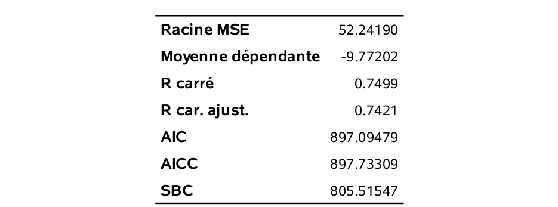
```
```{r fig2p1_fig2, echo = FALSE, out.width='70%', fig.align = "center"}
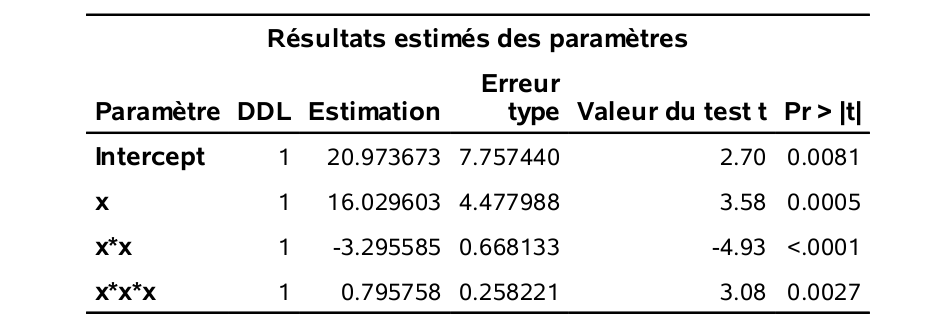
```

Le tableau qui suit résume ces quantités pour tous les modèles de l'ordre 1 à l'ordre 10.
 
```{r 02-table1, eval=TRUE,echo=FALSE}
knitr::kable(x = as.data.frame(emq[,c(2,1,3:6)]), 
             digits = 2, 
             row.names = TRUE, escape =FALSE,
            col.names = c("\\(\\mathsf{EMQ}\\)",
                          "\\(\\widehat{\\mathsf{EMQ}}_a\\)",
                          "\\(R^2\\)", "\\(R^2_a\\)",
                          "\\(\\mathsf{AIC}\\)", "\\(\\mathsf{BIC}\\)"),
            booktabs = TRUE,
            caption = "Mesures d'adéquation du modèle linéaire et estimés de l'erreur")
 
```
 
Les colonnes $\mathsf{EMQ}$ et $\widehat{\mathsf{EMQ}}_a$ ont déjà été expliquées à la section précédente et ont été représentées graphiquement. 
On voit que le augmente toujours au fur et à mesure qu'on ajoute une variable (augmente l'ordre du polynôme). Les critères $\mathsf{AIC}$ et $\mathsf{BIC}$ choisissent le modèle cubique ($k=3$), c'est-à-dire le bon modèle. Le $R^2$ ajusté quant à lui choisit le modèle d'ordre $4$ (qui est le deuxième meilleur selon le $\mathsf{EMQ}$). N'oubliez pas que ces trois critères sont calculés avec l'échantillon d'apprentissage ($n=100$), mais en pénalisant l'ajout de variables. On est ainsi en mesure de contrecarrer le problème provenant du fait qu'on ne peut pas utiliser directement le $\widehat{\mathsf{EMQ}}_a$.

Le $\mathsf{AIC}$ et le $\mathsf{BIC}$ sont des critères très utilisés et très généraux. Ils sont disponibles dès qu'on utilise la méthode du maximum de vraisemblance est utilisée comme méthode d'estimation. Le $R^2$ ajusté a une portée plus limitée car il est spécialisé à la régression linéaire.

## Division de l'échantillon et validation croisée

La deuxième grande approche après celle consistant à pénaliser le $\widehat{\mathsf{EMQ}}_a$ consiste à tenter d'estimer le $\mathsf{EMQ}$ directement. Nous allons voir deux telles méthodes ici, la division de l'échantillon et la validation croisée (_cross-validation_).

Ces deux méthodes s'attaquent directement au problème qu'on ne peut utiliser (sans ajustement) les mêmes données qui ont servi à estimer les paramètres d'un modèle pour estimer sa performance. Pour ce faire, l'échantillon de départ est divisé en deux, ou plusieurs parties, qui vont jouer des rôles différents.


### Division de l'échantillon

Cette idée est très simple. Nous avons un échantillon de taille $n$. Nous pouvons le diviser au hasard en deux parties de tailles respectives $n_1$ et $n_2$ ($n_1+n_2=n$),

- un échantillon d'apprentissage (_training_) de taille $n_1$ et
- un échantillon de validation (_test_) de taille $n_2$.

L'échantillon d'apprentissage servira à estimer les paramètres du modèle. L'échantillon de validation servira à estimer la performance prédictive (par exemple estimer l'$\mathsf{EMQ}$) du modèle. Comme cet échantillon n'a pas servi à estimer le modèle lui-même, il est formé de « nouvelles » observations qui permettent d'évaluer d'une manière réaliste la performance du modèle. Comme il s'agit de nouvelles observations, on n'a pas à pénaliser la complexité du modèle et on peut directement utiliser le critère de performance choisi, par exemple, l'erreur quadratique moyenne, c'est-à-dire, la moyenne des erreurs au carré pour l'échantillon de validation. Cette quantité est une estimation valable de l'$\mathsf{EMQ}$ de ce modèle. On peut faire la même chose pour tous les modèles en compétition et choisir celui qui a la meilleure performance sur l'échantillon de validation. 

Cette approche possède plusieurs avantages. Elle est facile à implanter. Elle est encore plus générale que les critères $\mathsf{AIC}$ et $\mathsf{BIC}$. En effet, ces critères découlent de la méthode d'estimation du maximum de vraisemblance. Plusieurs autres types de modèles ne sont pas estimés par la méthode du maximum de vraisemblance (par exemple, les arbres, les forêts aléatoires, les réseaux de neurones, etc.) La performance de ces modèles peut toujours être estimée en divisant l'échantillon. Cette méthode peut donc servir à comparer des modèles de familles différentes. Par exemple, choisit-on un modèle de régression linéaire, une forêt aléatoire ou bien un réseau de neurones?

Cette approche possède tout de même un désavantage. Elle nécessite une grande taille d'échantillon au départ. En effet, comme on divise l'échantillon, on doit en avoir assez pour bien estimer les paramètres du modèle (l'échantillon d'apprentissage) et assez pour bien estimer sa performance (l'échantillon de validation). 

La méthode consistant à diviser l'échantillon en deux (apprentissage et validation) afin de sélectionner un modèle est valide. Par contre, si on veut une estimation sans biais de la performance du modèle choisi (celui qui est le meilleur sur l'échantillon de validation), on ne peut pas utiliser directement la valeur observée de l'erreur de ce modèle sur l'échantillon de validation. Elle risque de sous-évaluer l'erreur. En effet, supposons qu'on a 10 échantillons et qu'on ajuste 10 fois le même modèle séparément sur les 10 échantillons. Nous aurons alors 10 estimations différentes de l'erreur du modèle. Il est alors évident que de choisir la plus petite d'entre elles sous-estimerait la vraie erreur du modèle. C'est un peu ce qui se passe lorsqu'on choisit le modèle qui minimise l'erreur sur l'échantillon de validation. Le modèle lui-même est un bon choix, mais l'estimation de son erreur risque d'être sous-évaluée. 

Une manière d'avoir une estimation de l'erreur du modèle retenu consiste à diviser l'échantillon de départ en trois (plutôt que deux). Aux échantillons d'apprentissage et de validation, s'ajoute un échantillon « test ». Cet échantillon est laissé de côté durant tout le processus de sélection du modèle qui est effectué avec les deux premiers échantillons tel qu'expliqué plus haut. Une fois un modèle retenu (par exemple celui qui minimise l'erreur sur l'échantillon de validation), on peut alors évaluer sa performance sur l'échantillon test qui n'a pas encore été utilisé jusque là. L'estimation de l'erreur du modèle retenu sera ainsi valide. Il est évident que pour procéder ainsi, on doit avoir une très grande taille d'échantillon au départ.

### Validation croisée

Si la taille d'échantillon n'est pas suffisante pour diviser l'échantillon en deux et procéder comme nous venons de l'expliquer, la validation croisée est une bonne alternative. Cette méthode permet d'imiter le processus de division de l'échantillon.

Voici les étapes à suivre pour faire une validation croisée à $K$ groupes (_$K$-fold cross-validation_) :

1. Diviser l'échantillon au hasard en $K$ parties $P_1, P_2, \ldots, P_K$ de taille contenant toutes à peu près le même nombre d'observations. 
2. Pour $j = 1$ à $K$, 
    i. Enlever la partie $j$.
    ii. Estimer les paramètres du modèle en utilisant les observations des $K-1$ autres parties combinées.
    iii. Calculer la mesure de performance (par exemple la somme du carré des erreurs) de ce modèle pour le groupe $P_j$. 
3. Faire la somme des $K$ estimations de performance pour obtenir une mesure de performance finale et repondérer au besoin.

On recommande habituellement de prendre entre $K=5$ et $10$ groupes (le choix de 10 groupes est celui qui revient le plus souvent en pratique). Si on prend $K=10$ groupes, alors chaque modèle est estimé avec 90% des données et on prédit ensuite le 10% restant. Comme on passe en boucle les 10 parties, chaque observation est prédite une et une seule fois à la fin. Il est important de souligner que les groupes sont formés de façon aléatoire et donc que l'estimé que l'on obtient peut être très variable, surtout si la taille de l'échantillon d'apprentissage est petite. Il arrive également que le modèle ajusté sur un groupe ne puisse pas être utilisé pour prédire les observations mises de côté, notamment si des varibles catégorielles sont présentes. Un échantillonage stratifié permet de pallier à cette lacune, mais ce problème se présente en pratique quand certaines classes ont peu d'observations.

Le cas particulier $K=n$ (en anglais _leave-one-out cross validation_, ou $\mathsf{LOOCV}$) consiste à enlever une seule observation, à estimer le modèle avec les $n-1$ autres et à valider à l'aide de l'observation laissée de côté et on recommence pour chaque observation. Pour les modèles linéaires, il existe des formules explicites qui nous permettent d'éviter d'ajuster $n$ régressions par moindre carrés.


Le fichier `selection3_cv.sas` contient une macro SAS permettant de faire une validation croisée pour un modèle de régression linéaire. 
Revenons à notre exemple où une seule variable explicative est disponible et où l'on cherche à déterminer un bon modèle polynomial. Le Tableau \@ref(tab:02-table2) est le même que le Tableau \@ref(tab:02-table1) mais avec une colonne en plus, la dernière, $\mathsf{VC} (K=10)$. Il s'agit des estimations du $\mathsf{EMQ}$ obtenues avec la validation croisée à 10 groupes.  Notez que si vous exécutez le programme, vous n'obtiendrez pas les mêmes valeurs car il y a un élément aléatoire dans ce processus. La colonne représente la moyenne de 100 réplications.


```{r 02-table2, echo=FALSE, eval = TRUE}
knitr::kable(x = as.data.frame(cbind(emq[,c(2,1,3:6)], rowMeans(emqcv))), 
             digits = 2, 
             row.names = TRUE,
            col.names = c("\\(\\mathsf{EMQ}\\)",
                          "\\(\\widehat{\\mathsf{EMQ}}_a\\)",
                          "\\(R^2\\)", "\\(R^2_a\\)",
                          "\\(\\mathsf{AIC}\\)",
                          "\\(\\mathsf{BIC}\\)",
                          "\\(\\mathsf{VC} (K=10)\\)"),
            escape = FALSE,
             booktabs = TRUE,
            caption = "Mesures d'adéquation du modèle linéaire et estimés de l'erreur, incluant la validation croisée.")
```
 

Le modèle cubique (ordre 3) est aussi choisi par la validation croisée, en moyenne (comme il l'était par le $\mathsf{AIC}$ et le $\mathsf{BIC}$). Le graphe qui suit trace les valeurs de l'estimation par validation croisée (courbe de validation croisée) et aussi le $\mathsf{EMQ}$. On voit que l'estimation par validation croisée suit assez bien la forme du $\mathsf{EMQ}$ (qu'il est supposé estimer). Les boîtes à moustache permettent d'apprécier la variabilité des estimés de l'erreur moyenne quadratique telles qu'estimée par validation croisée avec 10 groupes.

```{r plotcv, echo = FALSE, fig.width =6, fig.height=4, fig.align='center', cache = TRUE}
emqdat <- data.frame(ordre = rep(1:10, length.out = 20), 
           emq = c(emq[,2], rowMeans(emqcv)),
           echantillon = factor(c(rep("théorique",10), rep("validation croisée", 10)))
)
ggplot(data = emqdat, aes(x=ordre, y=emq)) +
  geom_boxplot(data = data.frame(emq = c(t(emqcv)), 
                                 ordre = rep(1:10, each=100)),
               aes(group=ordre),
               show.legend = FALSE,
               outlier.shape=NA) +
  #geom_line(aes(color=color=echantillon)) + 
  geom_point(aes(shape=echantillon, color=echantillon)) + 
  labs(title = "Erreur moyenne quadratique estimée en fonction de l'ordre", 
     x = "ordre du polynôme", 
     y = "erreur moyenne quadratique") + 
  theme(legend.position="bottom",
        legend.title=element_blank()) + 
  scale_x_continuous(breaks = 0:10, 
                     labels = as.character(0:10))
  
```

## Cibler les clients pour l'envoi d'un catalogue

Nous allons présenter un exemple classique de commercialisation de bases de données qui nous servira à illustrer la sélection de modèles, la régression logistique et la gestion de données manquantes. 

Le contexte est le suivant : une entreprise possède une grande base de données client. Elle désire envoyer un catalogue à ses clients mais souhaite maximiser les revenus d'une telle initiative. Il est évidemment possible d'envoyer le catalogue à tous les clients mais ce n'est possiblement pas optimal. La stratégie envisagée est la suivante :

1. Envoyer le catalogue à un échantillon de clients et attendre les réponses. Le coût de l'envoi d'un catalogue est de 10\$. 
2. Construire un modèle avec cet échantillon afin de décider à quels clients (parmi les autres) le catalogue devrait être envoyé, afin de maximiser les revenus.

Plus précisément, on s'intéresse aux clients de 18 ans et plus qui ont au moins un an d'historique avec l'entreprise et qui ont fait au moins un achat au cours de la dernière année.  Il y a 101 000  clients dans la base de données. La première étape de la stratégie consiste à envoyer le catalogue à un échantillon de 1000 clients. Par la suite, un modèle sera construit avec ces 1000 clients afin de cibler lesquels des 100 000 clients restants seront choisis pour recevoir le catalogue. Les 1000 clients forment l'échantillon d'apprentissage. Pour les 1000 clients de l'échantillon d'apprentissage, les deux variables cibles suivantes sont disponibles :

- `yachat`, une variable binaire qui indique si le client a acheté quelque chose dans le catalogue égale à 1 si oui et 0 sinon.
- `ymontant`, le montant de l'achat si le client a acheté quelque chose.

Les 10 variables suivantes sont disponibles pour tous les clients et serviront de variables explicatives pour les deux variables cibles. Il s'agit de : 

- `x1`: sexe de l'individu, soit homme (0) ou femme (1);
- `x2`: l'âge (en année);
- `x3`: variable catégorielle indiquant le revenu, soit moins de 35 000\$ (1), entre 35 000\$ et 75 000\$ (2) ou plus de 75 000$ (3);
- `x4`: variable catégorielle indiquant la région où habite le client (de 1 à 5);
- `x5`: conjoint : le client a-t-il un conjoint (0=non, 1=oui);
- `x6`: nombre d'année depuis que le client est avec la compagnie;
- `x7`: nombre de semaines depuis le dernier achat;
- `x8`: montant (en dollars) du dernier achat;
- `x9`: montant total (en dollars) dépensé depuis un an;
- `x10`: nombre d'achats différents depuis un an.

Les données se trouvent dans le fichier `DBM.sas7bdat`. Lors d'une vraie application, nous aurions seulement les valeurs des variables cibles `yachat` et `ymontant` pour l'échantillon d'apprentissage (car eux seuls ont reçu le catalogue).  Dans notre exemple, elles sont fournies pour tous les clients afin de pouvoir évaluer la performance des différentes stratégies testées. Les modèles seront déterminés (sélectionnés et ajustés) en utilisant seulement l'échantillon d'apprentissage (1000 clients). Les 100 000 autres clients serviront d'échantillon test pour évaluer la performance des modèles et, plus précisément, afin d'évaluer les revenus (ou d'autres mesures de performance) si ces modèles avaient été utilisés. L'échantillon test nous donnera donc l'heure juste quant aux mérites des différentes approches que nous allons comparer.

Voici d'abord des statistiques descriptives pour l'échantillon d'apprentissage.

```{r fig2p1_fig3, echo = FALSE, out.width='60%', fig.align = "center"}
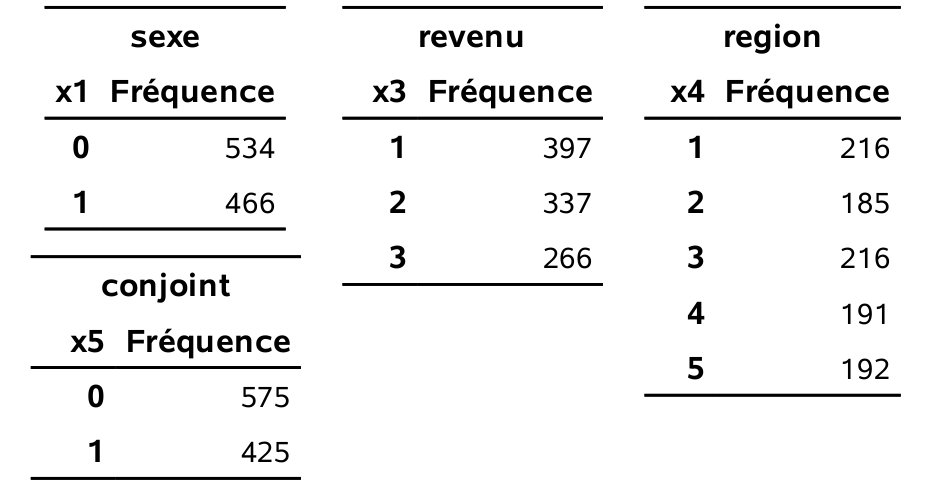
```
Il y a donc $46,6$% de femmes parmi les 1000 clients de l'échantillon. De plus, $39,7$% ont un revenu de moins de 35 000\$, $33,7$% sont entre 35 000\$ et 75 000\$ et $26,6$% ont plus de 75 000\$. $42,5$% de ces clients qui ont un conjoint. 
```{r fig2p1_fig4, echo = FALSE, out.width='90%', fig.align = "center"}
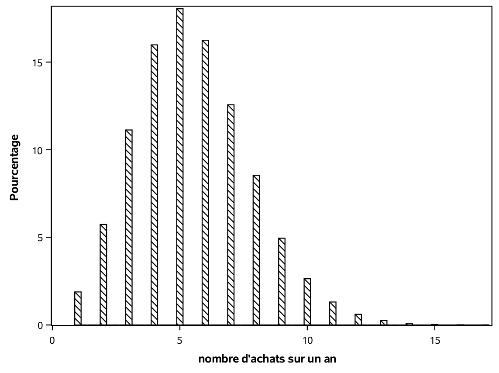
```
Le nombre d'achats différents depuis un an par ces clients varie entre 1 et 14. Un peu plus de la moitié ($51,4$%) ont fait 5 achats ou moins. Parmi les 1000 clients de l'échantillon d'apprentissage, 210 ont acheté quelque chose dans le catalogue. La variable yachat sera l'une des variables que nous allons chercher à modéliser en vue d'obtenir des prédictions.
```{r fig2p1_fig5, echo = FALSE, out.width='90%', fig.align = "center"}
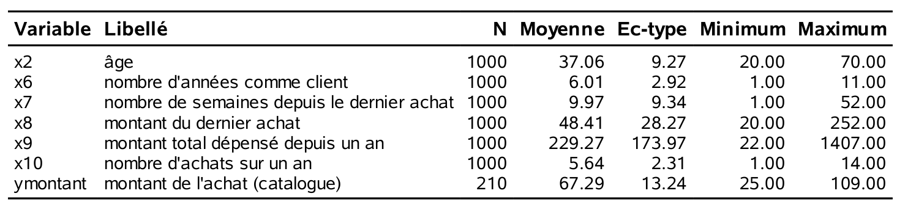
```

L'âge des 1000 clients de l'échantillon d'apprentissage varie entre 20 et 70 avec une moyenne de $37,1$ ans. En moyenne, ces clients ont acheté pour $229,3$\$ depuis un an. Le dernier achat de ces clients remonte, en moyenne, à 10 semaines. Nous chercherons également à modéliser la variable `ymontant`. Seuls 210 clients ont acheté quelque chose dans le catalogue et les statistiques rapportées correspondent seulement à ces derniers, car la variable `ymontant` est manquante si le client n'a rien acheté dans le catalogue. On pourrait également remplacer ces valeurs par des zéros et les modéliser, mais nous aborderons cet aspect ultérieurement. Les clients qui ont acheté quelque chose ont dépensé en moyenne $67,3$\$, et au minimum $25$\$. Les histogrammes de quelques unes de ces variables permet de mieux visualiser la répartition des observations.
```{r fig2p1_fig6, echo = FALSE, out.width='90%', fig.align = "center"}
knitr::include_graphics("figures/02-select-e6.png")
```

Il y a plusieurs façons d'utiliser l'échantillon d'apprentissage afin de mieux cibler les clients à qui envoyer le catalogue et maximiser les revenus.  En voici quelques unes.

a) On pourrait développer un modèle afin d'estimer la probabilité qu'un client achète quelque chose si on lui envoie un catalogue. Plus précisément, on peut développer un modèle pour $\Pr(\texttt{yachat}=1)$. Comme la variable `yachat` est binaire, un modèle possible est la régression logistique, que nous décrirons au chapitre suivant. Ainsi, en appliquant le modèle aux 100 000 clients restant, on pourra cibler les clients susceptibles d'acheter (ceux avec une probabilité élevée). 
b) Une autre façon serait de tenter de prévoir le montant d'argent dépensé. Nous venons de voir la distribution de la variable `ymontant`. Il y a deux situations, ceux qui ont acheté et ceux qui n'ont pas achetés.  En conditionnant sur le fait d'avoir acheté quelque chose, il est possible de décomposer le problème de la manière suivante :

\begin{align*} 
\E{\texttt{ymontant}} &= \E{\texttt{ymontant} \mid \texttt{yachat}=1} \P{\texttt{yachat}=1} \\& \qquad \qquad \qquad +
\E{\texttt{ymontant} \mid \texttt{yachat}=0} \P{\texttt{yachat}=0} \\
 &= \E{\texttt{ymontant} \mid \texttt{yachat}=1} \P{\texttt{yachat}=1}
\end{align*}
En mots, la moyenne du montant dépensé est égale à la moyenne du montant dépensé étant donné qu'il y a eu achat, fois la probabilité qu'il ait eu achat. 

On peut donc estimer $\E{\texttt{ymontant} \mid \texttt{yachat}=1}$ et $\P{\texttt{yachat}=1}$, pour ensuite les combiner et avoir une estimation de $\E{\texttt{ymontant}}$. Le développement du modèle pour $\E{\texttt{ymontant} \mid \texttt{yachat}=1}$ peut se faire avec la régression linéaire, en utilisant seulement les clients qui ont acheté dans l'échantillon d'apprentissage, car ymontant est une variable continue dans ce cas. Le développement du modèle pour $\P{\texttt{yachat}=1}$ peut se faire avec la régression logistique, tel que mentionné plus haut, en utilisant tous les 1000 clients de l'échantillon d'apprentissage. En fait, nous verrons plus loin qu'il est possible d'estimer conjointement les deux modèles avec un modèle Tobit. En appliquant le modèle aux 100 000 clients restants, on pourra cibler les clients qui risquent de dépenser un assez grand montant.

Comme nous n'avons pas encore vu la régression logistique, nous allons nous limiter à illustrer les méthodes qui restent à voir dans ce chapitre avec la régression linéaire en cherchant à développer un modèle pour $\E{\texttt{ymontant} \mid \texttt{yachat}=1}$, le montant d'argent dépensé par les clients qui ont acheté quelque chose.

Le fichier `prepare_DBM.sas` contient des commandes afin de préparer les données aux analyses qui seront présentées dans les sections qui suivent. En particulier, nous avons deux variables explicatives catégorielles. Il s'agit de revenu (`x3`) et région (`x4`). Il faut coder d'une manière appropriée afin de pouvoir les incorporer dans les modèles. La manière habituelle est de créer des variables indicatrices (binaires) qui indiquent si la variable prend ou non une valeur particulière. En général, si une variable catégorielle possède $K$ valeurs possibles, il est suffisant de créer $K-1$ indicatrices, en laissant une modalité comme référence. Par exemple, pour `x3`, nous allons créer deux variables,

- `x31`: variable binaire égale à 1 si `x3` égale 1 et 0 sinon,
- `x32`: variable binaire égale à 1 si `x3` égale 2 et 0 sinon.

Ainsi, la valeur 3 est celle de référence. Ces deux indicatrices sont suffisantes pour récupérer toute l'information comme le démontre le tableau \@ref(tab:02-dummy).

Table: (\#tab:02-dummy) Valeur des indicateurs en fonction du niveau de la variable catégorielle 

| `x3` | `x31` | `x32` |
|:----:|:-----:|:-----:|
|   1  |   1   |   0   |
|   2  |   0   |   1   |
|   3  |   0   |   0   |

En pratique, il suffit d'incorporer les indicatrices (`x31` et `x32`) dans le modèle comme variables explicatives et de ne plus utiliser la variable originale `x3`. On peut aussi procéder ainsi pour la variable `x4`, en créant quatre indicatrices.

## Recherche automatique du meilleur modèle

Lorsque nous voulons comparer un petit nombre de modèles, il est relativement aisé d'obtenir les critères ($\mathsf{AIC}$, $\mathsf{BIC}$ ou autre) pour tous les modèles et de choisir le meilleur. C'était le cas dans l'exemple du choix de l'ordre du polynôme où il y avait seulement 10 modèles en compétitions. 
Mais lorsqu'il y a plusieurs variables en jeu, le nombre de modèles potentiel augmente très rapidement. 

En fait, supposons qu'on a $p$ variables distinctes disponibles. Avant même de considérer les transformations des variables et les interactions entre elles, il y a déjà  modèles possibles. En effet, chaque variable est soit incluse ou pas (deux possibilités) et donc il y a $2^p=2\times 2 \times \cdots \times 2$ ($p$ fois) modèles en tout à considérer. Ce nombre augmente très rapidement comme en témoigne le tableau \@ref(tab:02-table3). 

```{r 02-table3, echo=FALSE, eval = TRUE}
p <- c(5,10,15,20,25,30)
npar <- 2^p
options(scipen=100)
knitr::kable(x = data.frame(p = p, npar = npar), 
             digits = 0,
             col.names = c("$p$",
                          "nombre de paramètres"),
            escape = FALSE,
             booktabs = TRUE,
            caption = "Nombres de modèles en fonction du nombre de paramètres $p$.")
```

Ainsi, si le nombre de variables est restreint, il est possible de comparer tous les modèles potentiels et de choisir le meilleur (selon un critère). II existe même des algorithmes très efficaces qui permettent de trouver le meilleur modèle sans devoir examiner tous les modèles possibles. Le nombre de variables qu'il est possible d'avoir dépend de la puissance de calcul et augmente d'année en année.  Par contre, dans plusieurs applications, il ne sera pas possible de comparer tous les modèles et il faudra effectuer une recherche limitée. 

Faire une recherche exhaustive parmi tous les modèles possibles s'appelle sélection de tous les sous-ensembles (_best subsets_). La procédure `reg` de **SAS** permet de faire cela pour la régression linéaire. 


## Recherche automatique de tous les sous-ensembles

On veut trouver un bon modèle pour prévoir la valeur de `ymontant` des clients qui ont acheté quelque chose. On a vu qu'il y a 210 clients qui ont acheté dans l'échantillon d'apprentissage. Nous allons chercher à développer un « bon » modèle avec ces 210 clients. Dans ce premier exemple, nous allons seulement utiliser les 10 variables explicatives de base (14 variables avec les indicatrices). Le code suivant montre comment faire une sélection de variables selon le critère du $R^2$ et demande à **SAS** de présenter le modèle à $k$ variables ($k=1, \ldots, 14$) qui a le plus grand $R^2$; voir `selection2_all_subset.sas` pour plus de détails. 

```{sas, eval = FALSE}
proc reg data=trainymontant;
model ymontant=x1 x2 x31 x32 x41 x42 x43 x44 x5 x6 
  x7 x8 x9 x10 / selection=rsquare best=1 aic bic;
run;
```

Ainsi, le modèle linéaire simple qui a le plus grand $R^2$ est celui qui inclut le conjoint (`x5`). Le meilleur modèle (selon le $R^2$) parmi tous les modèles avec deux variables est celui avec `x5` et `x6`.

Pour un nombre de variables fixé, le meilleur modèle selon le $R^2$ est aussi le meilleur selon les critères d'information $\mathsf{AIC}$ et $\mathsf{BIC}$, pour ce nombre fixé de variables. Pour vous convaincre de cette affirmation, fixons le nombre de variables et restreignons-nous seulement aux modèles avec ce nombre de variables. Comme = $1 - \mathsf{SCE}/\mathsf{SCT}$ et que $\mathsf{SCT}$ est une constante indépendante du modèle, le modèle avec le plus grand coefficient de détermination, $R^2$, est aussi celui avec la plus petite somme du carré des erreurs ($\mathsf{SCE}$). Comme $\mathsf{AIC}=n (\ln (\mathsf{SCE}/n)) + 2p$, ce sera aussi celui avec le plus petit $\mathsf{AIC}$ car la pénalité $2p$ est la même si on fixe le nombre de variables; la même remarque est valide pour le $\mathsf{BIC}$. 

Ainsi, pour trouver le meilleur modèle globalement (sans fixer le nombre de variables), il suffit de trouver le modèle à $k$ variables explicatives ayant le coefficient de détermination le plus élevé pour tous les nombres de variables fixés et d'ensuite de trouver celui qui minimise le $\mathsf{AIC}$ (ou le $\mathsf{BIC}$) parmi ces modèles. Cette astuce est utile dans la mesure où **SAS** ne permet pas de faire cette même recherche avec les critères d'information.

```{r fig2p2_fig7, echo = FALSE, out.width='90%', fig.align = "center"}
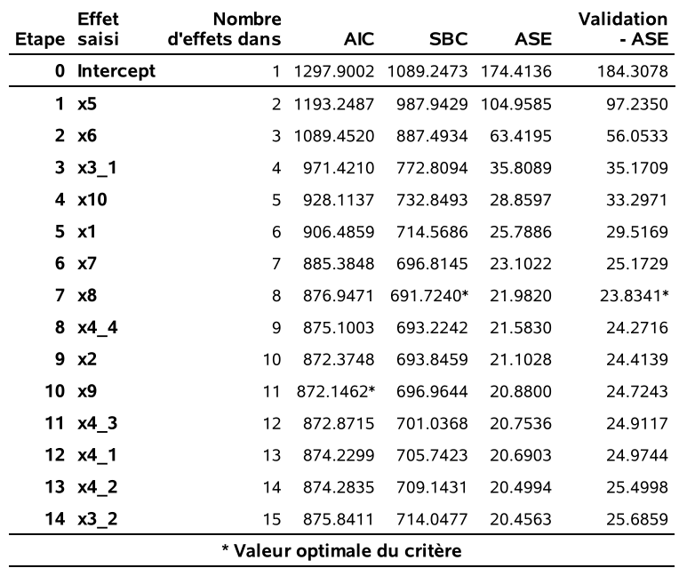
```


Dans l'exemple, on voit que le modèle avec les variables `x1` `x2` `x31` `x44` `x5` `x6` `x7` `x8` `x9` et `x10` est celui qui minimise le $\mathsf{AIC}$ globalement ($\mathsf{AIC}=660.15$). Le modèle choisi par le $\mathsf{BIC}$ contient seulement sept variables explicatives (plutôt que 10), soit `x1` `x31` `x5` `x6` `x7` `x8` `x10`.

Nous allons utiliser les 100 000 autres clients pour évaluer la performance réelle des modèles qui nous sont suggérés par nos différents critères. En pratique, nous ne pourrions pas faire cela car la valeur de la variable cible ne serait pas connue pour ces clients. En fait, dans une vraie application, nous utiliserions plutôt les modèles pour obtenir des prédictions pour les clients à « scorer ». Les valeurs des variables cibles pour les 100 000 clients nous permettront de voir à quel point différentes stratégies auraient été profitables si elles avaient été mises en place. Parmi, les 100 000 clients restants, il y en a 23 179 qui auraient acheté quelque chose si on leur avait envoyé le catalogue. Ces 23 179 observations vont nous servir pour estimer l'erreur moyenne quadratique (théorique) des modèles retenus par nos critères (voir le fichier `selection2_all_subset.sas` pour les manipulations).

Voici l'estimation de l'erreur moyenne quadratique (moyenne des carrés des erreurs) pour les deux modèles retenus par le $\mathsf{AIC}$ et le $\mathsf{BIC}$. Le tableau \@ref(tab:02-gmse-base) contient aussi l'estimation de l'erreur moyenne quadratique si on utilise toutes les variables (14 en incluant les indicatrices) sans faire de sélection.


Table: (\#tab:02-gmse-base) Estimation de l'erreur moyenne quadratique sur l'échantillon test avec les variables de base. Les meilleurs modèles selon les  critères d'informations découlent d'une recherche exhaustive de tous les sous-ensembles.

| nombre de variables | $\mathsf{EMQ}$ |méthode |
|:----:|:-----:|:-----|
|  14 | 25,69|toutes les variables |
| 10 | 24,72 | exhaustive - $\mathsf{AIC}$ |
|  7 | 23,83 | exhaustive - $\mathsf{BIC}$ |

On voit que le modèle choisi par le $\mathsf{BIC}$ est le meilleur des trois, car l'erreur moyenne quadratique sur l'échantillon test est de $3,6$\% inférieure à celle du modèle choisi par le $\mathsf{AIC}$. Ces deux méthodes font mieux que le modèle qui inclut toutes les variables sans faire de sélection.

Nous avons seulement inclus les variables de base pour ce premier essai. Il est possible qu'ajouter des variables supplémentaires améliore la performance du modèle. Pour cet exemple, nous allons considérer les variables suivantes:

- les variables continues au carré, comme $\texttt{age}^2$.
- toutes les interactions d'ordre deux entre les variables de base, comme $\texttt{sexe}\cdot\texttt{age}$. 

Toutes ces variables sont créées dans `prepare_DBM.sas`. Aux variables de base (10 variables explicatives, mais 14 avec les indicatrices pour les variables catégorielles), s'ajoutent ainsi 90 autres variables. Il y a donc 104 variables explicatives potentielles. Notez qu'il y a des interactions entre chacune des variables indicatrices et chacune des autres variables, mais il ne sert à rien de calculer une interaction entre deux indicatrices d'une même variable (car une telle variable est zéro pour tous les individus). De même, il ne sert à rien de calculer le carré d'une variable binaire. 

Lancer une sélection exhaustive de tous les sous-modèles avec 104 variables risque de prendre un temps énorme. Que faire alors? Il y a plusieurs possibilités. Nous pourrions faire une recherche limitée avec les méthodes que nous allons voir à partir de la section suivante. Nous pourrions aussi combiner les deux approches. Supposons que notre ordinateur permet de faire une recherche exhaustive de tous les sous-modèles avec 40 variables. Nous pourrions alors commencer avec une recherche limitée pour trouver un sous-ensemble de 40 « bonnes » variables et faire une recherche exhaustive, mais en se restraignant à ces 40 variables.


## Méthodes classiques de sélection

Les méthodes de sélection ascendante, descendante et séquentielle sont des algorithmes gloutons qui permettent de choisir des variables. Elles ont été développées à une époque où la puissance de calcul était bien moindre, et où il était impossible de faire une recherche exhaustive des sous-modèles. Avec l'approche classique, ces méthodes font une recherche séquentielle guidée parmi un nombre limité de modèles, à l'aide des valeurs-_p_ du test-_t_ pour la significativité des paramètres individuels du modèle avec $p$ prédicteurs potentiels $X_1,\ldots, X_p$. Les procédures `glmselect` et `reg` permettent une sélection de modèle avec une approche séquentielle, ascendante ou descendante.


### Sélection ascendante

L'idée de la sélection ascendante est de tester l'ajout de chaque variable individuellement et d'ajouter celle qui est la plus significative selon le test-_t_ si elle a une valeur-_p_ assez petite. 

- *Initialisation*: le modèle linéaire de départ est celui qui n'inclut que l'ordonnée à l'origine, $Y=\beta_0+\eps$, où $\eps$ est une erreur centrée.
- *Critère d'entrée*: $c$, valeur-_p_ minimale à partir de laquelle une variable peut être incluse dans le modèle (`proc reg` utilise par défaut 0.5).
- *Boucle*  soit $X_{(1)}, \ldots, X_{(k)}$, les variables explicatives à l'étape $k<p$.
    - pour chaque $j$ ($j=\{1,\ldots, p\}\setminus \{(1), \ldots (k)\}$), on ajuste tour à tour le modèle $Y=\beta_0+\sum_{i=1}^k \beta_i X_{(i)} + \beta_{k+1}X_{j}$ et on calcule la valeur-_p_ du test-_t_ pour les hypothèses $\mathcal{H}_0: \beta_{k+1}=0$ contre l'alternative bilatérale $\mathcal{H}_1: \beta_{k+1} \neq 0$.
    - Soit $p_{\min}$ la plus petite des $p-k$ valeurs-_p_ qui correspond à $X_{(k+1)}$, disons.
        - si $p_{\min}<c$, continuer la procédure.
        - si $p_{\min} \geq c$, retourner le modèle $Y=\beta_0 + \sum_{i=1}^k \beta_iX_{(i)}+\eps$.

On continue ainsi à ajouter des variables jusqu'à ce que le critère d'entrée ne soit pas satisfait. Si on se rend jusqu'au bout, on va terminer avec le modèle complet qui contient toutes les variables.


### Sélection descendante


- *Initialisation*: le modèle linéaire de départ est celui qui inclut toutes les variables explicatives, $Y=\beta_0+\sum_{j=1}^p \beta_j X_{(j)}+\eps$, où $\eps$ est une erreur centrée.
- *Critère de sortie*: $c$, valeur-_p_ maximale à partir de laquelle une variable peut être excluse du modèle (`proc reg` utilise par défaut 0.1).
- *Boucle*  soit $X_{(1)}, \ldots, X_{(p-k)}$, les variables explicatives présentes dans le modèle à l'étape $k<p$.
    - pour chaque $j$ ($j =1, \ldots, p-k$), on calcule la valeur-_p_ du test-_t_ $\mathcal{H}_0: \beta_{j}=0$ contre l'alternative bilatérale $\mathcal{H}_1: \beta_{j} \neq 0$.
    - si toutes ces valeurs sont inférieures à $c$, on retourne le modèle $Y=\beta_0 + \sum_{j=1}^{p-k} \beta_j X_{(j)}$.
    - sinon, on enlève la variable qui a la plus grande valeur-_p_ (disons $X_{(p-k)}$), on réajuste le modèle sans cette variable et on recommence la procédure.


L'idée est l'inverse de la méthode ascendante. On va tester le retrait de chaque variable individuellement et retirer celle qui est la moins significative, si sa valeur-_p_ est assez grande. Si la procédure se termine après $p$ itérations, aucune variable explicative n'est retenue.

### Méthode séquentielle

Il s'agit d'une méthode hybride entre ascendante et descendante. On sélectionne un critère d'entrée et de sortie pour chacune des deux (0.15 dans `proc reg`) et on début la recherche à partir du modèle ne contenant que l'ordonnée à l'origine. À chaque étape, on fait une étape ascendante suivie de une (ou plusieurs) étapes descendantes. On continue ainsi tant que le modèle retourné par l'algorithme n'est pas identique à celui de l'étape précédente. Le dernier modèle est celui retenu. 

Avec la méthode séquentielle, une fois qu'on entre une variable (étape ascendante), on fait autant d'étapes descendante afin de retirer toutes les variables qui satisfont le critère de sortie (il peut ne pas y en avoir). Une fois cela effectué, on refait une étape ascendante pour voir si on peut ajouter une nouvelle variable. 

Remarques sur ces méthodes: avec la méthode ascendante, une fois qu'une variable est dans le modèle, elle y reste. Avec la méthode descendante, une fois qu'une variable est sortie du modèle, elle ne peut plus y entrer. Avec la méthode séquentielle, une variable peut entrer dans le modèle et sortir plus tard dans le processus. Par conséquent, parmi les trois, la méthode séquentielle est généralement préférable aux méthodes ascendante et descendante, car elle inspecte potentiellement un plus grand nombre de modèles. 

On peut soi-même spécifier les critères d'entrée et de sortie. Plus le critère d'entrée est élevé, plus il y aura de variables dans le modèle final. De même, plus le critère de sortie est élevé, plus il y aura de variables dans le modèle.

Utilisons la méthode de sélection séquentielle classique avec des critères d'entrée et de sortie de 0.15 et les 104 variables. Le code suivant, extrait de `selection2_all_subset.sas`, donne la syntaxe **SAS**.

```{sas, 02-stepwise, eval = FALSE}
proc reg data=trainymontant;
model ymontant=
x1 x2 x31 x32 x41 x42 x43 x44 x5 x6 x7 x8 x9 x10
cx2 cx6 cx7 cx8 cx9 cx10
i_x2_x1 i_x2_x5 i_x2_x31 i_x2_x32 i_x2_x41 i_x2_x42 i_x2_x43 i_x2_x44
i_x2_x7 i_x2_x6 i_x2_x8 i_x2_x9 i_x2_x10
i_x1_x5 i_x1_x31 i_x1_x32 i_x1_x41 i_x1_x42 i_x1_x43 i_x1_x44
i_x1_x7 i_x1_x6 i_x1_x8 i_x1_x9 i_x1_x10
i_x5_x31 i_x5_x32 i_x5_x41 i_x5_x42 i_x5_x43 i_x5_x44
i_x5_x7 i_x5_x6 i_x5_x8 i_x5_x9 i_x5_x10
i_x31_x41 i_x31_x42 i_x31_x43 i_x31_x44
i_x31_x7 i_x31_x6 i_x31_x8 i_x31_x9 i_x31_x10
i_x32_x41 i_x32_x42 i_x32_x43 i_x32_x44
i_x32_x7 i_x32_x6 i_x32_x8 i_x32_x9 i_x32_x10
i_x41_x7 i_x41_x6 i_x41_x8 i_x41_x9 i_x41_x10
i_x42_x7 i_x42_x6 i_x42_x8 i_x42_x9 i_x42_x10
i_x43_x7 i_x43_x6 i_x43_x8 i_x43_x9 i_x43_x10
i_x44_x7 i_x44_x6 i_x44_x8 i_x44_x9 i_x44_x10
i_x7_x6 i_x7_x8 i_x7_x9 i_x7_x10
i_x6_x8 i_x6_x9 i_x6_x10
i_x8_x9 i_x8_x10
i_x9_x10 / selection=stepwise sle=.15 sls=.15 ;
run;
```

Notez que les variables `cx2` à `cx10` sont les carrés des variables `x2` à `x10` que nous avons créées au préalable. De plus, les variables débutant par _i_ sont les interactions entre les variables binaires et les variables continues. Par exemple, `i_x2_x1` est l'interaction entre `x1` et `x2`, c'est-à-dire le produit des deux.

La sortie **SAS** est assez volumineuse car elle retrace toutes étapes de la sélection séquentielle. L'historique montre qu'à l'étape 1, la variable `i_x5_x6` a été ajoutée, suivie de `i_x31_x10` à l'étape 2. Un peu plus loin, à l'étape 6, `i_x5_x6` est retirée et ainsi de suite. Il y a eu 40 étapes en tout et, à la fin, il reste 22 variables (parmi les 104) dans le modèle final. Le $R^2$ du modèle final est $0,966$. 


```{r fig2p2_fig8, echo = FALSE, out.width='90%', fig.align = "center"}
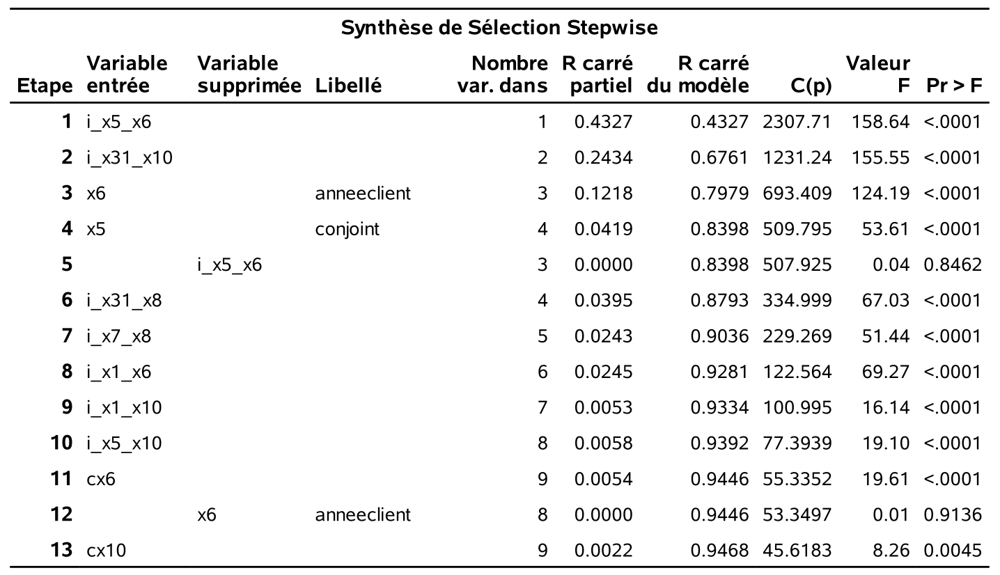
```
```{r fig2p2_fig9, echo = FALSE, out.width='90%', fig.align = "center"}
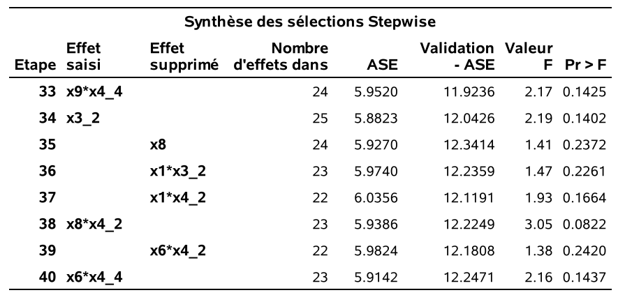
```


Voici les estimés des paramètres du modèle final retenu. On voit bien que toutes les valeurs-_p_ (qui ne sont pas valides à cause de la sélection de modèles) sont toutes inférieures à $0,15$. 

```{r fig2p2_fig10-11, echo = FALSE, out.width='70%', fig.align = "center"}
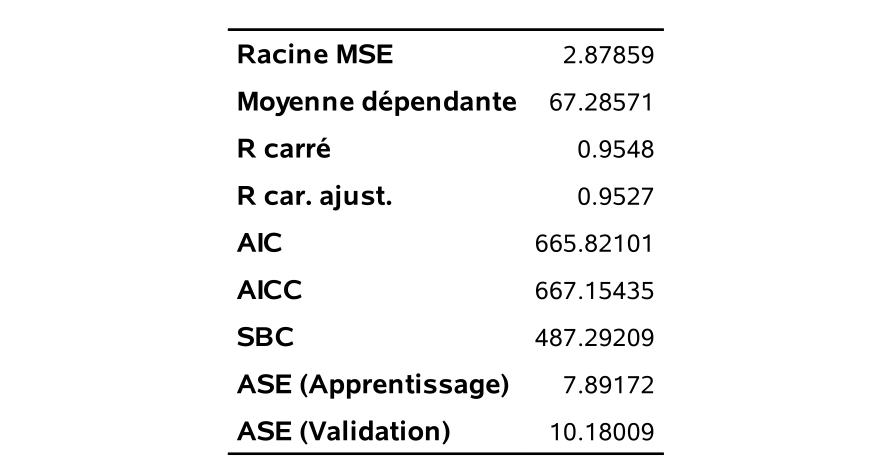
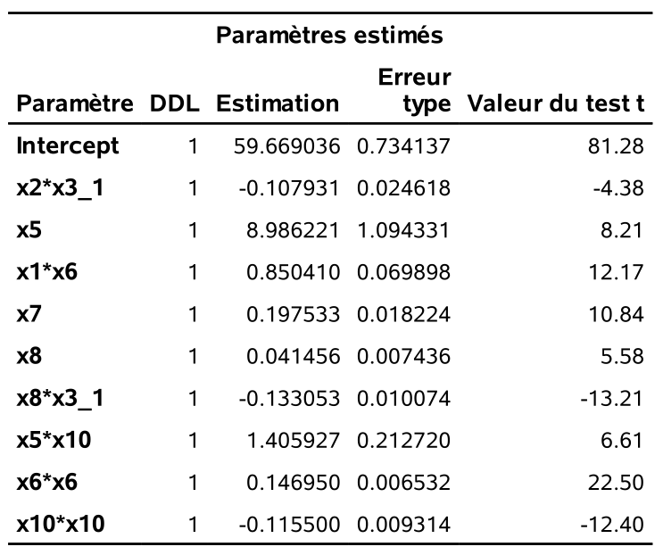
```

La performance de ce modèle a, comme pour les modèles précédents, été évaluée avec l'échantillon test de 23 179 observations. Le tableau \@ref(tab:02-comparaisonseqclas) présente la performance de la méthode de sélection séquentielle classique et celle du modèle dans lequel les 104 variables sont incluses sans faire de sélection.

```{r 02-comparaisonseqclas, echo=FALSE, message=FALSE, warnings=FALSE, results='asis'}
tabl <- "
Table: (\\#tab:02-comparaisonseqclas) Comparaison des méthodes selon l'erreur moyenne quadratique pour la méthode de sélection séquentielle classique et pour le modèle incluant toutes les variables, les termes quadratiques et les interactions.

| nombre de variables | $\\mathsf{EMQ}$ |méthode |
|:----:|:-----:|:-----|
| 104 | 19.63 | toutes les variables |
|22 | 12.25 | séquentielle classique |
"
cat(tabl)
```

On voit donc qu'utiliser toutes les 104 variables sans faire de sélection fait mieux ($\mathsf{EMQ}=19,63$) que les modèles précédents basés sur les 10 variables originales. Mais faire une sélection séquentielle classique permet une amélioration très importante de la performance ($\mathsf{EMQ}=12,25$). On voit que dans cet exemple, utiliser les 104 variables fait du surajustement (_over-fitting_).  

Le choix de $0,15$ comme critère d'entrée et de sortie est assez arbitraire. Il est fort possible que d'autres valeurs donnent de meilleurs résultats. Mais il n'est pas évident de les choisir.

Une façon de contourner le problème de devoir spécifier les critères d'entrée et de sortie est de procéder en deux étapes. Supposons que notre ordinateur permet de faire une recherche exhaustive de tous les sous-modèles avec près de 60 variables. L'idée est alors de passer de 104 à un sous-ensemble d'environ 60 variables, avec une sélection séquentielle gloutonne, et d'ensuite utiliser une recherche exhaustive avec ce sous-ensemble de variables. Plus précisément:

1) On fait une sélection séquentielle classique avec des valeurs élevées pour les critères d'entrée et de sortie afin que le modèle retenu contienne le nombre voulu de variables (par exemple, 60). 
2) En utilisant seulement ce sous-ensemble de variables, on choisit le meilleur modèle selon le $\mathsf{AIC}$ ou le $\mathsf{BIC}$ en faisant une recherche exhaustive de tous les sous-modèles.

En fixant, les critères d'entrée et de sortie à $0,6$ pour la recherche séquentielle, le modèle retenu aura 56 variables. Il est possible de faire une recherche exhaustive avec 56 variables sur un ordinateur portable avec **SAS**. Le $\mathsf{AIC}$ est mène à un modèle avec 38 de ces 56 variables. Le $\mathsf{BIC}$ est quant à lui beaucoup plus parcimonieux et choisit 15 de ces variables pour le modèle final. Encore une fois, ces deux modèles sont testés sur les 23 179 clients restants. Les résultats sont présentés dans le tableau \@ref(tab:02-comparaisonseqexha).

```{r 02-comparaisonseqexha, echo=FALSE, message=FALSE, warnings=FALSE, results='asis'}
tabl <- "
Table: (\\#tab:02-comparaisonseqexha) Comparaison des méthodes selon l'erreur moyenne quadratique pour la méthode de sélection séquentielle classique suivie d'une recherche exhaustive sur les 56 variables retenues.

| nombre de variables | $\\mathsf{EMQ}$ |méthode |
|:----:|:-----:|:-----|
| 38 | 14.83 | $(\\mathsf{AIC})$ |
| 15 | 11.96 | $(\\mathsf{BIC})$|
"
cat(tabl)
```
La stratégie consistant à sélectionner un sous-ensemble de 56 variables avec la méthode séquentielle classique pour ensuite faire une recherche exhaustive de tous les sous-modèles possibles avec ces 56 variables, selon le $\mathsf{BIC}$, donne le meilleur résultat jusqu'à présent ($\mathsf{EMQ}=11,96$). Le $\mathsf{AIC}$ fait moins bien dans ce cas, avec une erreur moyenne quadratique estimée de $14,83$. Nous verrons à la section suivante qu'il est possible de faire une recherche séquentielle en utilisant d'autres critères que la valeur-_p_ du test-_t_ pour faire ajouter ou enlever des variables.

## Recherche séquentielle automatique limitée

L'idée de la procédure séquentielle classique est d'inclure ou d'exclure une variable à la fois sur la base des valeurs-_p_. La procédure `glmselect` permet de faire une sélection séquentielle en utilisant d'autres critères, comme le $\mathsf{AIC}$ ou le $\mathsf{BIC}$. Cette procédure permet de contrôler très finement le processus de sélection de variables. Le code qui suit fait une recherche séquentielle avec les particularités suivantes. À chaque étape ascendante de la procédure séquentielle, c'est la variable qui améliore le plus le $\mathsf{AIC}$ (`select=aic`) qui est entrée. De plus, à chaque étape descendante de la procédure séquenctielle, c'est la (ou les) variable(s) qui détériore(nt) le plus le $\mathsf{AIC}$ qui est (sont) retirée(s). À la toute fin du processus, c'est le modèle qui a le meilleur $\mathsf{BIC}$ (`choose=BIC`) qui est retenu.

Si la procédure `reg` ne supporte pas la déclaration de variables catégorielles (`class`), `glmselect` et les autres fonctions que nous utiliserons permettent de simplifier la syntaxe et d'éviter de créer les variables binaires une par une. En revanche, lors de la sélection, les variables catégorielles sont enlevées en bloc et donc la sortie de la procédure peut différer de celle où on appelle la fonction en listant les 104 variables indicatrices et continues. Par défaut, **SAS** ne met les interactions que si les effets principaux sont présents; l'option `hier=none` permet de contourner cette règle.

```{sas 02-glmselectseq, eval=FALSE}
proc glmselect data=trainymontant;
class x3 x4;
model ymontant=x1|x2|x3|x4|x5|x6|x7|x8|x9|x10@2 cx2 cx6 cx7 cx8 cx9 cx10  /   
selection=stepwise(select=aic choose=sbc hier=none); 
score data=testymontant out=predglmselectaicsbc p=predymontant;
run;
```

Voici l'historique de la procédure séquentielle avec les 104 variables insérées manuellement. 

```{r fig2p2_fig12-13, echo = FALSE, out.width='70%', fig.align = "center"}
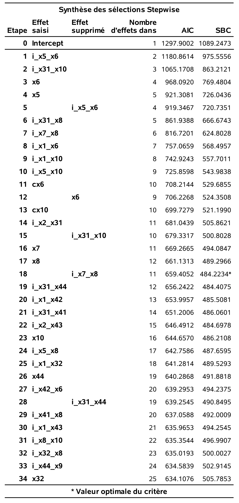
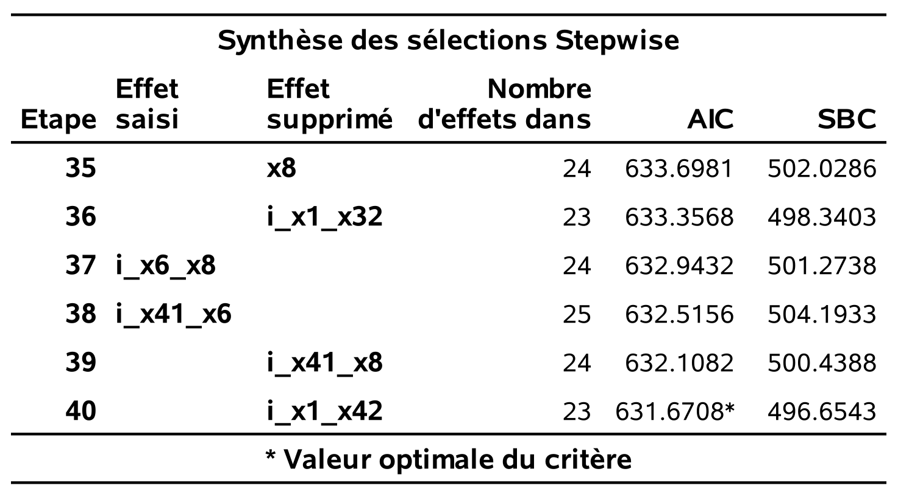
```


À l'étape 1, la variable `i_x5_x6` est ajoutée au modèle de base car c'est celle qui fait diminuer le plus le $\mathsf{AIC}$. À l'étape 2, la variable `i_x31_x10` est ajoutée,  À l'étape 6, la variable `i_x5_x6` est retirée car cela fait baisser le $\mathsf{AIC}$. Notez que le $\mathsf{AIC}$ décroit toujours d'une étape à l'autre. **SAS** garde aussi la trace du $\mathsf{BIC}$ car le modèle final sera choisi selon ce critère. Finalement le processus séquentiel se termine à l'étape 40, car il n'y a plus moyen de faire dimiuer le $\mathsf{AIC}$. Le modèle final retenu est celui de l'étape 18, car c'est celui qui a le $\mathsf{BIC}$ le plus petit parmi tous ces modèles ($\mathsf{BIC}=484.22$). 

Voici différentes statistiques ainsi que les estimations des paramètres de ce modèle qui contient 10 variables.

```{r fig2p2_fig14, echo = FALSE, out.width='65%', fig.align = "center"}
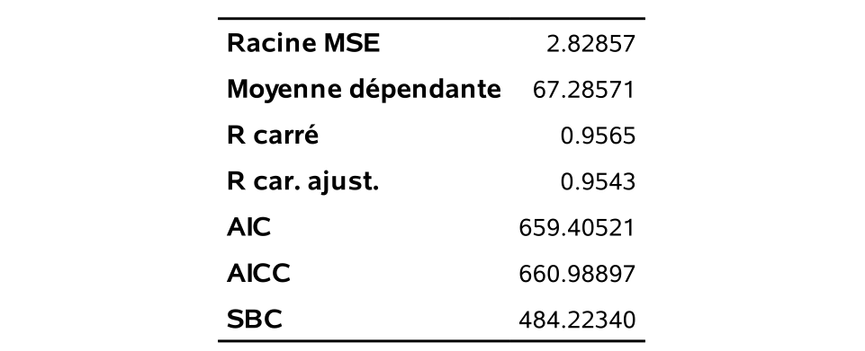
```
```{r fig2p2_fig15, echo = FALSE, out.width='70%', fig.align = "center"}
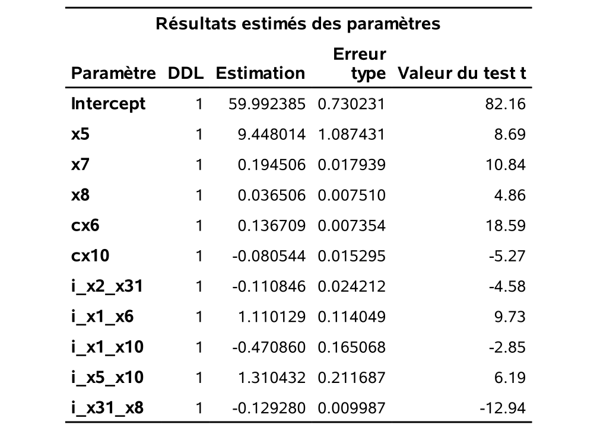
```

Il s'avère que ce modèle performe très bien avec une erreur moyenne quadratique estimé à $10.08$ sur les 23 179 clients de l'échantillon test. Il s'agit du meilleur jusqu'à maintenant. 

## Méthodes de régression avec régularisation

Une façon d'éviter le surajustement est d'ajouter une pénalité sur les coefficients: ce faisant, on introduit un biais dans nos estimés, mais dans l'espoir de réduire leur variabilité et ainsi d'obtenir une meilleur erreur moyenne quadratique. 

Les estimateurs des moindres carrés ordinaires pour la régression linéaire représentent la combinaison qui minimise la somme du carré des erreurs,
\begin{align*}
\mathsf{SCE} = \sum_{i=1}^n \left(y_i - \alpha - \sum_{j=1}^p\mathrm{X}_{ij}\beta_{j}\right)^2.
\end{align*}
On peut ajouter à cette fonction objective $\mathsf{SCE}$ un terme additionnel de pénalité qui va contraindre les paramètres à ne pas être trop grand. On considère une pénalité additionnelle pour la valeur absolue des coefficients,  \[
q_1(\lambda) = \lambda \sum_{j=1}^p |\beta_j|.
\]
Pour chaque valeur de $\lambda$ donnée, on obtiendra une solution différente pour les estimés car on minimisera désormais $\mathsf{SCE} + q_1(\lambda)$. On ne pénalise pas l'ordonnée à l'origine $\alpha$, parce que ce coefficient sert à recentrer les observations et a une signification particulière. Si on standardise les données, de manière à ce que leur moyenne empirique soit zéro et leur écart-type un, alors $\widehat{\alpha} = \overline{y}$. 

L'avantage des moindres carrés est que les valeurs ajustées et les prédictions ne changent pas si on fait une transformation affine (de type $Z = aX+b$).
Peu importe le choix d'unités (par exemple, exprimer une distance en centimètres plutôt qu'en mètres, ou la température en Farenheit plutôt qu'en Celcius), on obtient le même modèle. En revanche, une fois qu'on introduit un terme de pénalité, notre solution dépendra de l'unité de mesure, d'où l'importance d'utiliser les données centrées et réduites pour que la solution reste la même.

La pénalité $q_1(\lambda)$ a un rôle particulier parce qu'elle a deux effets: elle réduit la taille des paramètres, mais elle force également certains paramètres très proches de zéro à être exactement égaux à zéro, ce qui fait que la régression pénalité agit également comme outil de sélection de variables. Des algorithmes efficaces permettent de trouver la solution du problème d'optimisation
\begin{align*}
\min_{\boldsymbol{\beta}} \{\mathsf{SCE} + q_1(\lambda)\} = \min_{\boldsymbol{\beta}}  \left\{\sum_{i=1}^n \left(y_i - \alpha - \sum_{j=1}^p\mathrm{X}_{ij}\beta_{j}\right)^2 +
\lambda \sum_{j=1}^p |\beta_j|\right\}
\end{align*}
laquelle est appelée LASSO. La Figure \@ref(fig:lassopenalty) montre la fonction objective dans le cas où on a deux paramètres, $\beta_1$ et $\beta_2$. La solution des moindres carrés ordinaires, qui minimisent l'erreur moyenne quadratique, est au centre des ellipses de contour et correspond à la solution du modèle avec $\lambda=0$. À mesure que l'on augmente la pénalité $\lambda$, les coefficients rétrécissent vers $(0, 0$. On peut interpréter la pénalité $l_1$ comme une contraire budgétaire: les coefficients estimés pour une valeur de $\lambda$ donnée sont ceux qui minimisent la somme du carré des erreurs, mais doivent être à l'intérieur d'un budget alloué (losange). La forme de la région fait en sorte que la solution, qui se trouve sur la bordure du losange, intervient dans un coin avec certaines coordonnées nulles.


```{r lassopenalty, cache = TRUE, fig.cap = "Courbes de contour du critère de l'erreur moyenne quadratique (ellipses) et fonction de pénalité (losanges) pour différentes valeurs de $\\lambda$. Les points dénotent des solutions différentes et intersectent les contours du losange.", eval = TRUE, echo = FALSE}
set.seed(1234)
n <- 100L
X <- scale(cbind(rpois(n, 2), runif(n)))
y <- scale(X[,1] + 0.5*X[,2] + rnorm(n, sd = 0.4))
fit <- lm(y ~ X - 1)
points <- data.frame(x = c(0, fit$coefficients[1]), y = c(0, fit$coefficients[2]), z = c("(0,0)", "SCE"))

beta1 <- seq(-0.5, 1.5, length.out = 101)
beta2 <- seq(-0.5, 1.5, length.out = 101)
df <- expand.grid(beta1 = beta1, beta2 = beta2)

b <- as.matrix(df)
df$sse <- rep(t(y) %*% y, length(beta1)*length(beta2)) - 2 * b %*% t(X) %*% y + diag(b %*% t(X) %*% X %*% t(b))

diamond <- function(side_length, center) {
  base <- matrix(c(1, 0, 0, 1, -1, 0, 0, -1), nrow = 2) * sqrt(2) / 2
  trans <- (base * side_length) + center
  as.data.frame(t(trans))
}

a <- glmnet::glmnet(x = X, y = y, lambda = seq(0, 1, by = 0.05))

ggplot(df) + theme_classic() + 
  stat_contour(aes(beta1, beta2, z = sse),
               breaks = round(quantile(df$sse, seq(0, 0.5, 0.05)), 0),
               size = 0.5, color = "grey", alpha = 0.8
  ) +
  scale_x_continuous(limits = c(-0.5, 1.5)) +
  scale_y_continuous(limits = c(-0.5, 1.5)) +
  geom_polygon(data = diamond(0.1, c(0, 0)), mapping = aes(x = V1, y = V2), fill = "cadetblue", alpha = 0.1) +
  geom_polygon(data = diamond(0.2, c(0, 0)), mapping = aes(x = V1, y = V2), fill = "cadetblue", alpha = 0.1) +
  geom_polygon(data = diamond(0.3, c(0, 0)), mapping = aes(x = V1, y = V2), fill = "cadetblue", alpha = 0.1) +
  geom_polygon(data = diamond(0.4, c(0, 0)), mapping = aes(x = V1, y = V2), fill = "cadetblue", alpha = 0.1) +
  geom_polygon(data = diamond(0.5, c(0, 0)), mapping = aes(x = V1, y = V2), fill = "cadetblue", alpha = 0.1) +
  geom_polygon(data = diamond(0.6, c(0, 0)), mapping = aes(x = V1, y = V2), fill = "cadetblue", alpha = 0.1) +
  geom_polygon(data = diamond(0.7, c(0, 0)), mapping = aes(x = V1, y = V2), fill = "cadetblue", alpha = 0.1) +
  geom_polygon(data = diamond(0.8, c(0, 0)), mapping = aes(x = V1, y = V2), fill = "cadetblue", alpha = 0.1) +
  geom_polygon(data = diamond(0.9, c(0, 0)), mapping = aes(x = V1, y = V2), fill = "cadetblue", alpha = 0.1) +
  geom_polygon(data = diamond(1, c(0, 0)), mapping = aes(x = V1, y = V2), fill = "cadetblue", alpha = 0.1) +
  geom_polygon(data = diamond(1.1, c(0, 0)), mapping = aes(x = V1, y = V2), fill = "cadetblue", alpha = 0.1) +
  geom_polygon(data = diamond(1.2, c(0, 0)), mapping = aes(x = V1, y = V2), fill = "cadetblue", alpha = 0.1) +
  labs(x = expression(beta[1]), y = expression(beta[2])) + 
  geom_point(data = data.frame(t(as.matrix(a$beta))), aes(x = V1, y = V2))


```

Plusieurs variantes existent dans la littérature qui généralisent le modèle à des contextes plus compliqués. Le choix des variables à inclure dans la sélection dépend du choix de la pénalité $\lambda$, qui est règle générale estimée par validation croisée à 5 ou 10 groupes.


## Moyenne de modèles 

Une idée importante et moderne en statistique est qu'il est souvent préférable de combiner plusieurs modèles plutôt que d'en choisir un seul. La technique des forêts aléatoires (_random forests_) est une des meilleures techniques de prédiction disponibles de nos jours. Elle est basée sur cette idée, en combinant plusieurs arbres de classification (ou de régression) individuels. C'est une des techniques de base en exploitation de données.

Ici, nous allons voir comment cette idée peut être appliquée à notre contexte. Toutes les méthodes que nous avons vues jusqu'à maintenant font une sélection « rigide » de variables, dans le sens que chaque variable est soit sélectionnée pour faire partie du modèle, soit elle ne l'est pas. C'est donc tout ou rien pour chaque variable. Il y a beaucoup de variabilité associée à une telle forme de sélection. Une variable peut avoir été très près d'être choisie, mais elle ne l'a pas été et est éliminée complètement. Construire plusieurs modèles et en faire la moyenne permet d'adoucir le processus de sélection car une variable peut alors être partiellement sélectionnée. 

Supposons qu'on dispose de deux échantillons et qu'on fasse une sélection de variables séparément pour les deux échantillons, avec l'une des approches que nous avons vues jusqu'à maintenant. Il est alors très probable qu'on ne va pas avoir exactement les mêmes variables sélectionnées pour les deux échantillons. Supposons ensuite qu'on fasse la moyenne des coefficients pour les deux modèles. Si une variable, disons $X_1$, a été choisie les deux fois, alors la moyenne des deux coefficients devrait estimer en quelque sorte un effet global pour cette variable. Si une autre variable, disons $X_2$, n'a pas été choisie du tout pour les deux échantillons, alors la moyenne de ses deux coefficients est nulle. Mais si une variable, disons, $X_3$, a été choisie pour seulement l'un des deux échantillons, alors la moyenne de ses deux coefficients est la moitié du coefficient pour le modèle dans lequel elle a été choisie (car l'autre est zéro). Ainsi, cette variable est donc représentée par une « moitié » d'effet dans la moyenne des modèles. Donc au lieu d'être totalement là ou totalement absente, elle est présente en fonction de sa probabilité d'être sélectionnée. Ceci diminue de beaucoup la variabilité engendrée par une sélection « rigide » de variables et permet souvent de produire un modèle fort raisonnable.  

Le problème est que l'on n'a pas plusieurs échantillons mais un seul. Une solution possible est de générer nous-mêmes des échantillons différents à partir de l‘échantillon original. Cela peut être fait avec l'autoamorçage (_bootstrap_). Un échantillon d'autoamorçage est tout simplement un échantillon choisi au hasard et **avec remise** dans l'échantillon original.  Ainsi, une même observation peut être sélectionnée plus d'une fois tandis qu'une autre peut ne pas être sélectionnée du tout.

L'idée est alors la suivante :  

1) Générer plusieurs échantillons par autoamorçage nonparamétrique à partir de l‘échantillon original.
2) Faire une sélection de variables pour chaque échantillon.
3) Faire la moyenne des paramètres de ces modèles.

La procédure `glmselect` a une commande expérimentale, `modelaverage`, qui permet de faire une moyenne de modèles. Comme elle est expérimentale, les particularités (options et sorties) de cette commande risquent de changer au cours des versions à venir. Le code suivant permet de faire une moyenne de modèles. 

```{sas modelaverage, eval=FALSE}
proc glmselect data=trainymontant seed=57484765;
class x3 x4;
model ymontant=x1|x2|x3|x4|x5|x6|x7|x8|x9|x10@2 cx2 cx6 cx7 cx8 cx9 cx10  /   
selection=stepwise(select=aic choose=sbc); 
score data=testymontant out=predaverage p=predymontant;
modelaverage nsamples=500 sampling=urs subset(best=500);
run;
```

Chaque modèle est construit à l'aide d'un échantillon aléatoire avec remise (`sampling=urs`). Il y aura 500 échantillons, et donc modèles, en tout (`nsamples=500`). L'option `subset(best=500)` indique à **SAS** de faire la moyenne des paramètres des 500 modèles. Notez l'option `seed` qui permet de reproduire les résultats, car elle fixe une valeur pour le générateur de nombre aléatoire (qui sera utilisé pour générer les échantillons d'autoamorçage). Cette fois-ci la sélection se fait avec le critère $\mathsf{BIC}$ à tous les niveaux (`select=bic choose=bic`).

```{r fig2p2_fig16, echo = FALSE, out.width='90%', fig.align = "center"}
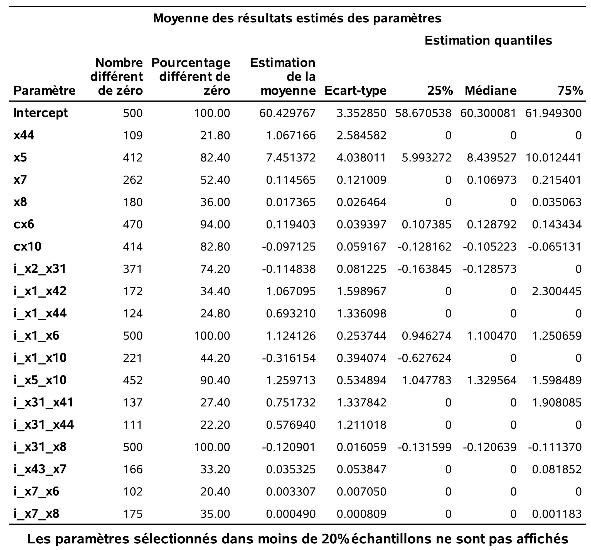
```

Ce tableau présente les variables qui ont été choisies dans an moins 20% des modèles, c'est-à-dire, dans au moins 100 des 500 modèles ici. Il y a deux variables qui ont été retenues dans tous les modèles, `i_x1_x6` et `i_x31_x8`. Le tableau rapporte aussi la moyenne des estimations pour ces paramètres.

Il s'avère que cette approche performe très bien sur l'échantillon test de 23 179 clients avec une erreur moyenne quadratique estimé de $10,57$. Le tableau \@ref(tab:02-modelcomparaisonfull) résume la performance des différentes méthodes que nous avons utilisé sur notre échantillon test.

Table: (\#tab:02-modelcomparaisonfull) Comparaison des méthodes selon l'erreur moyenne quadratique.

| variables | nombre de variables | $\mathsf{EMQ}$ |méthode |
|:----|:----:|:-----:|:-----|
| de base |  14 | 25,69|toutes les variables |
| | 10 | 24,72 | exhaustive - $\mathsf{AIC}$ |
| |  7 | 23,83 | exhaustive - $\mathsf{BIC}$ |
|interactions et termes quadratiques | 104 | 19,63 | toutes les variables |
| |22 | 12,25 | séquentielle classique | 
| | 38 | 14,83 |séquentielle classique, recherche exhaustive avec 56 variables $(\mathsf{AIC})$ |
| | 15 | 11,96 |séquentielle classique, recherche exhaustive avec 56 variables $(\mathsf{BIC})$|
| | 10 | 10,08 |séquentielle avec critère $\mathsf{AIC}$ (choix selon le $\mathsf{BIC}$)|
| | 26 | 11,61 | LASSO, validation croisée avec 10 groupes |
| |  | 10,57 |moyenne de modèles |

Dans cet exemple, la méthode séquentielle de `glmselect` avec les options  `select=aic` et `choose=bic` aurait donné le meilleur résultat pour prévoir le montant acheté des clients restants (de ceux qui auraient acheté quelque chose). Le deuxième meilleur aurait été la moyenne des modèles. 

Il y aurait plusieurs autres approches/combinaisons qui pourraient être testées. Le but de ce chapitre était simplement de présenter les principes de base en sélection de modèles et de variables ainsi que certaines approches pratiques. Il y a d'autres approches intéressantes, tels le filet élastique LARS (_least-angle regression_) qui sont disponibles dans `glmselect`. Ces méthodes sont dans la même mouvance moderne que celle qui consiste à faire la moyenne de plusieurs modèles, en performant à la fois une sélection de variables et en permettant d'avoir des parties d'effet par le rétrécissement (_shrinkage_). De récents développements théoriques permettent aussi de corriger les valeurs-_p_ pour faire de l'inférence post-sélection avec le LASSO.

Il faut bien comprendre qu'il ne s'agit que d'un seul exemple: il ne faut surtout pas conclure que la méthode séquentielle de `glmselect` avec les options `select=aic` et `choose=bic` sera toujours la meilleure. En fait, il est impossible de prévoir quelle méthode donnera les meilleurs résultats.