# Analyse de regroupements

## Introduction

On cherche à créer des groupes (*clusters*) d’individus homogènes en utilisant $p$ variables $X_1, \ldots, X_p$. Plus précisément, on veut combiner des sujets en groupes (interprétables) de telle sorte que les individus d’un même groupe soient le plus semblables possible par rapport à certaines caractéristiques et que les groupes soient le plus différent possible.  
Nous disposons des observations pour $n$ individus et $X_{ij}$ dénote la valeur de la $j$e variable explicative pour le $i$e sujet: les variables correspondant au sujet $S_i$ sont donc $X_{i1}, \ldots, X_{ip}$.

Il y a une certaine analogie avec l’analyse factorielle. En analyse factorielle, on cherche à déterminer s’il y a des groupes de **variables** corrélées entre elles. On cherche donc à regrouper des variables. En analyse de regroupements, on cherche plutôt à créer des groupes de **sujets** similaires. Les deux méthodes servent pour l'analyse exploratoire.

Étapes d’une analyse de regroupements

1) Choisir les variables pertinentes à l’analyse.
2) Décider comment seront mesurées les « distances » entre les sujets. Cela revient à choisir une mesure de dissemblance.
3) Décider quelle méthode sera utilisée (méthode hiérarchique, méthode non hiérarchique).
4) Choisir le nombre de groupes, soit à partir de connaissances à priori, soit en se basant sur l’analyse de regroupements elle-même.
5) Interpréter les groupes obtenus.
6) Utiliser ces groupes dans d’autres analyses, le cas échéant.

### Mesures de dissemblance

Une mesure de dissemblance sert à quantifier la distance entre deux sujets $S_i$ et $S_j$ en se basant sur les $p$ variables $X_1, \ldots, X_p$. Plus cette mesure est petite, plus les sujets $S_i$ et $S_j$ sont similaires. Même s’il y a des exceptions, la plupart des mesures de dissemblances $d$ ont les propriétés suivantes :

1) $d(S_i, S_j) \geq 0$ (positivité);
2) $d(S_i, S_i)=0$;
3) $d(S_i, S_j)=d(S_j, S_i)$ (symmétrie);
4) $d(S_i, S_j)$ augmente au fur et à mesure que les deux sujets deviennent plus différents.

Lorsque toutes les variables sont continues, une mesure de dissemblance souvent utilisée est la distance euclidienne entre sujets, soit
\begin{align*}
d(S_i, S_j) = \sqrt{(X_{i1}-X_{j1})^2 + \cdots + (X_{ip}-X_{jp})^2}.
\end{align*}

La distance euclidienne est tout simplement la longueur du segment qui relie les deux points dans l’espace.

Nous verrons plus tard d’autres mesures de dissemblances incluant des mesures qui peuvent être utilisées avec des variables binaires, nominales et ordinales. 

### Méthodes hiérarchiques et non hiérarchiques

Les **méthodes hiérarchiques** assignent les individus aux groupes à l'aide d'un algorithme glouton en partant du cas à $n$ groupes où chaque sujet est un groupe à part entière. La distance entre chaque paire de groupe est calculée. Les deux groupes ayant la distance la plus petite sont regroupés pour ne laisser que $n-1$ groupes. La distance entre chaque paire de groupe est à nouveau calculée (pour les  groupes). Les deux groupes ayant la distance la plus petite sont regroupés pour ne former qu’un seul groupe et ainsi de suite. Le processus se continue ainsi jusqu’à ce que tous les sujets soient regroupés en un seul groupe.

Avec une méthode hiérarchique, on n’a pas besoin de spécifier le nombre de groupes à priori. Cependant, une fois qu’un sujet est assigné à un groupe, il ne peut le quitter pour être réassigné à un autre groupe plus tard. Ce qui différencie les différentes méthodes hiérarchiques est la manière dont est calculée la distance entre deux groupes.

Pour les **méthodes non hiérarchiques**, le nombre de groupe est spécifié au départ et un algorithme cherche, à partir d’une solution initiale, la meilleure distribution des sujets à travers ce nombre de groupe d’une manière itérative. Avec ces méthodes, l’assignation d’un sujet peut être modifiée d’une itération à l’autre. Il faut cependant spécifier le nombre de groupe et les « centres » de ces groupes au départ. La solution peut être très sensible au choix des centres initiaux. 

## Segmentation de seniors en voyage organisé

Les données sont inspirées de 

> Hsu, C. H. C. et Lee E.-J. (2002). Segmentation of Senior Motorcoach Travelers. *Journal of Travel Research*, **40**, 364-373.

Les buts de l'étude étaient

1) Regrouper les gens de 55 et plus qui participent à des voyages organisés en autobus en groupes homogènes selon des caractéristiques reliées au choix de l’opérateur et du voyage.
2) Examiner les caractéristiques de ces groupes.
3) Examiner les caractéristiques démographiques de ces groupes.

Nous allons nous intéresser principalement aux deux premiers points ici. Un questionnaire a été élaboré afin d’évaluer l’importance de 55 caractéristiques des opérateurs de voyages organisés en autobus et des voyages eux-mêmes à l’aide d’une échelle de Likert à cinq points, allant de extrêmement important ($\texttt{5}$) à pas important du tout ($\texttt{1}$)). Des données sont disponibles pour 150 sujets (il y en avait 817 dans l’article). Elles se trouvent dans le fichier `cluster1.sas7bdat`.

Au lieu de faire une analyse de regroupements avec les 55 items du questionnaire, les auteurs ont choisi de faire une analyse factorielle avec rotation varimax au préalable afin de réduire le nombre de variables à six facteurs interprétables  :

- Activités sociales ($X_1$): formé de cinq items
- Politiques de l’opérateur et références ($X_2$)  : formé de six items.
- Horaires flexibles ($X_3$): formé de trois items.
- Santé et sécurité ($X_4$) : formé de quatre items.
- Matériel publicitaire ($X_5$): formé de deux items.
- Réputation ($X_6$): formé de deux items.

On voit donc que 22 items, parmi les 55, sont utilisés dans la définition de ces six facteurs. Dans l’article, les auteurs ont décidé d’inclure ces 22 items dans l’analyse de regroupements. Pour notre part et afin de simplifier l’exemple, nous allons plutôt créer six nouvelles échelles en faisant la moyenne des items de chaque facteur ci-haut et utiliser seulement ces six échelles dans l’analyse de regroupements. Les valeurs de ces six variables pour les 150 sujets se trouvent dans le fichier `cluster1a.sas7bdat` et sont toutes dans l'intervalle $[1,5]$, puisqu'elles représentent la moyenne d'échelles de Likert.

```{r fig4-e1, echo = FALSE, out.width='60%', fig.align = "center"}
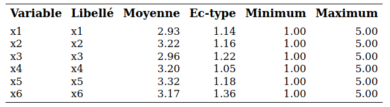
```

## Méthodes hiérarchiques

Comme nous venons de le voir, cette méthode débute avec $n$ groupes, un par sujet, et procède en regroupant des groupes formés au préalable d’une manière hiérarchique jusqu’à ce que tous les sujets ne forment qu’un seul groupe. Le nombre de groupe retenu pourra être sélectionné à l’aide de certains critères que nous verrons plus tard. 

À une étape donnée, il faut choisir quels groupes seront combinés. Les deux groupes dont la distance est la plus faible seront combinés. Il faut donc être en mesure de calculer la distance entre deux groupes. Nous allons décrire la méthode de Ward, qui compte parmi les plus populaires. Nous reviendrons brièvement sur d’autres méthodes plus loin.

### Méthode de Ward

Cette méthode est basée sur un critère d’homogénéité global des groupes. Pour un groupe donné, cette homogénéité est mesurée par la somme des carrés des observations par rapport à la moyenne du groupe. L’homogénéité globale est alors la somme des homogénéités de tous les groupes.  Plus l’homogénéité globale est petite, plus les groupes sont homogènes. À une étape donnée, les deux groupes qui causent la plus petite hausse de l’homogénéité globale (la plus petite perte d’information) sont regroupés. La méthode de Ward donne des groupes compacts d'apparence sphérique.

Plus précisément, supposons qu’à une étape du processus hiérarchique, nous avons $M$ groupes et que nous voulons passer à $M-1$ groupes. Pour un groupe $k$ (parmi $1, 2, \ldots, M$), définissons la somme des carrés des distances par rapport à la moyenne du groupe, $\mathsf{SCD}_k$. Plus $\mathsf{SCD}_k$ est petite, plus le groupe est compact et homogène.

On peut calculer cette distance pour tous les $M$ groupes et définir l'**homogénéité globale** comme la somme de l'homogénéité de tous les groupes,
\begin{align*}
\mathsf{SCD}_G = \mathsf{SCD}_1 + \cdots + \mathsf{SCD}_M.
\end{align*}
Plus l'homogénéité globale $\mathsf{SCD}_G$  est petite, mieux c’est. Pour passer de $M$ à $M-1$ groupes, la méthode de Ward va regrouper les deux groupes qui feront que $\mathsf{SCD}_G$ sera la plus petite possible.

On procède à une analyse simplifiée des données pour le voyage organisé avec deux variables et vingt observations afin d'être en mesure de visualiser l'algorithme de groupement. Les données se trouvent dans le fichier `cluster1a`. 

```{r 04-plottrueclust, eval = TRUE, echo = FALSE, out.width='90%', fig.align = "center"}
url <- "https://lbelzile.bitbucket.io/MATH60602/cluster1a.sas7bdat"
cluster1a <- haven::read_sas(url)
attach(cluster1a)
par(mar = c(4,4,1,2))
plot(y = x1, x = x2, col = cluster_vrai, pch = 14 + cluster_vrai, 
     bty = "l", xlab = expression(x[2]), 
     ylab = expression(x[1]), 
     xlim = c(1,5.4))
text(x2, x1, 1:nrow(cluster1a), pos = 4)
detach(cluster1a)
```

Comme souvent, les données ont été simulées et le nombre de regroupements est donc connu (de même que l'appartenance des différentes observations aux regroupements). La variable qui donne l’identité du vrai groupe est `cluster_vrai`. Il est important de bien comprendre qu’en pratique, on ne connaît ni le nombre de groupes, ni quelle observation appartient à quel groupe. Ici, on se servira du fait qu’on connaît les vrais groupes pour examiner la performance de l’analyse de regroupements. 

La première analyse utilise la méthode de Ward. Les commandes **SAS** se trouvent dans `cluster1_simplifie.sas`; la présentation de la procédure et de la syntaxe est différée. L’historique de regroupement est décrit dans la sortie **SAS**. La première colonne donne le nombre de groupes. Au départ, les observations 16 et 19 sont regroupées, il y a maintenant 19 groupes. Ensuite, les observations 11 et 13 sont regroupées, il y a maintenant 18 groupes. Au moment de passer de 14 à 13 groupes, c’est le groupe formé à l’étape 16 qui est fusionné avec l’observation 2 et ainsi de suite. La colonne `Fréq` donne le nombre d’observations dans le groupe qui vient d’être formé.

```{r fig4-e3, echo = FALSE, out.width='80%', fig.align = "center"}
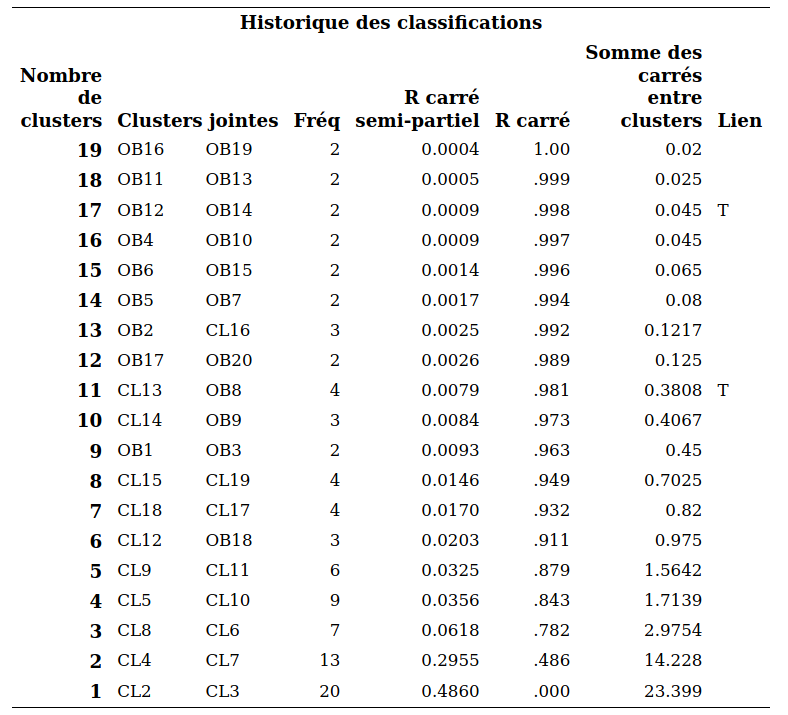
```

Les quantités `sprsq` et `rsq` sont des statistiques qui peuvent servir de guide pour choisir le nombre de groupes. Le $\mathsf{RSQ}$ est une mesure similaire au $R^2$ régression linéaire qui mesure globalement à quel point les groupes sont homogènes.  Elle prend une valeur entre 0 et 1 où 0 et plus le $\mathsf{RSQ}$ est élevé, meilleur le regroupement.
On définit le $\mathsf{RSQ}$ comme la proportion de la variabilité expliquée par les groupes. C'est une version standardisée de la somme des homogénéités, $\mathsf{SCD}_G$, 
\begin{align*}
\mathsf{RSQ} = 1-\frac{\mathsf{SCD}_G}{\mathsf{SCD}_T},
\end{align*}
 où $\mathsf{SCD}_T$ est la somme des carrés des distances par rapport à la moyenne lorsque toutes les observations sont dans un même groupe. Le graphique \@ref(fig:fig4-e4) montre l'évolution du $\mathsf{RSQ}$ en fonction du nombre de groupes. 

```{r fig4-e4, echo = FALSE, out.width='80%', fig.align = "center", fig.cap = "R carré en fonction du nombre de groupes"}
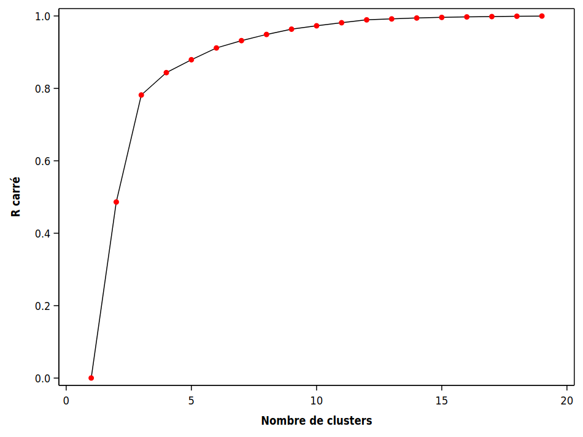
```

L’idée est généralement de choisir un petit nombre de groupe avec un $\mathsf{RSQ}$ assez élevé. 
Ici, on voit que le $\mathsf{RSQ}$ chute brutalement en passant de trois à deux groupes (il passe de  78,2\% de variabilité expliquée à 48,6\%). Ainsi, choisir trois groupes semble raisonnable.

L'autre mesure, le $\mathsf{SPRSQ}$ ou $R$ carré semi-partiel, mesure la perte d’homogénéité résultant du fait que l’on vient de former un nouveau groupe. Comme on veut des groupes homogènes, on veut qu’elle soit petite. Plus précisément, supposons que les groupes $k_1$ et $k_2$ viennent d’être regroupés à une étape donnée. Soient $\mathsf{SCD}_{k_1}$ et $\mathsf{SCD}_{k_2}$ les homogénéités de ces deux groupes et $\mathsf{SCD}_{k}$ l’homogénéité du nouveau groupe formé en fusionnant les deux. 
On définit la perte d’homogénéité (relative) en combinant ces deux groupes 
\begin{align*}
\mathsf{SPRSQ} = \frac{\mathsf{SCD}_k - \mathsf{SCD}_{k_1} - \mathsf{SCD}_{k_2}}{\mathsf{SCD}_T}
\end{align*}
On peut ainsi tracer une courbe pour le $\mathsf{SPRSQ}$ en fonction du nombre de groupes, comme dans le graphique \@ref(fig:fig4-e5). 

```{r fig4-e5, echo = FALSE, out.width='80%', fig.align = "center", fig.cap = "Courbe du $R^2$ semi-partiel en fonction des groupements hiérarchiques"}
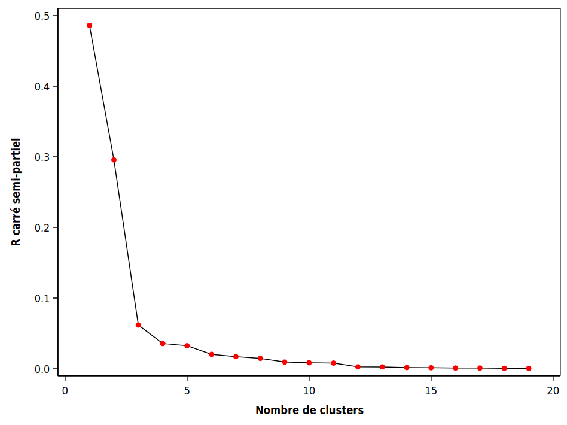
```

La procédure **SAS** qui permet d’effectuer une analyse de regroupements hiérarchique est `cluster`. Le fichier `cluster2_complet.sas` explique les différentes options disponibles.

```{sas 04-clust, eval= FALSE, echo= TRUE}
proc cluster data=temp method=ward outtree=temp1 nonorm rsquare ccc;
var x1-x6;
copy id cluster_vrai x1-x6;
ods output stat.cluster.ClusterHistory=criteres;
run;
```


On peut représenter graphique le R carré (Figure \@ref(fig:fig4-e7)), le Rcarré semi partiel (Figure \@ref(fig:fig4-e8)) et le critère de classification cubique (Figure \@ref(fig:fig4-e9)) en fonction du nombre de groupes. Ce derniers est plus technique mais son interprétation est simple, plus sa valeur est élevée, mieux c’est. Par contre, il peut avoir plusieurs maximums locaux et, de ce fait, ce n’est donc pas toujours évident de choisir le nombre de groupes avec ce critère. Il semble encore une fois que choisir trois groupes semble raisonnable.

```{r fig4-e7, echo = FALSE, out.width='80%', fig.align = "center", fig.cap = "R carré en fonction des regroupements hiérarchiques"}
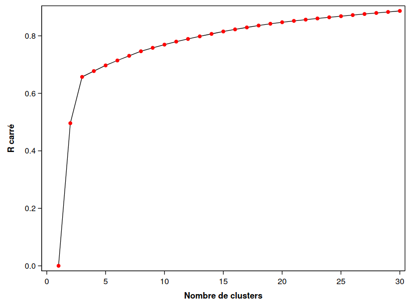
```

```{r fig4-e8, echo = FALSE, out.width='80%', fig.align = "center", fig.cap = "R carré semi-partiel en fonction des regroupements hiérarchiques"}
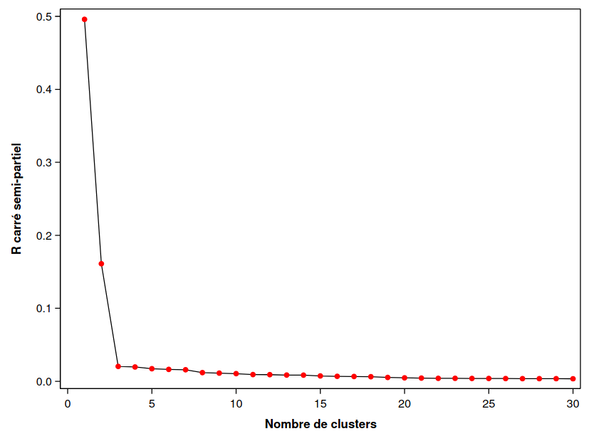
```

```{r fig4-e9, echo = FALSE, out.width='80%', fig.align = "center",fig.cap = "Critère de classification cubique en fonction des regroupements hiérarchiques"}
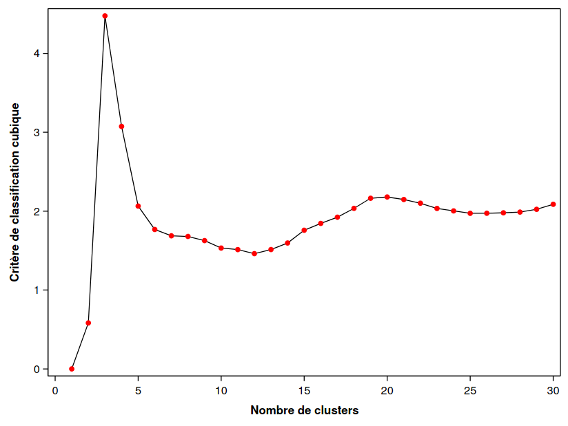
```

Parfois, l'information est présentée sous forme de dendogramme, qui trace l'arbre et la fusion des groupes. On peut ainsi retracer l'historique de la procédure hiérarchique. Celui produit par **SAS** donne, à un facteur multiplicatif près, le $\mathsf{SPRSQ}$. Il n’y a donc pas de nouvelles informations ici. On voit que c’est lorsqu’on passe de trois à deux groupes, qu’il y a une bonne perte d’homogénéité. 

En pratique, on ne peut jamais savoir si on a bel et bien regroupé ensemble les bons sujets. Mais ici, comme il s’agit de données artificielles qui ont été générées, nous connaissons la composition des vrais groupes. Il s’avère qu’il y en a effectivement trois. De plus, la solution à trois groupes obtenue avec la méthode de Ward a bien réussi à retrouver les groupes car il y a 146 sujets sur 150 (97,3\%) qui sont bien regroupés, et quatre qui font partie d’un mauvais groupe.  Ceci est un exemple facile où les observations sont bien séparées. Ce n’est pas toujours aussi simple en pratique. 

**Interprétation des groupes**: la méthode la plus simple consiste à inspecter les moyennes des variables de chaque groupe et de voir s’il en découle une interprétation raisonnable. La procédure `tree` permet d’extraire la solution avec un nombre spécifié de groupes et il est ensuite facile (avec la procédure `means`) d’obtenir ces moyennes (voir le fichier `cluster2_complet.sas`).


```{r fig4-e11, echo = FALSE, out.width='55%', fig.align = "center"}
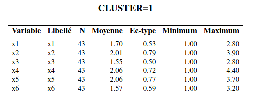
```

```{r fig4-e12, echo = FALSE, out.width='55%', fig.align = "center"}
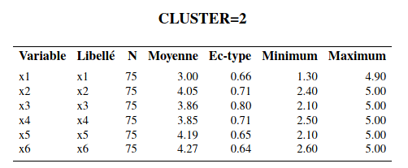
```

```{r fig4-e13, echo = FALSE, out.width='55%', fig.align = "center"}
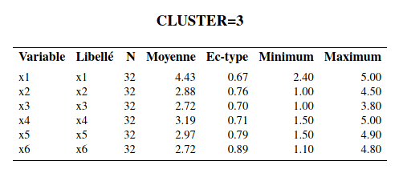
```


Le groupe 1 est le groupe où les sujets ont les valeurs, en moyenne, les plus faibles pour les six variables. Le groupe 2 est celui où les sujets ont les valeurs, en moyenne, les plus élevées pour les 6 variables sauf pour la variable $X_1$ (activité sociale). Le groupe 3 est celui où les sujets ont, en moyenne, la valeur la plus élevée de la variable $X_1$ et des valeurs moyennes inférieures au groupe 3 mais supérieures au groupe 2 pour les cinq autres variables. 

Dans l’article, les auteurs ont baptisé les sujets du groupe 1, les « indépendants », ceux du groupe 2, les « dépendants » et ceux du groupe 3, les « sociables ». On peut également tester l’égalité des moyennes des variables pour les différents groupes avec une ANOVA. On peut aussi être plus sophistiqué et explorer les groupes en modélisant les effets des variables en ce qui a trait à l’appartenance aux groupes. Traditionnellement, l’analyse discriminante est utilisée à cette fin. Il est aussi possible d’utiliser un arbre de classification ou une autre méthode prévisionnelle, telle la régression multinomiale logistique. La variable identifiant le groupe d’appartenance obtenu avec l’analyse de regroupement sert alors de variable dépendante $Y$. Ce type d’analyse permet de creuser un peu plus pour essayer de comprendre la structure des groupes formés.


## Méthodes non hiérarchiques

Contrairement aux méthodes hiérarchiques, il faut spécifier le nombre de groupe désiré dès le départ pour les méthodes non hiérarchiques. La méthode des $k$ moyennes ($k$ *means*) sera la seule décrite ici. Cette méthode utilise la distance euclidienne et est donc seulement applicable avec des variables quantitatives. Supposons que l’on veuille $k$ groupes. La méthode des $k$ moyennes peut être décrite en trois étapes :

1) On sélectionne $k$ germes (*seeds*) qui vont agir comme centres préliminaires des groupes.
    i) Ces germes peuvent être les centres des groupes obtenus à partir d’une autre méthode comme une méthode hiérarchique.
    ii) Ces germes peuvent être choisis à même l’ensemble de données. Par exemple, on peut choisir $k$ sujets au hasard.
2) On assigne dans l’ordre les observations au groupe le plus proche (distance euclidienne par rapport au germe). Soit on assigne toutes les observations avant de mettre à jour les germes, soit on met à jour les germes après chaque assignation d’un sujet. Le nouveau germe d’un groupe est la moyenne des observations faisant partie du groupe.
3) On peut répéter le processus jusqu’à ce que les changements des germes des groupes deviennent négligeables ou nuls. Les groupes finaux sont formés en assignant les sujets au groupe le plus proche.

Nous allons utiliser cette procédure pour raffiner la solution obtenue précédemment avec la méthode de Ward en utilisant les moyennes des groupes comme centres préliminaires. Le fichier `cluster3_non-hierarchique.sas` explique les différentes options. La syntaxe de la procédure **SAS** `fastclus` est la suivante:

```{sas 04-kmeans, eval = FALSE, echo = TRUE}
proc fastclus data=temp seed=initial distance maxclusters=3 out=temp3 maxiter=30;
var x1 x2 x3 x4 x5 x6;
run;
```

Voici une partie de la sortie **SAS**:


```{r fig4-e14, echo = FALSE, out.width='70%', fig.align = "center"}
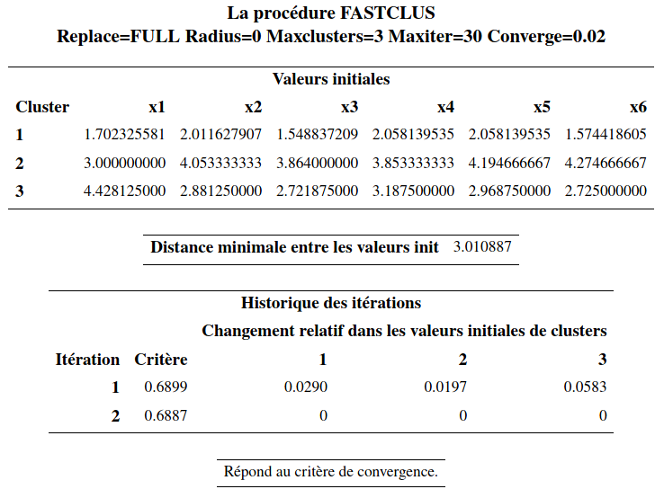
```


```{r fig4-e15, echo = FALSE, out.width='90%', fig.align = "center"}
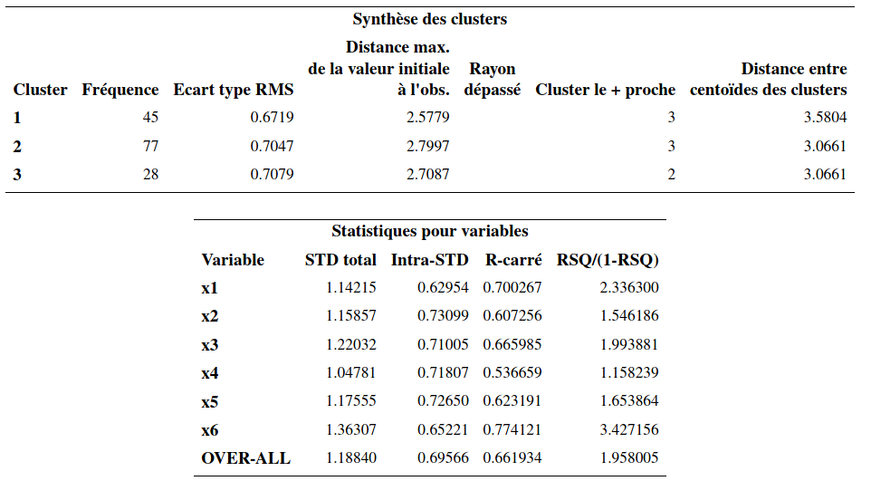
```


```{r fig4-e16, echo = FALSE, out.width='50%', fig.align = "center"}
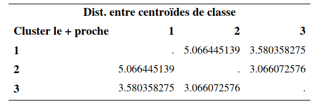
```


Évidemment, comme la solution obtenue avec la méthode de Ward est déjà excellente (146 observations de bien regroupées sur 150), on ne pourra pas avoir une amélioration notable. Il y a peu de changements par rapport à la solution de la méthode de Ward. Les tailles des groupes étaient de (43, 75, 32) avant. Elles sont maintenant (45, 77, 28). Le R carré passe de 65,7\% (avec Ward) à 66.2%.

L’interprétation des groupes est la même que précédemment.


```{r fig4-e17, echo = FALSE, out.width='70%', fig.align = "center"}
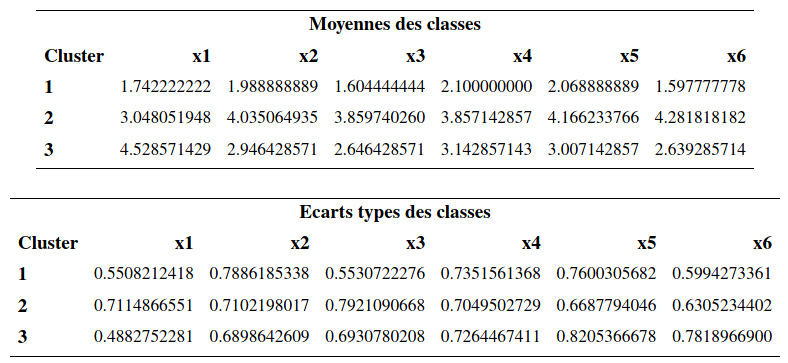
```

Il y a maintenant 148 sujets sur 150 (98,7\%) qui sont bien regroupés et 2 qui font partie d’un mauvais groupe.  C’est une légère amélioration par rapport à la solution avec la méthode de Ward pour laquelle il y avait 146 sujets sur 150 qui étaient bien regroupés. Mais encore une fois, en pratique on n’aura pas accès à cette information.

## Standardisation des variables


Dans les exemples précédents, nous avons utilisé les variables $X_1$ à $X_6$ telles quelles. En général, plus une variable a une grande variance, plus elle aura de l’influence sur le calcul de la distance euclidienne. Ainsi, en utilisant les variables telles quelles, nous accordons plus de poids aux variables avec de grandes variances. Ceci peut être bon ou mauvais. Cela dépend de la structure des groupes. 

Avec la procédure `stdize`, on peut standardiser au préalable les variables avant de faire l’analyse. Par défaut, les variables seront standardisées afin d’avoir une moyenne de zéro et une variance de un. On peut ensuite faire les analyses comme précédemment. Le fichier `cluster4_standardisation.sas` contient les commandes pour standardiser les variables et ensuite refaire l’analyse de regroupements avec la méthode de Ward. Notez que les six variables ont des variances semblables, donc les résultats ne devraient donc pas être trop affectés en standardisant les variables. Il s’avère effectivement que les résultats changent très peu si on standardise les variables. Les tailles des groupes de la solution à trois groupes sont (44, 75, 31) (comparativement à (43, 75, 32) sans la standardisation). Il s’avère que 147 des 150 sujets sont bien regroupés (comparativement à 146 sans la standardisation). Il s’agit d’une très légère amélioration.

## Considérations pratiques

Il peut être intéressant de comparer les résultats provenant d’une même méthode avec des nombres différents de groupes et aussi comparer ceux provenant de plusieurs méthodes (voir plus loin pour la description de certaines autres méthodes). Le choix de la méthode et du nombre de groupe n’est pas facile et devrait être basé sur des considérations pratiques et d’interprétation (comme en analyse factorielle). Il n’est pas rare qu’on obtienne des résultats très différents d’une méthode à l’autre pour un même ensemble de données. 

Avec une méthode non hiérarchique, il est préférable de fournir des germes de départ « raisonnablement bon » (provenant d’une méthode hiérarchique par exemple) plutôt que de laisser l’algorithme les choisir au hasard.

Le choix des variables est important. En général on veut créer des groupes d’individus qui sont homogènes par rapport à un certain aspect de leur comportement ou de leur situation. On ne doit alors inclure que les variables pertinentes à cet aspect. Par exemple, si le but de l’analyse est de segmenter nos clients selon leurs habitudes de consommation (genre de boutiques fréquenté, fréquence, etc.), on ne voudra peut-être pas inclure des variables démographiques. En fait, souvent l’analyse de regroupements servira justement à créer des groupes qui seront comparés (avec l’analyse de variance par exemple) par rapport à d’autres variables qui n’ont pas été utilisées pour créer les groupes. Dans notre exemple sur les voyages organisés, on a segmenté les voyageurs en trois groupes (indépendants, dépendants et sociables). Les auteurs de l’article (voir page 369 de l’article) ont comparé les trois groupes selon l’expérience de voyage, la taille de la communauté où ils habitent (avec des ANOVA), selon leur âge, leur revenu et leur éducation (avec des tests d’indépendance du khi-deux).

Le problème majeur avec l’analyse de regroupements est qu’il n’y a pas de façon claire de quantifier la performance de notre analyse. Lorsqu’on développe un modèle de prédiction (régression linéaire ou logistique par exemple), on peut estimer la performance de notre modèle d’une manière objective à l’aide de l’erreur quadratique de généralisation (régression linéaire) ou du taux de bonne classification (régression logistique). Ces quantités peuvent être estimées d’une manière objective en utilisant une méthode telle la validation croisée ou la division de l’échantillon. On ne peut faire de même avec l’analyse de regroupements car on n’a pas de variable réponse à prédire. Tout comme pour l’analyse factorielle, les connaissances à priori, le jugement, et les considérations pratiques font partie d’une analyse de regroupements.


## Exploration graphique préalable et analyse en composantes principales

Comme c’est le cas avec n’importe quelle analyse statistique, il est nécessaire de tenter d’explorer les données graphiquement. On peut parfois réussir à visualiser les groupes d’observations. 

Une première idée consiste à faire le graphe de toutes les paires de variables mais ceci possède deux limites, 

i) il y aura beaucoup de graphes si le nombre de variables est grand et 
ii) on examine seulement les relations bivariées.


```{r 04-pairplot, echo = FALSE, eval = TRUE, out.width='90%', fig.align = "center"} 
url <- "https://lbelzile.bitbucket.io/MATH60602/cluster1.sas7bdat"
cluster1 <- haven::read_sas(url)
par(mar = c(4,4,1,1))
plot(cluster1[,1:6], 
     col = cluster1$cluster_vrai, 
     pch = 14 + cluster1$cluster_vrai, 
     bty = "l")
```

Il n’est pas nécessairement évident de détecter des groupes d’observations ainsi, alors qu'on n'a déjà que six variables. On connaît les vrais groupes ici mais ce n’est pas le cas en pratique.


### Analyse en composantes principales

L’analyse en composantes principales peut être vue comme une méthode de réduction de la dimensionnalité. En fait, elle peut servir à faire de l’analyse factorielle et nous en avons déjà parlé dans le chapitre correspondant. En partant de $p$ variables $X_1, \ldots, X_p$, on forme de nouvelles variables qui sont des combinaisons linéaires des variables originales, 
\begin{align*}
C_j &= w_{j1} X_1 + w_{j2} X_2 + \cdots + w_{jp} X_p, \qquad (j=1, \ldots, p),
\end{align*}
de telle sorte que 

- La première variable formée, $C_1$, appelée première composante principale, possède la variance maximale parmi toutes les combinaisons linéaires sous la contrainte $w_{11}^2 + \cdots + w_{1p}^2=1$.
- La deuxième composante principale $C_2$ possède la variance maximale parmi toutes les combinaisons linéaires qui sont non corrélées avec $C_1$  sous la contrainte $w_{21}^2 + \cdots + w_{2p}^2=1$.
- La troisième composante principale $C_3$ possède la variance maximale parmi toutes les combinaisons linéaires qui sont non corrélées avec $C_1$ et $C_2$  sous la contrainte $w_{31}^2 + \cdots + w_{3p}^2=1$.

et ainsi de suite. Les contraintes sont nécessaires afin de standardiser le problème car il serait possible d’avoir des variances infinies sinon. Ainsi, les composantes principales forment un ensemble de variables non corrélées entre elles, qui récupèrent en ordre décroisant le plus possible de la variance des variables originales. La somme des variances des $p$ composantes principales est égale à la somme des variances des $p$ variables originales. 

On espère donc en général qu’un petit nombre de composantes principales réussira à expliquer la plus grande partie de la variance totale. On pourra alors se servir de ces dernières dans d’autres analyses mais ici, on va seulement s’en servir comme outil graphique préalable à une analyse de regroupements.


```{r fig4-e18, echo = FALSE, out.width='80%', fig.align = "center"}
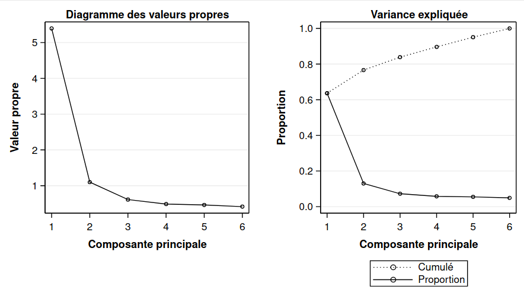
```


Cette étape est généralement effectuée avant l’analyse de regroupement.
Le fichier `cluster5_acp.sas` contient les commandes pour faire une analyse en composantes principales et sauvegarder les composantes principales afin d’en faire des graphiques. La sortie inclut une mesure de la variance cumulée des $k$ premières valeurs propres. La colonne `Proportion` donne la proportion de la variance totale qui est expliquée par la composante correspondante. La colonne `Cumulé` donne le cumul de variance totale expliquée par les composantes jusque là. Ainsi, les deux premières composantes principales reproduisent 76,7\% de la variance totale originale.

Même en ne connaissant pas l'appartenance des observations au regroupement, on distingue assez clairement trois groupes. Le panneau droit du graphique \@ref(fig:04-acp) montre les deux composantes principales, mais avec l’identification des vrais groupes (qu'on ne connaîtra pas en pratique).

```{r 04-acp, eval = TRUE, echo = FALSE, out.width='90%', fig.align = "center", fig.cap = "Projection des observations sur les composantes principales avec la vraie identité des groupes"}
url <- "https://lbelzile.bitbucket.io/MATH60602/cluster1.sas7bdat"
cluster1 <- haven::read_sas(url)
par(mar = c(4,4,1,1), mfrow = c(1,2))
plot(princomp(cluster1)$scores[,1:2], 
     xlab = "composante principale 1", 
     ylab= "composante principale 2", bty = "l")

plot(princomp(cluster1)$scores[,1:2], 
     xlab = "composante principale 1", 
     ylab= "composante principale 2", bty = "l",  
     col = cluster1$cluster_vrai, 
     pch = 14 + cluster1$cluster_vrai)
```


## Calcul alternatif des distances pour le regroupement hiérarchique


Nous avons utilisé la méthode de Ward afin de calculer la distance entre les groupes et procéder au passage de $n$  groupes à un groupe, avec l’approche hiérarchique. Supposons que nous avons choisi une mesure de dissemblance $d(S_i, S_j)$  quelconque (distance euclidienne par exemple) pour mesurer la distance entre deux sujets. D'autres méthodes sont disponibles dans la procédure `cluster`, et les regroupements utilisent 
Voici comment sont choisis les regroupements avec ces méthodes.

- Méthode du plus proche voisin ou méthode de liaison simple (*nearest neighbor*, *single linkage*): utilise la distance minimale entre chaque paire de sujets (un pour chaque groupe) provenant des deux groupes.
- Méthode du voisin le plus éloigné ou méthode de liaison complète (*complete linkage*): utilise la distance maximale entre toutes les paires de sujets (un pour chaque groupe) provenant des deux groupes.
- Méthode de liaison moyenne (*average linkage*): utilise la moyenne des distances entre toutes les paires de sujets (un pour chaque groupe) provenant des deux groupes.
- Méthode du barycentre (*centroid*): utilise la distance entre les représentants moyens de chaque groupe où le représentant moyen d’un groupe est le barycentre, soit la moyenne variable par variable, des sujets formant le groupe. 


Le fichier `cluster6_voisin_eloigne.sas` contient les commandes pour utiliser la méthode du voisin le plus éloigné (avec l’option `method=complete`). Le graphe plus bas donne cette distance pour les deux groupes qui viennent d’être fusionnés. Il s’agit donc du maximum des distances entre chaque paire de sujets (un pour chaque groupe) provenant des deux groupes fusionnés.


```{r fig4-e21, echo = FALSE, out.width='80%', fig.align = "center", fig.cap = "Distance maximale entre groupes en fonction des regroupements hiérarchiques pour la méthode du voisin le plus éloigné."}
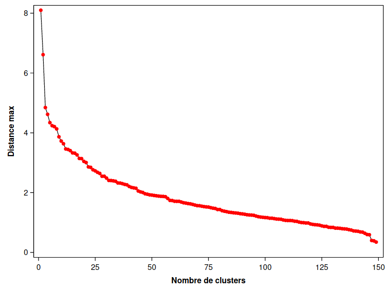
```


Comme on veut que cette distance soit petite pour les groupes fusionnés, on pourrait être tenté d’arrêter à trois groupes ici sur la base de la Figure \@ref(fig:fig4-e20). L’interprétation des groupes ne change pas comparativement aux analyses précédentes. La taille des groupes, (44, 71, 35) change un peu par rapport à la solution avec la méthode de Ward qui donnait des tailles de (43, 75, 32). En fait, avec la méthode du voisin le plus éloigné, 141 des 150 sujets sont dans le bon groupe (comparativement à 146 avec la méthode de Ward). Elle fait donc un peu moins bien pour cet exemple. 


On peut comparer les performances des regroupements hiérarchiques selon la méthode de groupement. La [page web de scikit-learn developers](https://scikit-learn.org/stable/auto_examples/cluster/plot_linkage_comparison.html) montre la performance sur des exemples jouets, qui montre que selon les hypothèses et la structure, aucune ne performe mieux que les autres dans tous les exemples.

```{r fig4-e20, echo = FALSE, out.width='80%', fig.align = "center", fig.cap = "Comparaison des méthodes de groupement sur des données test."}
knitr::include_graphics("figures/04-clustering-e20.png")
```

##  Autres mesures de dissemblance

Nous avons déjà mentionné que lorsque toutes les variables sont continues, la mesure de dissemblance la plus utilisée est la distance euclidienne. Dans la procédure `cluster`, **SAS** utilise la distance euclidienne au carré par défaut. Pour utiliser la distance euclidienne elle-même, il faut mettre le mot clé `nosquare` dans les options suivant l'appel à `proc cluster` (première ligne). Pour utiliser une mesure de dissemblance autre que la distance euclidienne (au carré ou pas), on peut utiliser la procédure `distance` au préalable pour calculer les distances, et ensuite fournir la matrice des distances directement à `cluster` en lieu et place des observations.

Il existe un très grand nombre d’autres mesures de dissemblance pour variables quantitatives, ordinales, nominales et binaires. Voici une brève description de certaines d’entre elles, qui sont disponibles dans `proc distance`.

Mesures de dissemblance pour variables quantitatives :

1) Distance euclidienne ou distance euclidienne au carré
2) Distance de Manhattan, ou taxi-distance: 
\begin{align*}
d(S_i, S_j) = |X_{i1}-X_{j1}| + \cdots + |X_{ip}- X_{jp}|
\end{align*}


Mesure de dissemblance pour variables nominales:

Le plus simple est d’utiliser la mesure d'appariement simple (*simple matching*). Cette mesure est simplement de la proportion des variables pour lesquelles les deux sujets ont des valeurs différentes.

Mesures de dissemblances pour variables ordinales:

1) Une manière simple consiste à les traiter comme des variables continues, et utiliser la distance euclidienne ou la distance de Manhattan. On peut aussi les standardiser au préalable si elles ne sont pas sur la même échelle (par exemple, si certaines vont de 1 à 5 et d’autres de 1 à 7).
2) On peut aussi les traiter comme des variables nominales avec la mesure d'appariement simple; ce faisant, on n’utilise pas l’ordre entre les modalités.


Le fichier `cluster7_cityblock.sas` contient les commandes pour refaire l’analyse des regroupements du voyage organisé avec la taxi-distance et la méthode de liaison moyenne (`method=average`) dans `proc cluster`.

Encore une fois, l’interprétation des groupes ne change pas comparativement aux analyses précédentes. La taille des groupes, (45, 75, 30) change un peu par rapport à la solution avec la méthode de Ward qui donnait des tailles de (43, 75, 32). Avec la distance de Manhattan et la méthode de liaison moyenne, 148 des 150 sujets sont dans le bon groupe (comparativement à 146 avec la méthode de Ward). Cette combinaison fait donc mieux pour cet exemple.