# Analyse de survie {#analyse-survie}

## Introduction

Le but de cette section est d'étudier l'effet de variables explicatives sur le temps de survie. Plusieurs méchanismes de survie peuvent impacter la survie, de façon aléatoire ou pas. 
Considérons l'exemple d'une étude sur le chômage dû à la crise du coronavirus. On s'intéresse à tous ceux qui étaient en recherche active d'emploi entre mars et juin; seuls ceux qui étaient au chômage durant cette période seront considérés. Certaines personnes seront déjà au chômage en avril et donc leur durée de chômage sera plus longue (troncature à gauche). Lors de notre suivi, d'autre mentionneront avoir trouvé un emploi lors de notre appel, mais ne pourront nous renseigner sur la date exacte de leur embauche (censure à gauche); cette dernière précèdera notre prise de contact, mais nous est inconnue. D'autres personnes seront toujours au chômage en juin à la fin de l'étude et on ignorera le nombre réel de mois passés au chômage (censure à droite). Enfin, certaines personnes cesseront de chercher activement un emploi et donc quitteront l'étude. Tous ces méchanismes (complexes) peuvent être dictés par certaines covariables (employabilité, découragement) et être aléatoires ou pas. Pour estimer le taux de chômage, il faudra prendre en compte les méchanismes de survie dans notre modèle. On se concentrera sur le cas simple des données censurées à droite de façon aléatoire.


### Exemple du temps d'abonnement 

Une entreprise oeuvrant dans le secteur des télécommunications s'intéresse aux facteurs influençant le temps qu'un client reste abonné à son service de téléphone cellulaire. Des données provenant d'un échantillon de clients se trouvent dans le fichier `survival1.sas7bdat`, qui contient les variables suivantes:

- $\texttt{t}$: temps (en semaines) que le client est resté abonné au service de téléphone cellulaire. Il s'agit du vrai temps si le client n'est plus abonné et d'un temps censuré à droite si le client est toujours abonné.
- $\texttt{censure}$: variable binaire qui indique si la variable $\texttt{t}$ est censurée ($1$ si le client est toujours abonné) ou non ($0$, la variable $\texttt{t}$ est la durée finale de l'abonnement).
- $\texttt{age}$: âge du client au début de l'abonnement.
- $\texttt{sexe}$: sexe du client, soit femme ($1$), soit homme ($0$).
- $\texttt{service}$: nombre de services en plus du cellulaire auquel le client est abonné parmi internet, téléphone fixe, télévision (câble ou antenne parabolique). 
- $\texttt{region}$: région où habite le client en ce moment (valeurs entre 1 et 5).

###  Contexte

On s'intéresse au temps avant qu'un événement survienne. On observe chaque sujet jusqu'à ce que l'une des deux choses suivantes se produise : l'événement survient avant la fin de la période d'observation ou bien l'étude se termine et l'événement n'est toujours pas survenu. Dans l'exemple, l'événement correspond au fait d'interrompre son abonnement. On dispose donc d'une variable « temps », que l'on nomme $T$, pour chaque individu qui est soit censurée soit non censurée. Si l'individu a expérimenté l'événement avant la fin de la période d'observation, la valeur de $T$ n'est pas censurée.  Si l'événement n'est toujours pas survenu à la fin de la période d'observation, la valeur de $T$ est censurée. Pour chaque individu, on dispose également d'un ensemble de variables explicatives $X_1, \ldots, X_p$. Pour l'instant, supposons que les valeurs de ces variables sont fixes dans le temps mais on reviendra plus loin au cas où leurs valeurs peuvent varier dans le temps. Bien que le terme analyse de survie semble implicitement référer à la santé, de nombreux autres exemples sont envisageables

- temps qu'un client demeure abonné à un service offert par notre compagnie.
- temps de survie d'un individu après avoir été diagnostiqué avec un certain type de cancer.
- ancienneté d'un travailleur au service d'une compagnie.
- durée de vie d'une franchise.
- temps avant la faillite d'une entreprise (ou d'un particulier).
- temps avant le prochain achat d'un client.
- temps durant lequel un(e) employé(e) est au chômage.

Si aucune observation n'est censurée, c'est-à-dire, si on a observé le « vrai » temps pour chaque sujet, on pourrait alors simplement modéliser $T$ en incluant des covariables dans les paramètres de vraisemblance d'une loi positive (par exemple, une régression log-linéaire). En revanche, si des observations sont censurées dans l'échantillon, leur omission biaiserait l'analyse.

Ce chapitre se veut une introduction à l'analyse de données de survie. Comme le développement de la théorie de l'analyse de survie est assez complexe (plus encore que celle de la régression linéaire ou logistique), on s'intéressera ici uniquement aux principes de base afin d'être en mesure d'appliquer les méthodes et de bien interpréter les résultats. Plusieurs extensions sont également possibles. Un survol de ces dernières sera effectué dans des sections plus loin.

Il existe deux grandes approches pour analyser des données de survies : 

i) nonparamétrique ou semi-paramétrique: estimateur de Kaplan-Meier, modèle de Cox (à risques proportionnels).
ii) paramétrique : modèle paramétrique avec loi continue (Weibull, log-normal, log-logistique, gamma). 

Nous discuterons seulement de la première approche dans ce chapitre. Le tableau suivant fait une analogie entre ce que nous ferons dans ce chapitre et des méthodes que vous connaissez.

| réponse $Y$                        	| résumé descriptif                          	| comparaison de deux groupes                        	| modèle général        	|
|------------------------------------	|--------------------------------------------	|----------------------------------------------------	|-----------------------	|
| continue                           	|  moyenne                                   	|  test-$t$ pour  deux échantillons                  	| régression linéaire   	|
| binaire                            	| proportion                                 	| test d'indépendance du khi-deux                    	| régression logistique 	|
| temps de survie (censure à droite) 	|  fonction de survie temps de survie médian 	|  test log-rang test de Wilcoxon généralisé (Gehan) 	| modèle de Cox         	|

La structure de données de base que l'on doit avoir pour travailler en **SAS** (et avec la plupart des autres logiciels) est la suivante:

1) une variable temps, $T$.
2) une variable $C$ (censure), qui vaut un si l'observation est censurée et zéro sinon.
3) d'autres variables explicatives $X_1, \ldots, X_p$, une par colonne.

## Fonctions de survie et de risque

Un des éléments de base d'une analyse de survie (_survival analysis_) est la **fonction (ou courbe) de survie**. Soit $F(t)=\P{T \leq t}$ la fonction de répartition du temps de survie $t$ et $f(t) = \d/ \d t F(t)$. La fonction de survie  est 
\begin{align*}
S(t)= \P{T > t} = 1-F(t)
\end{align*}
et donne la probabilité que le temps de survie soit supérieur à $t$. On verra plus loin comment estimer cette fonction avec un échantillon et comment tester l'égalité de deux (ou plusieurs) fonctions de survie.

La **fonction de risque** (en anglais, _hazard_) est 
\[h(t) =  \frac{f(t)}{S(t)}\]
où $f(t)$ est la fonction de densité (pour $T$ continu) ou de masse pour $T$ discret.
Dans le cas discret où le temps peut seulement prendre les valeurs $0, 1, 2, \ldots$, la fonction de risque est donc simplement la probabilité que l'événement survienne au temps $t$, étant donné qu'il n'était pas survenu avant, $\P{T=t \mid T > t} = \P{T=t} / \P{T >t} = f(t)/S(t)$; c'est une probabilité conditionnelle. Dans le cas général, la fonction de risque est nécessairement positive mais peut prendre des valeurs supérieures à un. On ne peut donc pas, à strictement parler, la voir comme une probabilité et c'est pourquoi on parle plutôt de risque. En fait, cette fonction mesure le risque instantané que l'événement survienne au temps $t$, étant donné qu'il n'était pas survenu avant. 

Cette fonction est importante car il s'agit de celle que nous allons modéliser avec le modèle de régression de Cox. Si, en régression logistique, on modélise le logarithme des cotes, on modélise plutôt la fonction de risque en analyse de survie.
Les fonctions de survie et de risque sont intimement reliées et 
\[ h(t) = - \frac{\d \ln\{S(t)\}}{\d t}, \qquad \qquad S(t) = \exp \left\{ -\int_0^t h(u) \d u\right\}. \]
Ainsi, si on connaît la fonction de survie, on peut retrouver la fonction de risque et vice-versa. Par conséquent, un modèle pour la fonction de survie spécifie une fonction de risque (et vice-versa).

## Estimation d'une courbe de survie et de risque

L'estimateur nonparamétrique le plus couramment utilisé est l'estimateur de Kaplan--Meier. Cette méthode permet d'estimer la fonction de survie pour un échantillon contenant des observations censurées. De plus, elle est nonparamétrique en ce sens qu'on ne suppose aucun modèle ou hypothèse particulière. Dans **SAS**, la procédure `lifetest` fournit l'estimation de Kaplan--Meier de la courbe de survie et permet aussi d'estimer la fonction de risque correspondante.

Supposons par exemple que l'échantillon ne contient aucune observation censurée (on a des temps exacts pour tous les sujets), l'estimateur de Kaplan--Meier de la fonction de survie à un temps $t$ donné est alors simplement la proportion des observations dans l'échantillon qui possède un temps de survie supérieur à $t$ --- on ne tient pas compte des observations censurées pour estimer la courbe de survie. Par convention, on considère qu'une observation censurée à droite faisait partie de l'ensemble d'observations à risque au temps de censure observé.

On considère l'exemple des temps d'abonnement pour illustrer le concept; les commandes **SAS** sont dans `survival1_fonction_survie.sas`. L'estimation de la fonction de survie selon la méthode Kaplan--Meier est obtenue grâce aux commandes suivantes:

```{sas survie1, eval = FALSE, echo = TRUE}
proc lifetest data=multi.survival1 method=km
       plots=survival(cl nocensor);
time t*censure(1);
run;
```

Le premier tableau renvoyé par **SAS** contient une ligne par observation et permet de lire l'estimé de la fonction de survie. Par exemple, on voit que l'estimation de la probabilité que le temps d'abonnement soit supérieur à 30 semaines est $\widehat{S}(30)=0,986$.

```{r fig5_e1, echo = FALSE, out.width='70%', fig.align = "center"}
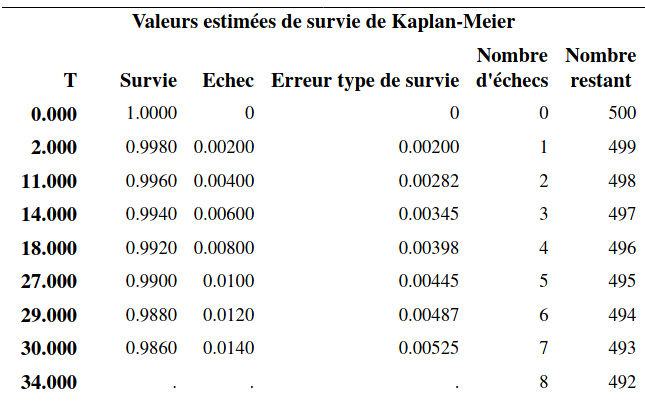
```
\begin{align*} \vdots \end{align*}
```{r fig5_e2, echo = FALSE, out.width='70%', fig.align = "center"}
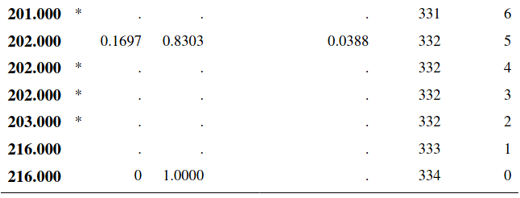
```

La sortie contient également un tableau contenant les quartiles. On utilise généralement le temps de survie médian (au lieu de la moyenne) dans ce type d'étude. Ici, l'estimé du  temps de survie médian est de 114 semaines: on estime que la moitié des clients vont avoir une durée d'abonnement supérieure à 114 semaines. De même, la moitié des clients vont avoir une durée d'abonnement inférieure à 114 semaines. Un intervalle de confiance de niveau 95% pour ce temps médian est [$110; 119$].

Un estimé de la moyenne et de l'écart-type est donné, mais ce dernier est biaisé (trop bas) puisque les données censurées ne donnent qu'une borne inférieure pour la vraie valeur. Avec un modèle paramétrique pour la survie (par ex., une loi exponentielle), les paramètres estimés du modèle dicteraient ces deux valeurs. Le modèle de Kaplan--Meier estime la survie, mais si la plus grande observation est censurée, la courbe n'atteindra pas zéro.


Le graphique de la fonction de survie permet de lire le temps de survie pour une probabilité donnée. Les bandes donnent un intervalle de confiance ponctuel de niveau 95% pour chaque temps donné.

```{r fig5_e4, echo = FALSE, out.width='90%', fig.align = "center"}
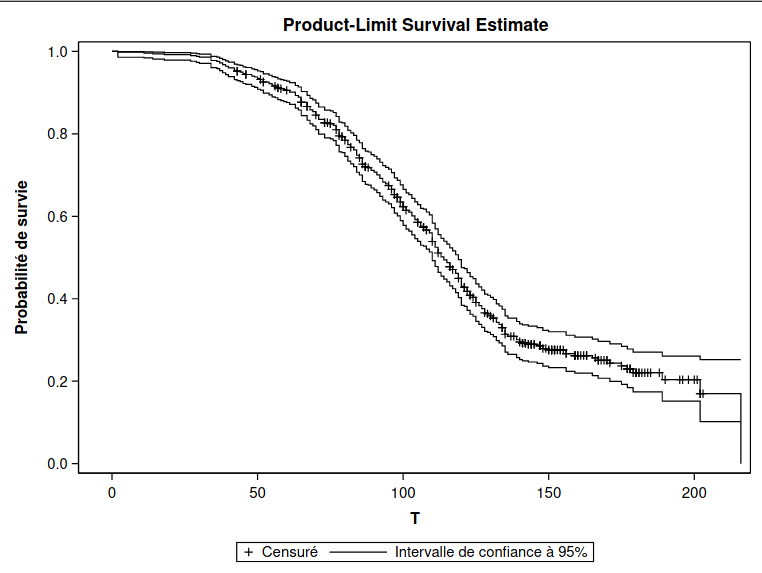
```

Le tableau \@ref(fig:fig5-e5) donne le nombre de données censurées: parmi les 500 observations, il y a 334 clients qui ont terminé leur abonnement et 166 qui sont censurées (le client est toujours abonné et le temps est donc une borne inférieure de la durée d'abonnement).


```{r fig5-e5, fig.cap="Fraction de valeurs censurées", echo = FALSE, out.width='60%', fig.align = "center"}
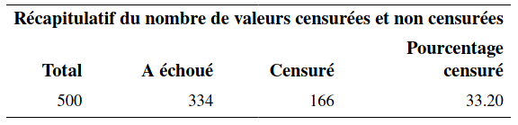
```


### Calcul de l'estimateur de Kaplan--Meier

Cette partie peut être omise; elle est incluse seulement par souci de complétude. Soit $T_1, \ldots, T_n$ les $n$ réalisations aléatoires de la variable temps (certaines censurées, d'autres pas). Supposons qu'il y a $m$ temps distincts où au moins un individu expérimente l'événement. Soient $t_{(1)} < \cdots < t_{(m)}$, ces temps ordonnés en ordre croissant et $r_i$  le nombre d'individus à risque au temps $t_{(i)}$ (les individus qui n'ont pas encore expérimenté l‘événement, et qui ne sont pas encore censurés avant $t_{(i)}$). On note $d_i$ le nombre d'individus qui expérimentent l'événement au temps $t_{(i)}$. L'estimateur de Kaplan--Meier de la fonction de survie à un temps $t$ est
\[ \widehat{S}(t) = \left( 1- \frac{d_1}{r_1}\right) \times \cdots \left( 1- \frac{d_{i(t)}}{r_{i(t)}}\right), \qquad t_{(1)} \leq t \leq t_{(m)},
\]
où $i(t) =\max(j \in \{1, \ldots, m\}:  t \geq t_{j})$, soit le plus grand indice parmi $1, \ldots, m$ tel que $t \geq t_{i(t)}$. Par convention, si $t < t_{(1)}$, on fixe $\widehat{S}(t)=1$.


## Comparaison de deux courbes de survie

Supposons que les individus ont été divisés en deux groupes et que $S_1(t)$ et $S_2(t)$ dénotent respectivement  la fonction de survie du premier groupe et dudeuxième groupe. On est souvent intéressé à tester l'égalité des fonctions de survie, c'est-à-dire, les hypothèses $\Hy_0: S_1(t) = S_2(t)$ pour tout $t$ et $\Hy_1: S_1(t) \neq S_2(t)$ pour au moins une valeur de $t$. 

Par exemple, dans une étude sur le temps de survie après avoir été diagnostiqué avec un certain type de cancer, on pourrait vouloir comparer le temps de survie des individus ayant reçu le traitement standard (groupe 1) au temps de survie des individus ayant reçu un nouveau traitement (groupe 2).

Les deux tests utilisés habituellement sont le test du log-rang (_log-rank test_) et le test de Wilcoxon généralisé (ou test de Gehan).

Testons l'hypothèse que la courbe de survie des clients masculins est la même que celle des clients féminins dans l'exemple des données d'abonnement. Ce test est effectué grâce à l'option `strata` de la procédure `lifetest`  à l'aide des commandes suivantes (voir le fichier `survival1_fonction_survie.sas`):

```{sas survie2, eval = FALSE, echo = TRUE}
proc lifetest data=multi.survival1 method=km plots=(s) censoredsymbol=none;
time t*censure(1);
strata sexe;
run;
```

On retrouve dans la sortie les estimés de la fonction de survie, de même que les quartiles par strate: la première strate correspond aux hommes (`sexe=0`) et la deuxième aux femmes (`sexe=1`). 


```{r fig5_e6, echo = FALSE, out.width='75%', fig.align = "center"}
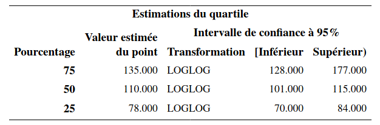
```

```{r fig5_e7, echo = FALSE, out.width='75%', fig.align = "center"}
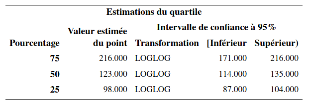
```

```{r fig5_e8, echo = FALSE, out.width='75%', fig.align = "center"}
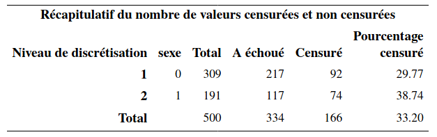
```

On voit qu'il y a 309 hommes et 191 femmes. L'estimation du temps de survie médian est de 110 semaines pour les hommes et de 123 semaines pour les femmes. 
```{r fig5_e9, echo = FALSE, out.width='55%', fig.align = "center"}
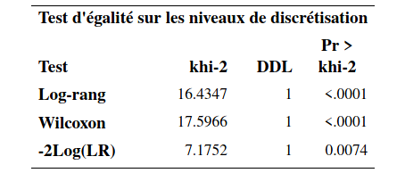
```


Un des tableaux contient les statistiques et valeurs-$p$ pour trois tests de l'hypothèse d'égalité des fonctions de survie, le test du log-rang et le test de Gehan. Le troisième test dans le tableau (`-2Log(LR)`) est un test du rapport de vraisemblance sous l'hypothèse que les temps de survie des deux groupes suivent une loi exponentielle. Il est préférable d'utiliser les deux premiers qui ne font pas d'hypothèses quant à la distribution du temps de survie. Les valeurs-$p$ des tests log-rang et de Wilcoxon généralisé sont toutes les deux inférieures à $10^{-4}$. On rejette donc $\Hy_0$ pour conclure qu'il y a donc une différence significative entre les deux courbes de survie.


Le test de Wilcoxon généralisé accorde plus de poids au temps près du début de la distribution qu'au temps plus loin. Il est donc, en général, plus puissant lorsque la différence entre les deux fonctions de survie survient tôt dans la distribution. Le test log-rang quant à lui suppose que le ratio des fonctions de risques des deux groupes est constant pour toute la période d'intérêt. 

Ces courbes sont représentées dans la Figure \@ref(fig:fig5-e10). On voit que la courbe des femmes est systématiquement au-dessus de celle des hommes. Les femmes ont donc tendance à rester abonnées plus longtemps que les hommes, et cette différence est significative. 

```{r fig5-e10, fig.cap = "Courbes de survie estimées par sexe (Kaplan--Meier)", echo = FALSE, out.width='83%', fig.align = "center"}
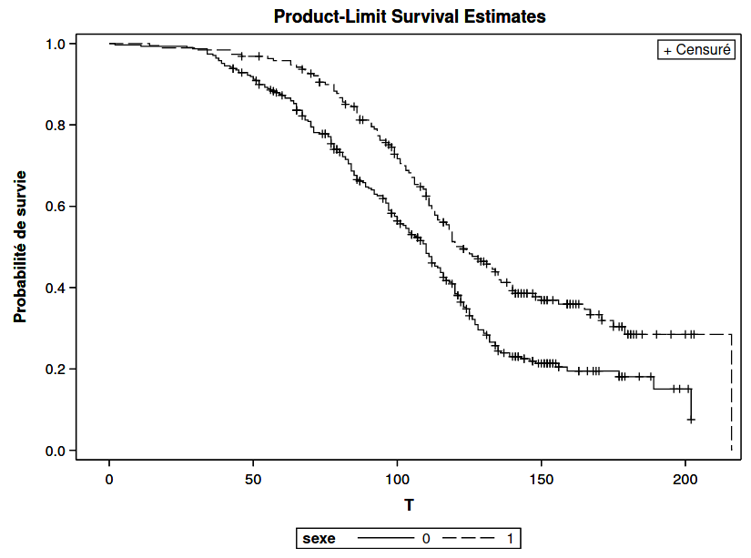
```


Il est également possible de tester l'égalité des courbes de survie avec plus de deux groupes. Par exemple, s'il y a trois groupes, l'hypothèse nulle est alors $\Hy_0: S_1(t)=S_2(t)=S_3(t)$ pour tout $t$, versus l'alternative qu'au moins deux des fonctions ont une valeur différente pour au moins une valeur de $t$. Les commandes **SAS** pour exécuter le test sont les mêmes: il suffit de mettre la variable identifiant les groupes à la ligne `strata`. 

## Modèle à risques proportionnels de Cox 


Le modèle à risques proportionnels de Cox (_proportional hazard model_) est l'un des modèles les plus utilisés pour analyser des données de survie. C'est un modèle semi-paramétrique, car seulement une partie du modèle doit être spécifié. Il postule que les valeurs des variables explicatives ne changent pas dans le temps. Nous verrons subséquemment une extension qui permet d'incorporer des variables explicatives dont la valeur change dans le temps.

### Description du modèle de Cox

Soit $h(t; \bs{x})$ la valeur de la fonction de risque au temps  pour un individu dont les valeurs des variables explicatives sont $X_1=x_1, \ldots, X_p=x_p$. Le modèle à risques proportionnels est
\begin{align*}
h(t; \bs{x}) = h_0(t)\exp(\beta_1x_1 + \cdots + \beta_p x_p)
\end{align*}
où $h_0(t)$ est la fonction de risque de base; il n'est pas nécessaire de spécifier cette dernière, d'où la nature semiparamétrique du modèle de Cox.

Lorsque toutes les variables explicatives prennent la valeur zéro, $\bs{X}=\bs{0}$, on recouvre $h(t; \bs{0})= h_0(t)$. Par conséquent, la fonction $h_0(t)$ peut être interprétée comme  la fonction de risque lorsque toutes les variables explicatives valent zéro. Toutefois, tout comme la valeur de l'ordonnée à l'origine dans un modèle de régression linéaire, cette interprétation n'est pas nécessairement valide si la situation où toutes les variables explicatives valent zéro n'est pas possible ou si elle ne survient pas dans notre échantillon.

La deuxième partie du modèle, $\exp(\beta_1x_1 + \cdots + \beta_p x_p)$, vient modéliser l'effet d'un changement des valeurs des variables explicatives sur la fonction de risque de base. Tout comme dans le cas de la régression logistique (l'effet des variables sur la cote), c'est un effet multiplicatif, d'où le terme **risques proportionnels**. 

Pour l'interprétation des paramètres, il sera plus simple de penser en termes de rapport de risque (_hazard ratio_), qui est défini comme étant le rapport des fonctions de risque pour deux ensembles de valeurs des variables explicatives. Pour simplifier l'illustration, supposons que nous avons seulement une variable explicative $X$ et que $h(t; x) = h_0(t)\exp(\beta x)$. Le rapport de risque lorsque $X=x_1$ par rapport à $X=x_0$ est 
\begin{align*}
\frac{h(t; x_1)}{h(t; x_0)} = \exp\{\beta(x_1-x_0)\}.
\end{align*}
Par conséquent, l'impact d'une augmentation de $X$ d'une unité (quand $x_1-x_0=1$) est $\exp(\beta)$. Ainsi, pour chaque augmentation d'une unité pour $X$, le risque que l'événement survienne est multiplié par $\exp(\beta)$.

Le terme **risques proportionnels** fait référence à la situation  où le rapport de risque dépend seulement de la différence $x_1-x_0$ et non pas du temps lui-même. Le rapport de risque est constant par rapport au temps $t$. Cela implique que l'effet d'une variable est stable dans le temps. Nous verrons plus loin comment faire en sorte que l'effet d'une variable puisse varier dans le temps.


Débutons avec un exemple simple en utilisant les données d'abonnement: on ajuste un modèle de Cox en utilisant seulement la variable binaire sexe (`survival2_cox.sas`). Ceci peut être fait avec la procédure `phreg`, comme suit:
```{sas survie3, eval = FALSE, echo = TRUE}
proc phreg data=multi.survival1;
model t*censure(1)=sexe / ties=exact; 
run;
```

La sortie inclut notamment des tests de significativité globale basés sur la vraisemblance pour les variables explicatives (rapport de vraisemblance, score et Wald) ainsi qu'un tableau des coefficients et des statistiques sur la qualité de l'ajustement pour le modèle sans variable explicative et celui qui inclut sexe. 

```{r fig5_e11, echo = FALSE, out.width='45%', fig.align = "center"}
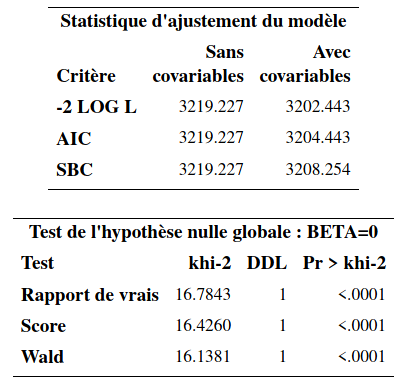
```

```{r fig5_e12, echo = FALSE, out.width='85%', fig.align = "center"}
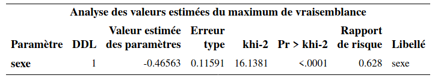
```


Il y a une seule variable explicative, le sexe de l'individu. L'estimation du paramètre de l'effet de sexe est $\hat{\beta}=-0,466$. Ce paramètre est significativement différent de $0$ (valeur-$p$ inférieure à $10^{-4}$). Pour l'interprétation, on utilise la colonne « Rapport de risque » qui contient la valeur $\exp(\hat{\beta}_{\texttt{sexe}}) = \exp(-0,466) = 0,628$. Ainsi, le rapport du risque d'une femme par rapport à un homme est
\begin{align*}
 \frac{\hat{h}(t; \texttt{sexe}=1)}{\hat{h}(t; \texttt{sexe}=0)}= 0,628.
\end{align*}
Par conséquent, le risque qu'une femme interrompe son abonnement est 0,628 fois celui d'un homme. Une femme est donc moins à risque de quitter qu'un homme. Nous avions déjà vu cela à la section précédente lorsque nous avions comparé les courbes de survie des hommes et des femmes. Il est important de se rappeler qu'avec ce modèle, l'effet d'une variable est le même dans le temps (peu importe la valeur de $t$). Donc, une femme est moins à risque de quitter qu'un homme à tout moment, d'après ce modèle. Inversement, le ratio du risque d'un homme par rapport à une femme est $1/0,628=1,59$. Ainsi, à tout moment, un homme a un risque d'interrompre son abonnement qui est 59% plus élevé que celui d'une femme.

Comme il y a un seul paramètre ici, les tests basés sur la vraisemblance pour $\Hy_0: \bs{\beta}=\bs{0}$ reviennent à tester l'effet de la variable sexe. Le test de Wald est le même que celui du tableau des coefficients. Dans le cas particulier où il y a une seule variable explicative binaire (comme ici), le test du score est équivalent au test du log-rang que nous avons vu à la section précédente (à une petite différence près lorsqu'il y a des ex aequo dans les temps de survie). 

On pourrait également utiliser une variable explicative continue plutôt qu'une variable binaire; le principe est le même.

```{r fig5_e13, echo = FALSE, out.width='45%', fig.align = "center"}
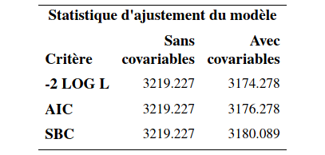
```

```{r fig5_e14, echo = FALSE, out.width='85%', fig.align = "center"}
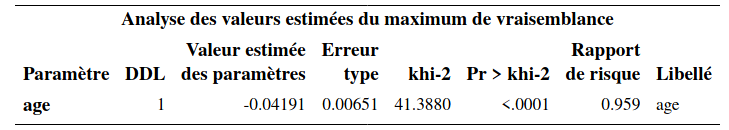
```

Le rapport de risque pour âge est 0,959 et donc le risque diminue de 4,1% chaque fois que l'âge augmente d'un an --- le risque d'interrompre l'abonnement diminue lorsque l'âge augmente et cet effet est significatif (valeur-$p$ des tests inférieures à $10^{-4}$). 

Généralement, on considérera le modèle de Cox avec toutes les variables explicatives simultanément. La variable $\texttt{region}$ est nominale tandis que la variable $\texttt{service}$ est ordinale (avec quatre modalités). Nous allons les incorporer, comme d'habitude, en utilisant des variables indicatrices avec  $\texttt{region=5}$ et $\texttt{service=0}$ (le client n'est abonné à aucun autre service) comme catégories de référence.

```{sas survie4, eval = FALSE, echo = TRUE}
proc phreg data=multi.survival1;
class region(ref='5') service(ref='0') / param=ref;
model t*censure(1)=age sexe region service / ties=exact; 
run;
```


```{r fig5_e15, echo = FALSE, out.width='45%', fig.align = "center"}
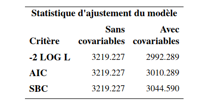
```


```{r fig5_e16, echo = FALSE, out.width='45%', fig.align = "center"}
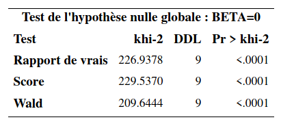
```


```{r fig5_e17, echo = FALSE, out.width='45%', fig.align = "center"}
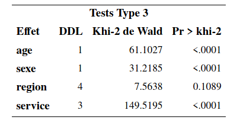
```


```{r fig5_e18, echo = FALSE, out.width='85%', fig.align = "center"}
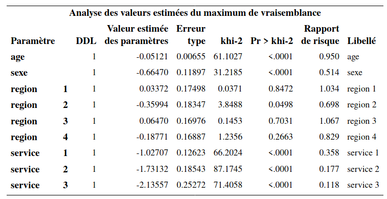
```

Les effets des variables sont maintenant des effets marginaux. Ainsi, lorsque les autres variables demeurent fixes, le risque de quitter d'une femme est $0,514$ fois plus petit que celui d'un homme.  L'effet marginal (une fois que les autres variables sont incluses) de la variable sexe est significatif (valeur-$p$ inférieure à $10^{-4}$).

Toutes autres choses étant égales, chaque augmentation de l'âge d'un an fait diminuer le risque d'interrompre l'abonnement. Plus précisément, le risque est multiplié par 0,95 lorsque l'âge augmente d'un an et cet effet est significatif.

Pour la variable service, l'interprétation se fait par rapport à la catégorie de référence, qui est la catégorie $\texttt{0}$ (abonné à aucun autre service). Ainsi, si le client est abonné à un autre service, son risque de quitter est $0,358$ fois celui d'un client qui n'est pas abonné à un autre service (toutes autres choses étant égales). Si le client est abonné à deux autres services, son risque de quitter est encore plus petit comparativement à un client qui n'est pas abonné à un autre service (rapport de risque de $0,177$) Finalement, si le client est abonné à trois autres services, son risque de quiter est encore plus petit (rapport de risque de $0,118$). Les paramètres de ces trois variables sont tous significatifs. Ainsi, les clients qui sont abonnés à un, deux ou trois services ont un risque de quitter qui est significativement plus faible que celui d'un client qui n'est pas abonné à un autre service. Le tableau `Tests Type 3` permet de tester globalement la significativité d'une variable explicative modélisée avec plusieurs indicatrices. Pour la variable $\texttt{service}$, le test présenté teste l'hypothèse nulle $\Hy_0: \beta_{\texttt{service}_1}=\beta_{\texttt{service}_2}=\beta_{\texttt{service}_3}=0$ contre l'alternative qu'un moins un de ces trois paramètres est non-nul. Le test est largement significatif (statistique de Wald du $\chi^2_4$ valant 149,52 avec une valeur-$p$ inférieure à $10^{-4}$). L'effet de la variable $\texttt{service}$ est donc globalement significatif. Afin de comparer les autres modalités entre elles, par exemple afin de voir si le risque de quitter est différent entre un client qui a deux services et un autre qui a trois services, il suffit de changer la catégorie de référence à la commande `class` et de réajuster le modèle.

Finalement, la variable $\texttt{region}$ n'est pas globalement significative (statistique de Wald de 7,56 avec une valeur-$p$ de 0,11).

### Estimation de la fonction de survie pour des valeurs particulières des variables explicatives

Il est possible d'obtenir l'estimation de la fonction de survie pour des valeurs particulières des variables explicatives avec la commande `baseline` (voir le script `survival2_cox.sas` pour plus de détails).  Pour ce faire, il faut avoir un autre fichier de données qui contient les valeurs des variables explicatives pour lesquelles on veut une estimation de la fonction de survie. 

Si on ajuste le modèle avec aucune variable explicative, on retrouvera alors l'estimation de Kaplan--Meier de la fonction de survie comme avec la procédure `lifetest`.

Supposons qu'on ajuste le modèle avec les variables sexe et âge seulement dans l'exemple du temps d'abonnement, et que l'on désire la fonction de survie pour les hommes de 25 et 60 ans et pour les femmes de 25 et 60 ans. Le fichier `survival2.sas7bdat` contient les données qui seront utilisées à cette fin. Il contient seulement les quatre lignes suivantes.


```{r fig5_e19, echo = FALSE, out.width='15%', fig.align = "center"}
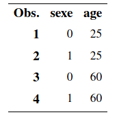
```


Les quatre fonctions de la Figure \@ref(fig:fig5-e20) correspondent aux profils pour lesquels nous désirons une estimation de la courbe de survie. La courbe 1 est pour les hommes de 25 ans, la courbe 2 pour les femmes de 25 ans, la courbe 3 pour les hommes de 60 ans et la courbe 4 pour les femmes de 60 ans. On voit donc que, parmi ces quatre profils, les hommes de 25 ans sont le plus à risque de quitter tandis que les femmes de 60 ans sont le moins à risque de quitter.

```{r fig5-e20, echo = FALSE, out.width='80%', fig.cap="Courbes de survie pour hommes et femmes de 25 et 60 ans.", fig.align = "center"}
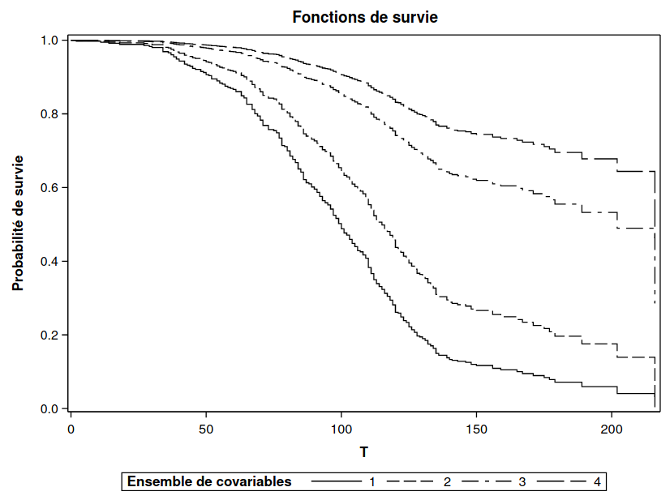
```

## Extensions du modèle de Cox


Dans cette section, nous allons voir deux extensions du modèle à risques proportionnels de base.

i) Inclusion de variables explicatives dont la valeur change dans le temps.
ii) Modèle à risques compétitifs (_competing risks_) pour étudier la situation où il y a plusieurs manières de quitter l'état.


### Variables explicatives dont la valeur change dans le temps 

Il est clair que certaines caractéristiques d'un individu évoluent dans le temps (_time-varying covariates_). Si le sexe d'un individu est stable dans le temps, son revenu, son statut matrimonial, l'endroit où il habite, sont par contre des caractéristiques qui peuvent changer dans le temps. Il peut alors être intéressant d'en tenir compte dans l'analyse. Rappelez-vous que le modèle à risques proportionnels est
\begin{align*}
h(t; \bs{x}) = h_0(t) \exp(\beta_1x_1 + \cdots + \beta_px_p).
\end{align*}

Supposons que la variable $X_1$ change au fil du temps et que les autres demeurent fixes. On peut alors réécrire le modèle 
\begin{align*}
h(t; \bs{x}) = h_0(t) \exp\{\beta_1x_1(t) + \cdots + \beta_px_p\},
\end{align*}
où $x_1(t)$ indique que la valeur de $X_1$ dépend du temps $t$.

Supposons que la variable $\texttt{service}$, qui représente le nombre d'autres services souscrits, est la seule que nous voulons modéliser comme une variable qui varie dans le temps. Pour l'âge, nous prenons simplement l'âge au début de l'abonnement, idem pour la région.

Le plus difficile est de créer correctement le fichier de données pour effectuer ce genre d'analyse. Supposons pour cet exemple qu'il y a eu au plus un changement dans la variable $\texttt{service}$, comme présenté dans le fichier `survival3.sas7bdat`. Les variables $\texttt{t}$, $\texttt{censure}$, $\texttt{age}$, $\texttt{sexe}$ et $\texttt{region}$ sont comme précédemment. Trois nouvelles variables remplacent l'ancienne variable service.

- $\verb+service_avant+$: nombre d'autres services auxquels le client est abonné au début de son abonnement.
- $\verb+temps_ch+$: temps au moment où un changement est survenu quant au nombre d'autres services. En l'absence de changement, l'observation est remplacée par une valeur manquante (`.`).
- $\verb+service_apres+$: nombre d'autres services auxquels le client est abonné à partir du temps $\verb+temps_ch+$.


```{r fig5_e21, echo = FALSE, out.width='80%', fig.align = "center"}
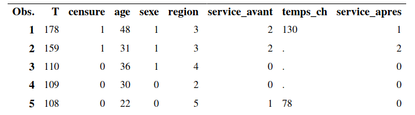
```

On regarde plus en détail le profil des cinq premiers clients, dont seuls deux ont changé le nombre d'abonnements; les individus 3--5 se sont désabonnés du service cellulaire à un moment donné. Le premier client était abonné à deux autres services au début de son abonnement au téléphone cellulaire mais, après 130 semaines d'abonnement, a effectué un changement à son forfait pour ne conserver qu'un autre service en plus du cellulaire. Pour le deuxième client, comme $\verb+temps_ch+$ est manquante, il est toujours abonné à deux autres services et ce, jusqu'à la fin de l'étude. 

Les commandes **SAS** permettant d'ajuster le modèle avec point de rupture se trouvent dans le fichier `survival3_varie_temps.sas`. Notez que lorsqu'on a une variable catégorielle qui varie dans le temps (comme ici avec la variable service), on ne peut pas utiliser `class` pour la déclarer catégorielle; il faut plutôt créer nous-mêmes les variables indicatrices nécessaires à l'intérieur même de l'appel à la fonction `phreg` (voir le script). Ici, nous utiliserons la catégorie $\texttt{0}$ (aucun autre service) comme catégorie de référence.


```{r fig5_e22, echo = FALSE, out.width='85%', fig.align = "center"}
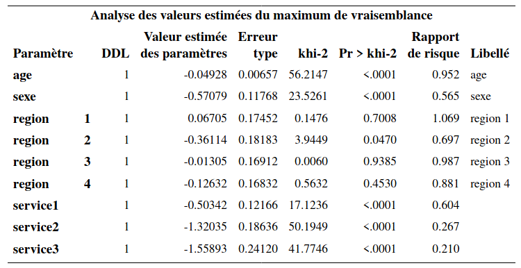
```


L'interprétation se fait comme précédemment. Ici, c'est la valeur d'une variable qui varie dans le temps et non pas son effet. Ainsi, le ratio de risque de quitter pour un client qui a un autre service est 0,604 fois celui d'un client qui n'a aucun autre service (référence). Le fait d'avoir deux ou trois services diminue encore plus le risque de quitter (ratios de risque de 0,267 et 0,21, respectivement). 

### Modèle à risques compétitifs

Parfois, la raison pour laquelle un individu quitte l'état étudié peut avoir un intérêt en soi. Par exemple si on s'intéresse au temps qu'un employé demeure au service de la compagnie, la distinction entre le fait qu'il ait démissionné ou bien qu'il ait été renvoyé peut avoir un impact sur l'effet des variables explicatives. Comme autre exemple, si on s'intéresse au temps de survie d'un individu après qu'il ait été diagnostiqué avec un certain type de cancer, il pourrait être important de distinguer selon la cause exacte de la mort.

De manière générale, supposons qu'il y a $K$ manières possibles que l'événement survienne. On peut alors spécifier $K$ fonctions de risques (une pour chaque manière) et obtenir le modèle de Cox à risques compétitifs (_competing risks_),
\begin{align*}
h_1(t; \bs{x})&= h_{01}(t) \exp(\beta_{11}x_1 + \cdots + \beta_{p1} x_p)\\
&\vdots\\
h_K(t; \bs{x})&= h_{0K}(t) \exp(\beta_{1K}x_1 + \cdots + \beta_{pK} x_p)\\
\end{align*}
Notez que les coefficients $K$ sont différents d'une équation à l'autre. En estimant ce modèle, on obtient donc une estimation de l'effet des variables selon la raison du départ de l'état. De plus, on peut aussi inclure des variables dont la valeur change dans le temps, comme vu précédemment.
Ce qui simplifie énormément la situation est qu'il est prouvé qu'on peut estimer les paramètres de chaque équation séparément sans perte de précision. Par conséquent, en pratique, il suffira d'ajuster $K$ modèles séparément.


Dans notre exemple d'abonnement cellulaire, supposons que nous avons trois causes possibles pour la perte d'un client: soit il a interrompu son abonnement pour aller chez le compétiteur A, soit pour aller chez le compétiteur B, soit il n'a plus de cellulaire du tout.

Les données pour cet exemple se trouvent dans le fichier `survival4.sas7bdat` et le programme dans le fichier `survival4_risques_competitifs.sas`. La seule nouveauté par rapport au fichier original est la variable $\texttt{censure}$ qui est maintenant codée ainsi

- 1, si le temps est censuré (l'individu est toujours abonné à notre service)
- 2, si l'individu a quitté pour aller chez le compétiteur A
- 3, si l'individu a quitté pour aller chez le compétiteur B
- 4, si l'individu a quitté parce qu'il n'a plus besoin de cellulaire.

On peut calculer la fréquence de chaque modalité.


```{r fig5_e23, echo = FALSE, out.width='65%', fig.align = "center"}
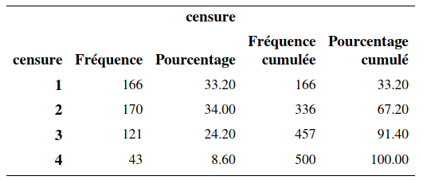
```
Ainsi, il y a donc 166 clients toujours abonnés, 170 qui nous ont quitté pour aller chez A, 121 pour aller chez B, et 43 qui n'ont plus de cellulaires.

Pour ajuster le modèle lorsque la cause du départ est le compétiteur A, le code est
```{sas survie6, eval = FALSE, echo = TRUE}
proc phreg data=multi.survival4;
class region(ref='5') service(ref='0') / param=ref;
model t*censure(1,3,4)=age sexe region service / ties=exact; 
run;
```

Notez qu'on précise que les valeurs 1, 3 et 4 sont des observations censurées. Ici, l'événement d'intérêt est que le client est parti chez le compétiteur A. S'il est toujours abonné ($\texttt{censure=1}$), s'il est parti chez le compétiteur B ($\texttt{censure=3}$) ou s'il nous a quitté car il n'a plus de cellulaire ($\texttt{censure=4}$), alors l'événement « quitter pour aller chez A » n'est pas survenu. C'est pourquoi on doit traiter ces situations comme des censures. 

```{r fig5_e24, echo = FALSE, out.width='65%', fig.align = "center"}
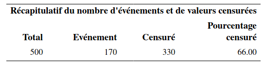
```

```{r fig5_e25, echo = FALSE, out.width='85%', fig.align = "center"}
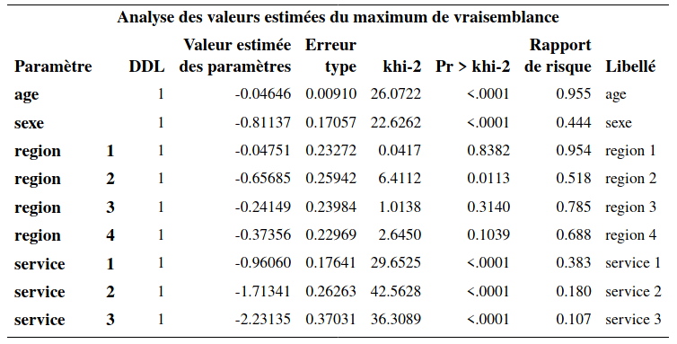
```


Ainsi, on voit que l'événement est survenu 170 fois et qu'il y a 330 censures. L'interprétation des paramètres se fait comme précédemment. Sauf qu'il faut préciser qu'il s'agit du risque de quitter pour aller chez le compétiteur A. Par exemple, le risque de quitter pour aller chez le compétiteur A d'une femme est 0,444 fois le risque de quitter pour aller chez le compétiteur A d'un homme. Ainsi, les femmes sont moins à risque de quitter pour aller chez le compétiteur A que les hommes.


Pour ajuster le modèle lorsque la cause du départ est le compétiteur B, procède de la même manière. Notez que cette fois-ci, ce sont les valeurs 1, 2 et 4 de la variable censure qui correspondent au fait que l'événement n'est pas survenu; on spécifie donc `censure(1,2,4)` dans l'appel à la fonction `phreg`.  Il y a 121 clients qui ont quitté pour aller chez B et 379 cas autre (censure). L'interprétation des paramètres se fait en termes de risque de quitter pour aller chez le compétiteur B.

```{r fig5_e26, echo = FALSE, out.width='65%', fig.align = "center"}
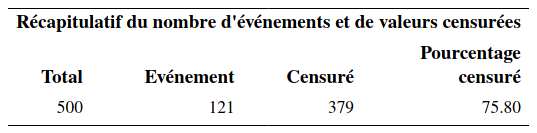
```

```{r fig5_e27, echo = FALSE, out.width='85%', fig.align = "center"}
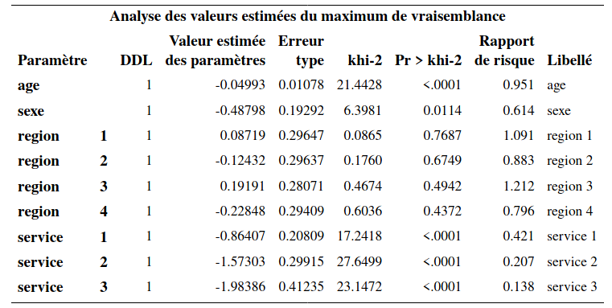
```


Si on ajuste le modèle pour le cas de figure où la cause de départ est que le client n'a plus besoin de cellulaire, on obtient une sortie similaire. On voit, que contrairement aux deux premiers modèles, l'effet de la variable sexe n'est pas significatif ici. 


```{r fig5_e28, echo = FALSE, out.width='65%', fig.align = "center"}
knitr::include_graphics("figures/05-survie-e28.png")
```

```{r fig5_e29, echo = FALSE, out.width='85%', fig.align = "center"}
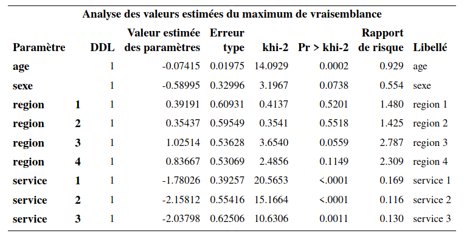
```


En fait, comme il y a seulement 43 événements (quitter car on n'a plus besoin de cellulaire), les estimations des paramètres sont moins précises, ce qu'on peut voir avec les erreurs-types qui sont plus élevés. Les observations censurées contiennent moins d'information que les événements, d'où cette perte de précision.

## Risques non proportionnels


Comme son nom l'indique, le modèle à risques proportionnels suppose que les risques sont proportionnels. Cela implique que l'effet d'une variable est stable dans le temps. Nous verrons dans cette section deux façons de modéliser le cas de risques non proportionnels.

### Non-proportionnalité avec un terme d'interaction avec le temps 

Pour simplifier l'exposition, supposons que nous avons une seule variable explicative $X$. L'équation du modèle à risques proportionnels est $h(t; x) = h_0(t)\exp(\beta x)$ et suppose que la fonction de risque de base $h_0(t)$ est indépendante de la variable explicative $X$. Une manière de modéliser la non-proportionnalité est d'inclure un terme d'interaction entre la variable et le temps. Il existe plusieurs façons de le faire, l'une d'entre elles consiste à inclure une nouvelle variable qui est le produit entre le temps et la variable $X$. Le modèle est alors \[h(t; x) = h_0(t) \exp(\beta_1x + \beta_2xt).\]
Pour ce modèle, le rapport de risque, pour une augmentation d'une unité de $X$ est $\exp(\beta_1+ \beta_2t)$ et dépend du temps $t$: c'est un modèle avec risques non proportionnels. On retombe sur le modèle à risques proportionnels lorsque $\beta_2=0$. 

Ajustons le modèle pour l'abonnement cellulaire en ajoutant une interaction entre l'âge et le temps. Les commandes se trouvent dans `survival5_non_proportionnel.sas`, dont l'extrait montre comment créer la variable produit.
```{sas survie7, echo =TRUE, eval = FALSE}
proc phreg data=temp;
class region(ref='5') service(ref='0') / param=ref;
model t*censure(1)=age iaget sexe region service / ties=exact;
iaget=age*t; 
run;
```

L'interaction entre l'âge et le temps est spécifiée en incluant une nouvelle variable, $\texttt{iaget}$, créée à l'intérieur de l'appel à la procédure `phreg`, et qui est égale au produit entre l'$\texttt{age}$ et $\texttt{t}$. On remarque que le terme d'interaction est tout juste non significatif (valeur-$p$ de 0,061). 

```{r fig5_e30, echo = FALSE, out.width='85%', fig.align = "center"}
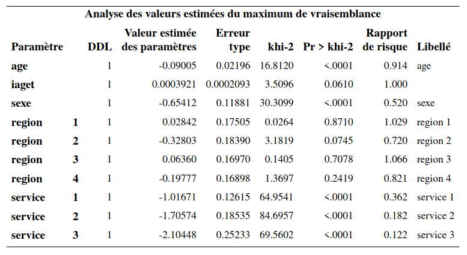
```


### Stratification

Une autre manière de modéliser la non-proportionnalité est par la stratification. Il est important de comprendre qu'on ne pourra pas estimer l'effet de la variable de stratification. On devrait donc seulement utiliser une variable qui ne nous intéresse pas en soi, mais qui peut avoir un effet sur le temps de survie. 

Encore une fois, pour simplifier, supposons que nous avons deux variables $X$ et $Z$; cette dernière est binaire et prend les valeurs $0$ et $1$. On s'intéresse à l'effet de la variable $X$ mais pas à celui de la variable $Z$; néanmoins, on croit que $Z$ impacte le temps de survie et que, de ce fait, le postulat de proportionnalité de la fonction de risque n'est pas validé. Le modèle de Cox avec stratification (pour la variable $Z$) est 
\begin{align*}
h(t; x, z) = h_z(t) \exp(\beta x),
\end{align*}
où $h_0(t)$ est la fonction de risque de base quand $Z=0$ et $h_1(t)$ est la fonction de risque de base lorsque $Z=1$. L'effet de la variable $X$ est supposé être le même peut importe la valeur de $Z$, mais la fonction de risque de base peut différer. Le rapport de risque pour $Z=1$ versus $Z=0$ est $h_1(t)/h_0(t)$; cette quantité dépend du temps $t$. L'effet de la variable  est donc variable dans le temps (et non pas constant). Ce modèle permet donc de modéliser la non-proportionnalité pour la variable $Z$. Si on stratifie par rapport à une variable, il ne faut pas l'inclure dans le modèle en plus car elle est déjà modélisée via la stratification. Notez que les paramètres $\boldsymbol{\beta}$ seront estimés à l'aide des données de toutes les strates.

L'avantage de la stratification est que cette méthode permet de modéliser n'importe quel changement dans l'effet d'une variable dans le temps sans devoir spécifier un type de changement particulier, comme lorsqu'on doit choisir la forme de l'interaction. Par contre, on perd la possibilité de tester l'effet de la variable de stratification on réduit la taille de l'échantillon pour l'estimation de la fonction de risque de base. On devrait donc utiliser la stratification seulement avec des variables pour lesquelles nous n'avons pas besoin d'estimer l'effet (variables secondaires ou de contrôles).

On considère la stratification par rapport à la région pour notre modèle pour le temps d'abonnement à un forfait cellulaire; un test permet de voir que l'hypothèse de non-proportionnalité des fonctions de risque n'est pas valide pour région. Le modèle contient toutes les variables explicative, hormis région qui est utilisée pour la stratification.


Les commandes pour ajuster le modèle sont
```{sas survie8, eval = FALSE, echo = TRUE}
proc phreg data=multi.survival1;
class service(ref='0') / param=ref;
model t*censure(1)=age sexe service / ties=exact;
strata region;
run;
```


```{r fig5_e31, echo = FALSE, out.width='75%', fig.align = "center"}
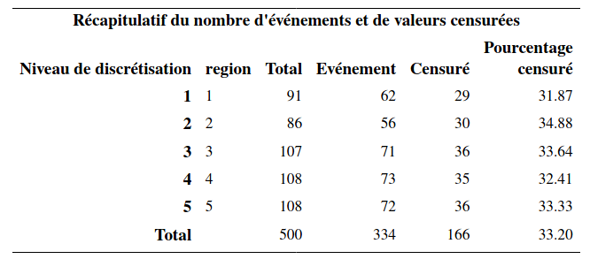
```


```{r fig5_e32, echo = FALSE, out.width='85%', fig.align = "center"}
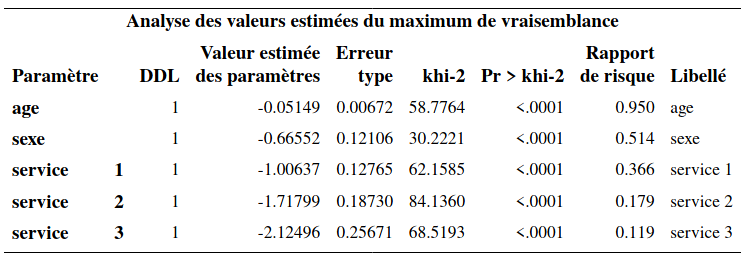
```


On voit à la lecture de la sortie **SAS** qu'il n'y a pas de paramètres pour la variable région. Les paramètres des autres variables s'interprètent comme d'habitude.
