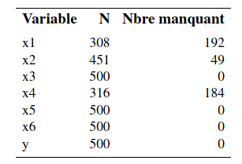
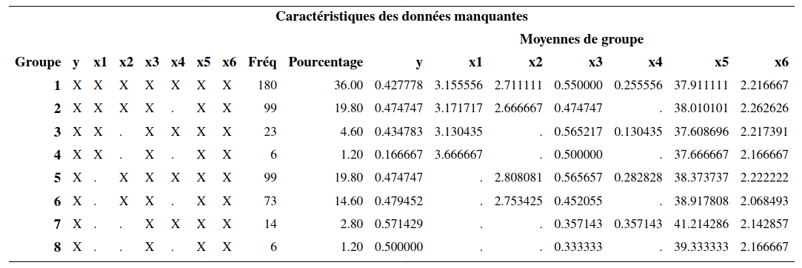
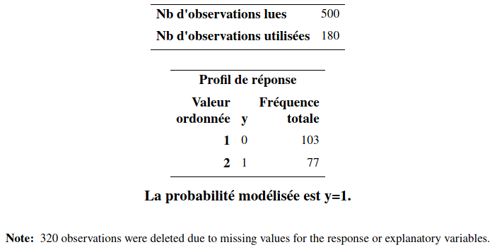
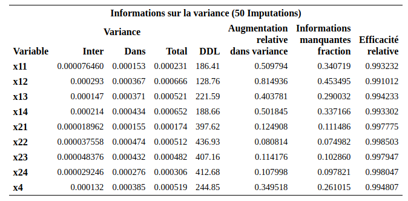

# Données manquantes {#donnees-manquantes}

Il arrive fréquemment d'avoir des valeurs manquantes dans notre échantillon. Ces valeurs peuvent être manquantes pour diverses raisons. Si on prélève nous-mêmes nos données, un répondant peut refuser de répondre à certaines questions. Si on acquiert nos données d'une source externe, les valeurs de certaines variables peuvent être manquantes directement dans le fichier obtenu.  Si on ne prend pas en compte le méchanisme générant les valeurs manquantes, ces dernières peuvent également biaiser nos analyses. Le but de ce chapitre est de faire un bref survol de ce sujet.

## Terminologie


Soit $X$ une variable pour laquelle des données sont manquantes. Voici la définition de trois processus de génération de données manquantes.

1) Les données manquantes de $X$ sont dites **manquantes de façon complètement aléatoire** (MCAR, de l'anglais _missing completely at random_) si la probabilité que la valeur de $X$ soit manquante ne dépend ni de la valeur de $X$ (qui n'est pas observée), ni des valeurs des autres variables. 

Le fait qu'une variable est manquante peut être relié au fait qu'une autre soit manquante. Des gens peuvent refuser systématiquement de répondre à deux questions dans un sondage. Dans ce cas, si la probabilité qu'une personne ne réponde pas ne dépend pas des valeurs de ces variables (et de toutes les autres), nous sommes encore dans le cas MCAR. Si par contre, la probabilité que les gens ne répondent pas à une question sur leur revenu augmente avec la valeur de ce revenu, alors nous ne sommes plus dans le cas MCAR.

Le cas MCAR peut se présenter par exemple si des questionnaires, ou des pages ont été égarés ou détruits par inadvertance (effacées du disque rigide, etc.) Si les questionnaires manquants constituent un sous-ensemble choisi au hasard de tous les questionnaires, alors le processus est MCAR. L'hypothèse que les données manquantes sont complètement aléatoires est en général considérée comme trop restrictive.

2) Les données manquantes de $X$ sont dites **données manquantes de façon aléatoire** (MAR, de l'anglais _missing at random_) si la probabilité que la valeur de $X$ soit manquante ne dépend pas de la valeur de $X$ (qui n'est pas observée) une fois qu'on a contrôlé pour les autres variables. 


Il est possible par exemple que les femmes refusent plus souvent que les hommes de répondre à une question (et donc, le processus n'est pas MCAR). Si pour les femmes, la probabilité que $X$ est manquante ne dépend pas de la valeur de $X$ et que pour les hommes, la probabilité que $X$ est manquante ne dépend pas de la valeur de $X$, alors le processus est MAR. Les probabilités d'avoir une valeur manquante sont différentes pour les hommes et les femmes mais cette probabilité ne dépend pas de la valeur de $X$ elle-même. L'hypothèse MAR est donc plus faible que l'hypothèse MCAR.

3) Les données manquantes de $X$ sont dites **manquantes de façon non-aléatoire** (MNAR, de l'anglais _missing not at random_) si la probabilité que la valeur de $X$ soit manquante dépend de la valeur de $X$ elle-même.

Par exemple, les gens qui ont un revenu élevé pourraient avoir plus de réticences à répondre à une question sur leur revenu. La méthode de traitement que nous allons voir dans ce chapitre, l'imputation multiple, est très générale et est valide dans le cas MAR (et donc aussi dans le cas MCAR). Le cas MNAR est beaucoup plus difficile à traiter et ne sera pas considéré ici. 

## Quelques méthodes

### Cas complets

La première idée naïve pour une analyse est de retirer les observations avec données manquantes pour conserver les cas complets (*listwise deletion*, ou _complete case analysis_).

Cette méthode consiste à garder seulement les observations qui n'ont aucune valeur manquante pour les variables utilisées dans l'analyse demandée. Dès qu'une variable est manquante, on enlève le sujet au complet. C'est la méthode utilisée par défaut dans la plupart des logiciels, dont **SAS**. 

- Si le processus est MCAR, cette méthode est valide car l'échantillon utilisé est vraiment un sous-échantillon aléatoire de l'échantillon original. Par contre, ce n'est pas nécessairement la meilleure solution car on perd de la précision en utilisant moins d'observations.
- Si le processus est seulement MAR ou MNAR, cette méthode produit généralement des estimations biaisées des paramètres.

En général, l'approche des cas complet est la première étape d'une analyse afin d'obtenir des estimés initiaux que nous corrigerons pas d'autre méthode. Elle n'est vraiment utile que si la proportion d'observations manquantes est très faible et le processus est MCAR. Évidemment, la présence de valeurs manquantes mène à une diminution de la précision des estimateurs (caractérisée par une augmentation des erreurs-types) et à une plus faible puissance pour les tests d'hypothèse et donc ignorer l'information partielle (si seulement certaines valeurs des variables explicatives sont manquantes) est sous-optimal.

### Imputation simple 

La deuxième approche est l'**imputation simple**. L'idée ici est de ne pas enlever les observations avec des valeurs manquantes mais de remplacer ces valeurs par des valeurs raisonnables. Par exemple, on peut remplacer les valeurs manquantes d'une variable par la moyenne de cette variable dans notre échantillon. On peut aussi ajuster un modèle de régression avec cette variable comme variable dépendante et d'autres variables explicatives comme variables indépendantes et utiliser les valeurs prédites comme remplacement. Une fois que les valeurs manquantes ont été remplacées, on fait l'analyse avec toutes les observations.

Il existe d'autres façons d'imputer les valeurs manquantes mais le problème de toutes ces approches est que l'on ne tient pas compte du fait que des valeurs ont été remplacées et on fait comme si c'était de vraies observations. Cela va en général sous-évaluer la variabilité dans les données. Par conséquent, les écarts-type des paramètres estimés seront en général sous-estimés et l'inférence (tests et intervalles de confiance) ne sera pas valide.
Cette approche n'est donc **pas recommandée**.

Une manière de tenter de reproduire correctement la variabilité dans les données consiste à ajouter un terme aléatoire dans l'imputation. C'est ce que fait la méthode suivante, qui possédera l'avantage de corriger automatiquement les écarts-type des paramètres estimés.

### Imputation multiple

Cette méthode peut être appliquée dans à peu près n'importe quelle situation et permet d'ajuster les écarts-type des paramètres estimés. Elle peut être appliquée lorsque le processus est MAR (et donc aussi MCAR).

L'idée consiste à procéder à une imputation aléatoire, selon une certaine technique, pour obtenir un échantillon complet et à ajuster le modèle d'intérêt avec cet échantillon. On répète ce processus plusieurs fois et on combine les résultats obtenus. 

L'estimation finale des paramètres du modèle est alors simplement la moyenne des estimations pour les différentes répétitions et on peut également obtenir une estimation des écarts-type des paramètres qui tient compte du processus d'imputation.

Plus précisément, supposons qu'on s'intéresse à un seul paramètre $\theta$ dans un modèle donné. Ce modèle pourrait être un modèle de régression linéaire, de régression logistique, etc. Le paramètre $\theta$ serait alors un des $\bs{\beta}$ du modèle.

Supposons qu'on procède à $K$ imputations, c'est-à-dire, qu'on construit $K$ ensemble de données complets à partir de l'ensemble de données initial contenant des valeurs manquantes. On estime alors les paramètres du modèle séparément pour chacun des ensembles de données imputés. Soit  $\widehat{\theta}_k$, l'estimé du paramètre $\theta$ pour l'échantillon $k \in \{1, \ldots, K\}$ et $\widehat{\sigma}_k^2=\Va{\widehat{\theta}_k}$ l'estimé de la variance de $\widehat{\theta}_k$ produite par le modèle estimé. 

L'estimation finale de $\theta$, dénotée $\widehat{\theta}$, est obtenue tout simplement en faisant la moyenne des estimations de tous les modèles, c'est-à-dire,
\begin{align*}
\widehat{\theta} = \frac{\widehat{\theta}_1 + \cdots + \widehat{\theta}_K}{K}.
\end{align*}
Une estimation ajustée de la variance de $\widehat{\theta}$ est 
\begin{align*}
\Va{\hat{\theta}} &= W+ \frac{K+1}{K}B, 
\\ W &= \frac{1}{K} \sum_{k=1}^K \widehat{\sigma}^2_k = \frac{\widehat{\sigma}_1^2 + \cdots + \widehat{\sigma}_K^2}{K},\\
B &= \frac{1}{K-1} \sum_{k=1}^K (\widehat{\theta}_k - \widehat{\theta})^2.
\end{align*}
Ainsi, le terme $W$ est la moyenne des variances et $B$ est la variance entre les imputations. Le terme $(1+1/K)B$ est celui qui vient corriger le fait qu'on travaille avec des données imputées et non pas des vraies données en augmentant la variance estimée du paramètre. 

C'est ici qu'on voit l'intérêt à procéder à de l'imputation multiple. Si on procédait à une seule imputation (même en ajoutant une part d'aléatoire pour essayer de reproduire la variabilité des données), on ne serait pas en mesure d'estimer la variance inter-groupe de l'estimateur. Notez que la formule présentée n'est valide que pour le cas unidimensionnel; l'estimation de la variance dans le cas multidimensionnel est différente (voir Little et Rubin, 2002).

Les procédures `mi` et `mianalyze` de **SAS** permettent d'effectuer de l'imputation multiple et d'obtenir des estimations valides des paramètres et de leurs écarts-type pour à peu près n'importe quel modèle. Plus spécifiquement, la procédure `mi` permet d'examiner la configuration des valeurs manquantes et de procéder à l'imputation. De son côté, la procédure `mianalyze` permet de combiner les résultats des estimations provenant des échantillons combinés afin d'obtenir les estimations finales. La structure habituelle du code **SAS** est la suivante:

1. procédure `mi` pour obtenir des échantillons imputés.
2. procédure quelconque pour ajuster le modèle voulu (par exemple, `proc reg` ou `proc logistic`). Il faut ajuster les modèles séparément pour chaque échantillon imputé avec la commande `by`.
3. procédure `mianalyze` pour combiner les résultats.

La méthode d'imputation multiple possède l'avantage d'être applicable avec n'importe quel modèle sous-jacent. Une fois qu'on a des échantillons complets (imputés), on ajuste le modèle comme d'habitude. Mais une observation imputée ne remplacera jamais une vraie observation. Il faut donc faire tout ce qu'on peut pour limiter le plus possible les données manquantes. 

Il faut utiliser son jugement. Par exemple, si la proportion d'observations perdues est petite (moins de 5\%), ça ne vaut peut-être pas la peine de prendre des mesures particulières et on peut faire une analyse avec les données complètes seulement. S'il y a un doute, on peut faire une analyse avec les données complètes seulement et une autre avec imputations multiples afin de valider la première. 
 
Si, à l'inverse, une variable secondaire cause à elle seule une grande proportion de valeurs manquantes, on peut alors considérer l'éliminer afin de récupérer des observations. Par exemple, si vous avez une proportion de 30\% de valeurs manquantes en utilisant toutes vos variables et que cette proportion baisse à 3\% lorsque vous éliminez quelques variables peu importantes pour votre étude (ou qui peuvent être remplacées par d'autres jouant à peu près le même rôle qui elles sont disponibles), alors vous pourriez considérer la possibilité de les éliminer. Il est donc nécessaire d'examiner la configuration des valeurs manquantes avant de faire quoi que ce soit. La procédure `mi` permet de faire cela, comme nous le verrons dans l'exemple qui suit.

## Example d'application de l'imputation 

On examine l'exemple de recommandations de l'association professionnelle des vachers de la section \@ref(cowboy).


Le but est d'examiner les effets des variables $X_1$ à $X_6$ sur les intentions d'achat ($Y$); la base de données `missing1.sas7bdat` contient les observations et les commandes **SAS** se trouvent dans le fichier `missing1.sas`. Il s'agit des mêmes données que celles du fichier `logit1.sas7bdat` mais avec des valeurs manquantes.

```{r missing1r, eval = TRUE, echo = FALSE}
url <- "https://lbelzile.bitbucket.io/MATH60602/missing1.sas7bdat"
missing1 <- haven::read_sas(url)
smallmiss <- missing1[1:10,]
smallmisst <- apply(smallmiss,c(1,2), function(x){sprintf("%i", x)})
smallmisst[is.na(smallmiss)] <- "."
kableExtra::kbl(smallmisst, row.names = FALSE,
             booktabs = TRUE,
             longtable = FALSE,
             col.names = c(paste0("$X_",1:6,"$"),"$y$"),
             align =  paste0(c(rep("r", 7)),collapse = ""),
             escape = FALSE,
             caption = "Tableau des configurations des données manquantes.")
```


Les points (`.`) indiquent des valeurs manquantes. Le premier sujet n'a pas de valeur manquante. Le deuxième a une valeur manquante pour $X_1$ (emploi) et $X_4$ (éducation), etc.

Une première façon de voir combien il y a de valeurs manquantes consiste à faire sortir les statistiques descriptives avec la procédure `means`.
Ainsi, il y 192 valeurs manquantes pour $X_1$, 48 pour $X_2$ et 184 pour $X_4$. Les autres variables n'ont pas de valeurs manquantes, incluant la variable dépendante $Y$. La procédure unidimensionnelle nous permet seulement de voir combien il y a de valeurs manquantes variable par variable, séparément. 


```{r fig6_e1, echo = FALSE, out.width='35%', fig.align = "center"}

```


Afin d'avoir plus d'information au sujet de la configuration des valeurs manquantes, on peut utiliser la procédure `mi`. Comme on veut seulement voir comment sont distribuées les valeurs manquantes et non pas imputer les valeurs manquantes, on fixe `nimpute=0`.
```{sas missing1, eval = FALSE, echo = TRUE}
proc mi data=multi.missing1 nimpute=0;
var y x1-x6;
run;
```

```{r fig6_e2, echo = FALSE, out.width='100%', fig.align = "center"}

```

Dans la partie de gauche, les `X` indiquent que la variable est présente dans cette configuration et le point indique qu'elle est manquante. Ainsi, il y a 180 sujets (36\% de l'échantillon) avec aucune observation manquante. Il y en a 99 avec seulement $X_4$ manquante et ainsi de suite. On voit donc, par exemple, que pour 14 sujets, à la fois $X_1$ et $X_2$ sont manquantes.  La partie de droite donne la moyenne des variables dans chaque configuration.


La recommandation d'usage est d'imputer au moins le pourcentage de cas incomplet, ici 72\% donc 72 imputations. Si la procédure est trop gloutonne en calcul, on peut diminuer le nombre d'imputations, mais au moins cinq ou 10 réplications sont de mise.

On peut comparer l'inférence avec toutes les variables explicatives pour les données sans valeurs manquantes ($n=500$ observations), avec les cas complets uniquement ($n=180$ observations). 
Le Tableau \@ref(tab:missing3r) présente les estimations des paramètres du modèle de régression logistique s'il n'y avait pas eu de valeurs manquantes, avec les cas complets et les résultats de l'imputation multiple.
  
  


Revenons à présent à notre fichier avec des valeurs manquantes. Si on demande à **SAS** d'ajuster le modèle de régression logistique, il va par défaut retirer les observations qui ont au moins une valeur manquante pour une des variables nécessaires à l'analyse. Ainsi, le modèle va être ajusté avec seulement 180 observations. Cette analyse est présentée seulement pour montrer l'effet des valeurs manquantes. 

Ceci est clairement indiqué dans la partie de la sortie qui est reproduite ci-après.  

```{r fig6_e3, echo = FALSE, out.width='80%', fig.align = "center"}

```

Il ne serait pas raisonnable de faire l'analyse avec seulement 180 observations et de laisser tomber les 320 autres. De plus, comme nous l'avons vu plus haut, ce n'est pas valide à moins que le processus ne soit MCAR. La partie du milieu du Tableau  \@ref(tab:missing3r) présente les estimations obtenues. On voit par exemple que la variable $X_3$ (sexe), qui était clairement significative lorsqu'il n'y avait pas de valeurs manquantes, est maintenant non-significative (valeur-$p$ de 0,068). La même chose est vraie pour quelques autres variables incluant $\I{X_6=2}$. Il y a même pire, non seulement la variable $\I{X_2=1}$ est passée de significative à non significative, mais en plus l'estimé de son paramètre a changé de signe.  

Nous allons donc faire l'analyse avec l'imputation multiple, en prenant la méthode d'imputation par défaut dans la procédure `mi`. Le code **SAS** est
```{sas missing2, eval = FALSE, echo = TRUE}
proc mi data=multi.missing1 out=outmi 
    nimpute=pctmissing seed=746382643;
var x11 x12 x13 x14 x21 x22 x23 x24 x3 x4 x5 x61 x62;
run;

proc logistic data=outmi outest=outlogistic 
    covout descending noprint;
model y(ref='0') = x11 x12 x13 x14 x21 x22 x23 x24 x3 x4 x5 x61 x62;
by _imputation_;
run;

proc mianalyze data=outlogistic;
var intercept x11 x12 x13 x14 x21 x22 x23 x24 x3 x4 x5 x61 x62;
run;
```
Avec la procédure `mi` on demande un nombre d'imputations égal au nombre de données manquantes, mais au moins cinq et au plus 50 (`nimpute=pctmissing`). Le fichier de sortie (`outmi`) va contenir ces $m$ ensembles de données pour un total de $m \times 500$. Dans ce fichier, l'ensemble est identifié par la variable `_imputation_`, qui prend des valeurs de 1 à $m$. 

On estime pour chaque jeu de données un modèle de régression logistique grâce à la commande `by _imputation_`. Les paramètres estimés sont placés dans le fichier `outlogistic`. On sauvegarde aussi l'estimé de la matrice de variance des paramètres avec l'option `covout`.

Finalement, la procédure `mianalyze` est utilisée pour combiner les résultats de ces $m$ modèles et pour fournir les estimations finales des paramètres. Une partie de la sortie est présentée
```{r fig6_e4, echo = FALSE, out.width='80%', fig.align = "center"}

```
```{r fig6_e5, echo = FALSE, out.width='100%', fig.align = "center"}
knitr::include_graphics("figures/06-manquantes-e5.png")
```

```{r missing3r, eval = TRUE, echo = FALSE, cache = TRUE}
url <- "https://lbelzile.bitbucket.io/MATH60602/missing1.sas7bdat"
missing1 <- haven::read_sas(url)
url <- "https://lbelzile.bitbucket.io/MATH60602/logit1.sas7bdat"
logit1 <- haven::read_sas(url)
class(missing1) <- "data.frame"
class(logit1) <- "data.frame"
missing1$x1 <- factor(missing1$x1)
missing1$x2 <- factor(missing1$x2)
missing1$x6 <- factor(missing1$x6)
# missing1$x1 <- relevel(factor(missing1$x1), ref = 5)
# missing1$x2 <- relevel(factor(missing1$x2), ref = 5)
# missing1$x6 <- relevel(factor(missing1$x6), ref = 3)
# logit1$x1 <- relevel(factor(logit1$x1), ref = 5)
# logit1$x2 <- relevel(factor(logit1$x2), ref = 5)
# logit1$x6 <- relevel(factor(logit1$x6), ref = 3)

# imputation des données manquantes
set.seed(1234)
form <- "y~relevel(factor(x1), ref = 5)+relevel(factor(x2), ref = 5)+x3+x4+x5+relevel(factor(x6), ref = 3)"
summar_full <- summary(glm(form, data = logit1,
                           family=binomial(link='logit'))
                       )$coefficients[,c(1,2,4)]

summar_comp <- summary(glm(formula = form, 
                           data = missing1,
                           family=binomial(link='logit'))
                       )$coefficients[,c(1,2,4)]
url <- "https://lbelzile.bitbucket.io/MATH60602/mi.sas7bdat"
summar_mi <- haven::read_sas(url)
combi <- cbind(summar_full, summar_comp, summar_mi, 
               row.names = c("Intercept","$x_1=1$","$x_1=2$","$x_1=3$",
                             "$x_1=4$","$x_2=1$","$x_2=2$","$x_2=3$","$x_2=4$",
                             "$x_3$","$x_4$","$x_5$","$x_6=1$","$x_6=2$"))
combif <- apply(combi, c(1,2), function(x){paste0("$",formatC(x, digits = 3, format = "f",), "$")})
knitr::kable(combif, col.names = rep(c("$\\widehat{\\boldsymbol{\\beta}}$", "$\\mathrm{se}(\\widehat{\\boldsymbol{\\beta}})$","valeur-$p$"), 3),
                    booktabs = TRUE,
                    escape = FALSE,
            caption = "Estimés, erreurs-type et valeurs-$p$ des paramètres,  avec les 500 données complètes (gauche), avec les 180 cas complets (milieu) et imputation multiple (droite).", align = 'rrrrrrrrr')

```

On peut remarquer que la précision est systématiquement meilleure avec l'imputation multiple; les erreurs-type pour l'imputation multiple sont plus petits que celle du modèle qui retire les données incomplètes. 

On voit que la variable $X_3$ (sexe) est significative avec l'imputation multiple. Son paramètre estimé est 1,202, comparativement à 1,349 s'il n'y avait pas eu de valeurs manquantes. La précision dans l'estimation avec l'imputation multiple est seulement un peu moins bonne (erreur-type de 0,282) que celle s'il n'y avait pas eu de manquantes (erreur type de 0,26). Le paramètre de $\I{X_6=2}$ redevient aussi significatif, alors qu'il ne l'était plus si on retirait les manquantes. Il est peu probable que les données soit $\mathsf{MCAR}$ et donc les résultats de l'analyse des cas complets seraient biaisés.


## Valeurs manquantes dans un contexte de prédiction

Nous avons vu que l'imputation multiple permet de corriger les écarts-type des paramètres estimés afin d'obtenir une inférence valide. Mais cette fois-ci, le but n'est pas d'estimer un modèle afin de tester formellement certaines hypothèses, mais plutôt de développer un modèle pour obtenir des prédictions. Dans ce cas, l'imputation multiple peut aussi être utile.


Nous allons revenir une dernière fois sur l'exemple de ciblage de clients pour l'envoi d'un catalogue. Rappelez-vous qu'on a un échantillon d'apprentissage de 1000 clients pour lesquels la variable $\texttt{yachat}$ est disponible (est-ce que le client a acheté quelque chose lorsqu'on lui a envoyé un catalogue). Nous avons développé des modèles avec ces 1000 clients afin de décider à qui, parmi les 100 000 clients restants, envoyer le catalogue. Nous avions alors utilisé des données sans valeurs manquantes.  Cette fois-ci, nous allons faire comme s'il y avait des valeurs manquantes pour les variables explicatives à la fois dans l'échantillon d'apprentissage mais aussi dans l'échantillon à prédire. Nous allons chercher à développer un modèle de régression logistique pour $\P{\texttt{yachat}=1}$. Plusieurs approches sont possibles et il n'est pas clair à priori laquelle est la meilleure. Voici la description de deux approches.

**Approche 1: **

1) Obtenir $K$ ensembles de données complets par imputations multiples (simultanément pour les échantillons tests et d'apprentissage). 
2) Pour chaque ensemble de données complet,
    a. Faire une sélection de variables
    b. Obtenir les estimations de $\P{\texttt{yachat}=1}$
3) Pour chaque observation dans les deux échantillons faire la moyenne des $K$ estimations de $\P{\texttt{yachat}=1}$ de manière à avoir une seule prédiction par observation de la probabilité d'achat.
4) Trouver le meilleur point de coupure avec les probabilités calculées en 3) pour l'échantillon d'apprentissage. 
5) Assigner les observations de l'échantillon à prédire avec ce point de coupure en utilisant les probabilités calculées en 3) pour les données de l'échantillon test.

**Approche 2:**

1) Obtenir $K$ ensembles de données complets par imputations multiples (simultanément pour les échantillons tests et d'apprentissage). 
2) Pour chaque ensemble de données complet,
    a.  Faire une sélection de variables
    b. Trouver le meilleur point de coupure par validation-croisée
    c. Obtenir les prédictions ($0$ ou $1$) pour l'échantillon à scorer, avec ce point de coupure.
3) Assigner l'observation à la classe majoritaire (celle qui a le plus de votes parmi zéro ou un pour les $K$ prédictions) pour chaque observation à prédire.

Nous allons seulement utiliser une approximation de la première approche ici et ignorer les valeurs de $\texttt{yachat}$ et $\texttt{ymontant}$ lors de l'imputation car ces dernières sont manquantes dans l'échantillon test et on se trouverait imputer à partir de modèles différentes dans les deux échantillons (test et apprentissage). Le code se trouve dans le fichier `manquantes2_prevision.sas` et les données dans `dbmmissing.sas7bdat`. Des informations sur les valeurs manquantes dans l'échantillon d'apprentissage peuvent être obtenues à l'aide des procédures `means` et `mi`. Il y a des valeurs manquantes dans chaque variable: par exemple, 99 valeurs manquantes pour $X_1$. Globalement, seulement 201 des 1000 clients n'ont aucune valeur manquante sur les 10 variables. Il y a 164 configurations différentes de valeurs manquantes.

En utilisant l'approche 1 présentée plus haut, nous allons imputer simultanément les valeurs manquantes pour l'échantillon d'apprentissage et l'échantillon test à prédire avec $K=5$ échantillons imputés. La méthode de sélection de variables utilisée est la procédure séquentielle classique avec 0,05 comme critère d'entrée et de sortie. De plus, afin de simplifier le tout, le point de coupure a été fixé à 0,14 (celui que l'on avait obtenu dans le cas où il n'y a pas de valeurs manquantes) et non pas estimé par validation-croisée.

Il s'avère que le revenu net, sur les 100 000 clients restants, aurait été de 926 917\$. S'il n'y avait pas eu de valeurs manquantes, la sélection basée sur une procédure séquentielle classique aurait généré un revenu net de 969 350\$. Les données manquantes rendent plus difficile le développement du modèle. Mais on fait quand même encore beaucoup mieux que la stratégie de référence qui consiste à envoyer le catalogue aux 100 000 clients, qui aurait généré un revenu net de 601 112\$.
